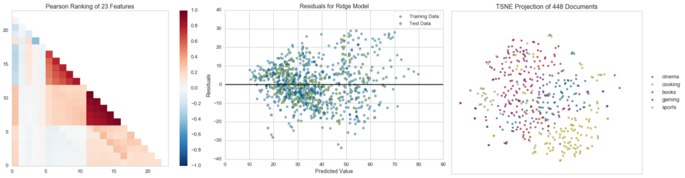

# Yellowbrick

[](https://travis-ci.org/DistrictDataLabs/yellowbrick)
[](https://coveralls.io/github/DistrictDataLabs/yellowbrick?branch=master)
[](https://landscape.io/github/DistrictDataLabs/yellowbrick/master)
[](http://yellowbrick.readthedocs.io/en/latest/?badge=latest)
[](https://waffle.io/DistrictDataLabs/yellowbrick)


**Visual analysis and diagnostic tools to facilitate machine learning model selection.**


Image by [Quatro Cinco](https://flic.kr/p/2Yj9mj), used with permission, Flickr Creative Commons.

This README is a guide for developers, if you're new to Yellowbrick, get started at our [documentation](http://www.scikit-yb.org/).

## What is Yellowbrick?

Yellowbrick is a suite of visual diagnostic tools called "Visualizers" that extend the Scikit-Learn API to allow human steering of the model selection process. In a nutshell, Yellowbrick combines Scikit-Learn with Matplotlib in the best tradition of the Scikit-Learn documentation, but to produce visualizations for _your_ models!



### Visualizers

Visualizers are estimators (objects that learn from data) whose primary objective is to create visualizations that allow insight into the model selection process. In Scikit-Learn terms, they can be similar to transformers when visualizing the data space or wrap an model estimator similar to how the "ModelCV" (e.g. RidgeCV, LassoCV) methods work. The primary goal of Yellowbrick is to create a sensical API similar to Scikit-Learn. Some of our most popular visualizers include:

#### Feature Visualization

- **Rank Features**: single or pairwise ranking of features to detect relationships
- **Parallel Coordinates**: horizontal visualization of instances
- **Radial Visualization**: separation of instances around a circular plot
- **PCA Projection**: projection of instances based on principal components
- **Feature Importances**: rank features based on their in-model performance 
- **Scatter and Joint Plots**: direct data visualization with feature selection

#### Classification Visualization

- **Class Balance**: see how the distribution of classes affects the model
- **Classification Report**: visual representation of precision, recall, and F1
- **ROC/AUC Curves**: receiver operator characteristics and area under the curve
- **Confusion Matrices**: visual description of class decision making

#### Regression Visualization

- **Prediction Error Plots**: find model breakdowns along the domain of the target
- **Residuals Plot**: show the difference in residuals of training and test data
- **Alpha Selection**: show how the choice of alpha influences regularization

#### Clustering Visualization

- **K-Elbow Plot**: select k using the elbow method and various metrics
- **Silhouette Plot**: select k by visualizing silhouette coefficient values

#### Text Visualization

- **Term Frequency**: visualize the frequency distribution of terms in the corpus
- **TSNE**: use stochastic neighbor embedding to project documents.

And more! Visualizers are being added all the time, be sure to check the examples (or even the develop branch) and feel free to contribute your ideas for Visualizers!

## Installing Yellowbrick

Yellowbrick is compatible with Python 2.7 or later but it is preferred to use Python 3.5 or later to take full advantage of all functionality. Yellowbrick also depends on Scikit-Learn 0.18 or later and Matplotlib 1.5 or later. The simplest way to install Yellowbrick is from PyPI with pip, Python's preferred package installer.

    $ pip install yellowbrick

Note that Yellowbrick is an active project and routinely publishes new releases with more visualizers and updates. In order to upgrade Yellowbrick to the latest version, use pip as follows.

    $ pip install -u yellowbrick

You can also use the `-u` flag to update Scikit-Learn, matplotlib, or any other third party utilities that work well with Yellowbrick to their latest versions.

If you're using Windows or Anaconda, you can take advantage of the conda utility to install Yellowbrick:

    conda install -c districtdatalabs yellowbrick

Note, however, that there is a [known bug](https://github.com/DistrictDataLabs/yellowbrick/issues/205) installing Yellowbrick on Linux with Anaconda.

## Using Yellowbrick

The Yellowbrick API is specifically designed to play nicely with Scikit-Learn. Here is an example of a typical workflow sequence with Scikit-Learn and Yellowbrick:

### Feature Visualization

In this example, we see how Rank2D performs pairwise comparisons of each feature in the data set with a specific metric or algorithm, then returns them ranked as a lower left triangle diagram.

```python
from yellowbrick.features import Rank2D

visualizer = Rank2D(features=features, algorithm='covariance')
visualizer.fit(X, y)                # Fit the data to the visualizer
visualizer.transform(X)             # Transform the data
visualizer.poof()                   # Draw/show/poof the data
```

### Model Visualization

In this example, we instantiate a Scikit-Learn classifier, and then we use Yellowbrick's ROCAUC class to visualize the tradeoff between the classifier's sensitivity and specificity.

```python
from sklearn.svm import LinearSVC
from yellowbrick.classifier import ROCAUC

model = LinearSVC()
model.fit(X,y)
visualizer = ROCAUC(model)
visualizer.score(X,y)
visualizer.poof()
```

For additional information on getting started with Yellowbrick, check out our [examples notebook](https://github.com/DistrictDataLabs/yellowbrick/blob/develop/examples/examples.ipynb).

We also have a [quick start guide](https://github.com/DistrictDataLabs/yellowbrick/blob/master/docs/quickstart.rst).

## Contributing to Yellowbrick

Yellowbrick is an open source project that is supported by a community who will gratefully and humbly accept any contributions you might make to the project. Large or small, any contribution makes a big difference; and if you've never contributed to an open source project before, we hope you will start with Yellowbrick!

Principally, Yellowbrick development is about the addition and creation of *visualizers* &mdash; objects that learn from data and create a visual representation of the data or model. Visualizers integrate with Scikit-Learn estimators, transformers, and pipelines for specific purposes and as a result, can be simple to build and deploy. The most common contribution is therefore a new visualizer for a specific model or model family. We'll discuss in detail how to build visualizers later.

Beyond creating visualizers, there are many ways to contribute:

- Submit a bug report or feature request on [GitHub Issues](https://github.com/DistrictDataLabs/yellowbrick/issues).
- Contribute a Jupyter notebook to our examples[ gallery](https://github.com/DistrictDataLabs/yellowbrick/tree/develop/examples).
- Assist us with [user testing](http://www.scikit-yb.org/en/latest/evaluation.html).
- Add to the documentation or help with our website, [scikit-yb.org](http://www.scikit-yb.org).
- Write unit or integration tests for our project.
- Answer questions on our issues, mailing list, Stack Overflow, and elsewhere.
- Translate our documentation into another language.
- Write a blog post, tweet, or share our project with others.
- Teach someone how to use Yellowbrick.

As you can see, there are lots of ways to get involved and we would be very happy for you to join us! The only thing we ask is that you abide by the principles of openness, respect, and consideration of others as described in the [Python Software Foundation Code of Conduct](https://www.python.org/psf/codeofconduct/).

For more information, checkout the `CONTRIBUTING.md` file in the root of the repository or the detailed documentation at [Contributing to Yellowbrick](http://www.scikit-yb.org/en/latest/contributing.html)

## Development Scripts

Yellowbrick contains scripts to help with development, including downloading fixture data for tests and managing images for comparison.

### Images

The image comparison helper script manages the test directory's `baseline_images` folder by copying files from the `actual_images` folder to setup baselines. To use this script, first run the tests (which will cause image not found errors) then copy the images into baseline as follows:

```
$ python -m tests.images tests/test_visualizer.py
```

Where `tests/test_visualizer.py` is the test file that contains the image comparison tests. All related tests will be discovered, validated, and copied to the baseline directory. To clear out images from both actual and baseline to reset tests, use the `-C` flag:

```
$ python -m tests.images -C tests/test_visualizer.py
```

Glob syntax can be used to move multiple files. For example to reset all the classifier tests:

```
$ python -m tests.images tests/test_classifier/*   
```

Though it is recommended that specific test cases are targeted, rather than updating entire directories. 
