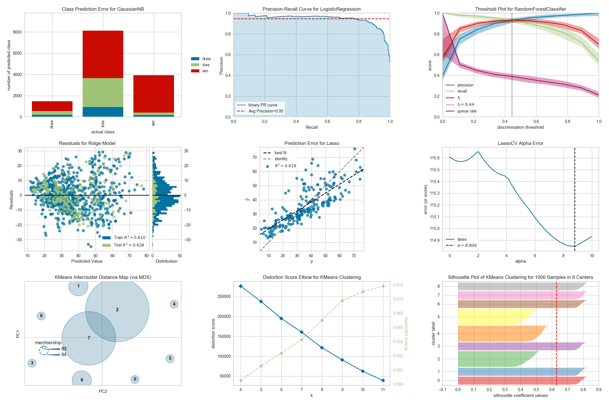

# Yellowbrick

[](https://travis-ci.com/DistrictDataLabs/yellowbrick)
[](https://ci.appveyor.com/project/districtdatalabs/yellowbrick)
[](https://coveralls.io/github/DistrictDataLabs/yellowbrick?branch=master)
[](https://lgtm.com/projects/g/DistrictDataLabs/yellowbrick/alerts/)
[](https://lgtm.com/projects/g/DistrictDataLabs/yellowbrick/context:python)
[](https://badge.fury.io/py/yellowbrick)
[](http://yellowbrick.readthedocs.io/en/latest/?badge=latest)
[](https://doi.org/10.5281/zenodo.1206239)
[](https://doi.org/10.21105/joss.01075)
[](https://mybinder.org/v2/gh/DistrictDataLabs/yellowbrick/develop?filepath=examples%2Fexamples.ipynb)


**Visual analysis and diagnostic tools to facilitate machine learning model selection.**

[](https://www.scikit-yb.org/en/latest/gallery.html)

## What is Yellowbrick?

Yellowbrick is a suite of visual diagnostic tools called "Visualizers" that extend the scikit-learn API to allow human steering of the model selection process. In a nutshell, Yellowbrick combines scikit-learn with matplotlib in the best tradition of the scikit-learn documentation, but to produce visualizations for _your_ machine learning workflow!

For complete documentation on the Yellowbrick API, a gallery of available visualizers, the contributor's guide, tutorials and teaching resources, frequently asked questions, and more, please visit our documentation at [www.scikit-yb.org](https://www.scikit-yb.org/).

## Installing Yellowbrick

Yellowbrick is compatible with Python 3.4 or later and also depends on scikit-learn and matplotlib. The simplest way to install Yellowbrick and its dependencies is from PyPI with pip, Python's preferred package installer.

    $ pip install yellowbrick

Note that Yellowbrick is an active project and routinely publishes new releases with more visualizers and updates. In order to upgrade Yellowbrick to the latest version, use pip as follows.

    $ pip install -U yellowbrick

You can also use the `-U` flag to update scikit-learn, matplotlib, or any other third party utilities that work well with Yellowbrick to their latest versions.

If you're using Anaconda (recommended for Windows users), you can take advantage of the conda utility to install Yellowbrick:

    conda install -c districtdatalabs yellowbrick

## Using Yellowbrick

The Yellowbrick API is specifically designed to play nicely with scikit-learn. Here is an example of a typical workflow sequence with scikit-learn and Yellowbrick:

### Feature Visualization

In this example, we see how Rank2D performs pairwise comparisons of each feature in the data set with a specific metric or algorithm and then returns them ranked as a lower left triangle diagram.

```python
from yellowbrick.features import Rank2D

visualizer = Rank2D(
    features=features, algorithm='covariance'
)
visualizer.fit(X, y)                # Fit the data to the visualizer
visualizer.transform(X)             # Transform the data
visualizer.show()                   # Finalize and render the figure
```

### Model Visualization

In this example, we instantiate a scikit-learn classifier and then use Yellowbrick's ROCAUC class to visualize the tradeoff between the classifier's sensitivity and specificity.

```python
from sklearn.svm import LinearSVC
from yellowbrick.classifier import ROCAUC

model = LinearSVC()
visualizer = ROCAUC(model)
visualizer.fit(X,y)
visualizer.score(X,y)
visualizer.show()
```

For additional information on getting started with Yellowbrick, view the [Quick Start Guide](https://www.scikit-yb.org/en/latest/quickstart.html) in the [documentation](https://www.scikit-yb.org/en/latest/) and check out our [examples notebook](https://github.com/DistrictDataLabs/yellowbrick/blob/develop/examples/examples.ipynb).

## Contributing to Yellowbrick

Yellowbrick is an open source project that is supported by a community who will gratefully and humbly accept any contributions you might make to the project. Large or small, any contribution makes a big difference; and if you've never contributed to an open source project before, we hope you will start with Yellowbrick!

If you are interested in contributing, check out our [contributor's guide](https://www.scikit-yb.org/en/latest/contributing/index.html). Beyond creating visualizers, there are many ways to contribute:

- Submit a bug report or feature request on [GitHub Issues](https://github.com/DistrictDataLabs/yellowbrick/issues).
- Contribute a Jupyter notebook to our examples [gallery](https://github.com/DistrictDataLabs/yellowbrick/tree/develop/examples).
- Assist us with [user testing](https://www.scikit-yb.org/en/latest/evaluation.html).
- Add to the documentation or help with our website, [scikit-yb.org](https://www.scikit-yb.org).
- Write [unit or integration tests](https://www.scikit-yb.org/en/latest/contributing/developing_visualizers.html#integration-tests) for our project.
- Answer questions on our issues, mailing list, Stack Overflow, and elsewhere.
- Translate our documentation into another language.
- Write a blog post, tweet, or share our project with others.
- [Teach](https://www.scikit-yb.org/en/latest/teaching.html) someone how to use Yellowbrick.

As you can see, there are lots of ways to get involved and we would be very happy for you to join us! The only thing we ask is that you abide by the principles of openness, respect, and consideration of others as described in the [Python Software Foundation Code of Conduct](https://www.python.org/psf/codeofconduct/).

For more information, checkout the `CONTRIBUTING.md` file in the root of the repository or the detailed documentation at [Contributing to Yellowbrick](https://www.scikit-yb.org/en/latest/contributing/index.html)

## Yellowbrick Datasets

Yellowbrick gives easy access to several datasets that are used for the examples in the documentation and testing. These datasets are hosted in our CDN and must be downloaded for use. Typically, when a user calls one of the data loader functions, e.g. `load_bikeshare()` the data is automatically downloaded if it's not already on the user's computer. However, for development and testing, or if you know you will be working without internet access, it might be easier to simply download all the data at once.

The data downloader script can be run as follows:

    $ python -m yellowbrick.download

This will download the data to the fixtures directory inside of the Yellowbrick site packages. You can specify the location of the download either as an argument to the downloader script (use `--help` for more details) or by setting the `$YELLOWBRICK_DATA` environment variable. This is the preferred mechanism because this will also influence how data is loaded in Yellowbrick.

_Note: Developers who have downloaded data from Yellowbrick versions earlier than v1.0 may experience some problems with the older data format. If this occurs, you can clear out your data cache as follows:_

    $ python -m yellowbrick.download --cleanup

_This will remove old datasets and download the new ones. You can also use the `--no-download` flag to simply clear the cache without re-downloading data. Users who are having difficulty with datasets can also use this or they can uninstall and reinstall Yellowbrick using `pip`._

## Citing Yellowbrick

We would be glad if you used Yellowbrick in your scientific publications! If you do, please cite us using the [citation guidelines](https://www.scikit-yb.org/en/latest/about.html#citing-yellowbrick).

## Affiliations

[](https://districtdatalabs.com/) [](https://numfocus.org)
