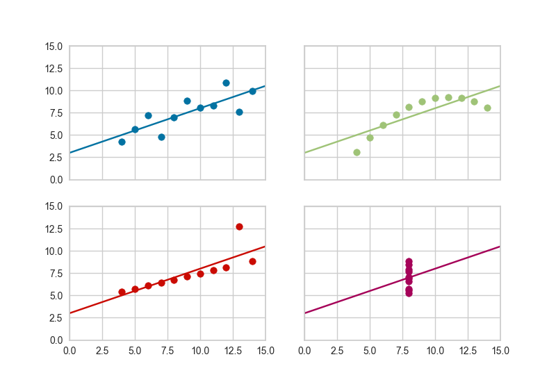

.. -*- mode: rst -*-

Anscombe's Quartet
==================

Yellowbrick has learned Anscombe's lesson---which is why we believe that
visual diagnostics are vital to machine learning.

.. code:: python

    import yellowbrick as yb
    import matplotlib.pyplot as plt

    g = yb.anscombe()
    plt.show()

API Reference
-------------

.. automodule:: yellowbrick.anscombe
    :members:
    :undoc-members:
    :show-inheritance:
