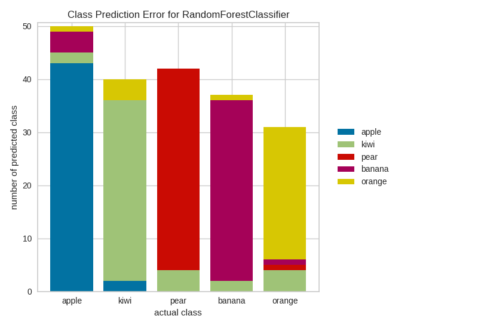

.. -*- mode: rst -*-

Class Prediction Error
======================
The class prediction error chart provides a way to quickly understand how good your classifier is at predicting the right classes.

.. code:: python

    from sklearn.datasets import make_classification

    # Create classification dataset
    X, y = make_classification(
        n_samples=1000, n_classes=5, n_informative=3, n_clusters_per_class=1
    )

    # Name the classes
    classes = ['apple', 'kiwi', 'pear', 'banana', 'orange']

    # Perform 80/20 training/test split
    X_train, X_test, y_train, y_test = tts(
        X, y, test_size=0.20, random_state=42
    )

.. code:: python

    # Instantiate the classification model and visualizer
    visualizer = ClassPredictionError(
        RandomForestClassifier(), classes=classes
    )

    # Fit the training data to the visualizer
    visualizer.fit(X_train, y_train)

    # Evaluate the model on the test data
    visualizer.score(X_test, y_test)

    # Draw visualization
    g = visualizer.poof()

API Reference
-------------

.. automodule:: yellowbrick.classifier.class_balance
    :members: ClassPredictionError
    :undoc-members:
    :show-inheritance:
