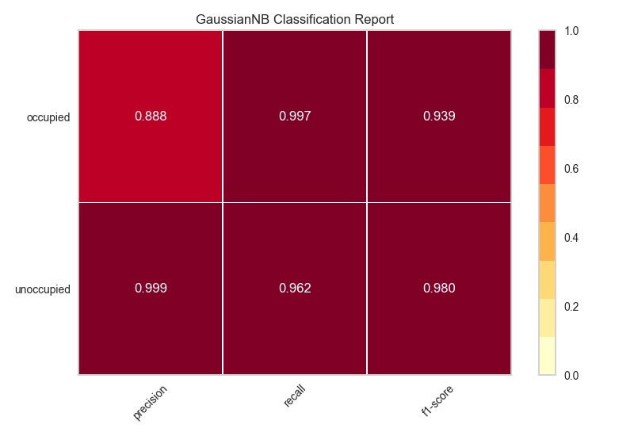

.. -*- mode: rst -*-

Classification Report
=====================

The classification report visualizer displays the precision, recall, and
F1 scores for the model. In order to support easier interpretation and problem detection, the report integrates numerical scores with a color-coded
heatmap.

.. code:: python

    # Load the classification data set
    data = load_data('occupancy')

    # Specify the features of interest and the classes of the target
    features = ["temperature", "relative humidity", "light", "C02", "humidity"]
    classes = ['unoccupied', 'occupied']

    # Extract the numpy arrays from the data frame
    X = data[features].as_matrix()
    y = data.occupancy.as_matrix()

    # Create the train and test data
    X_train, X_test, y_train, y_test = train_test_split(X, y, test_size=0.2)

.. code:: python

    # Instantiate the classification model and visualizer
    bayes = GaussianNB()
    visualizer = ClassificationReport(bayes, classes=classes)

    visualizer.fit(X_train, y_train)  # Fit the training data to the visualizer
    visualizer.score(X_test, y_test)  # Evaluate the model on the test data
    g = visualizer.poof()             # Draw/show/poof the data

API Reference
-------------

.. automodule:: yellowbrick.classifier.classification_report
    :members: ClassificationReport
    :undoc-members:
    :show-inheritance:
