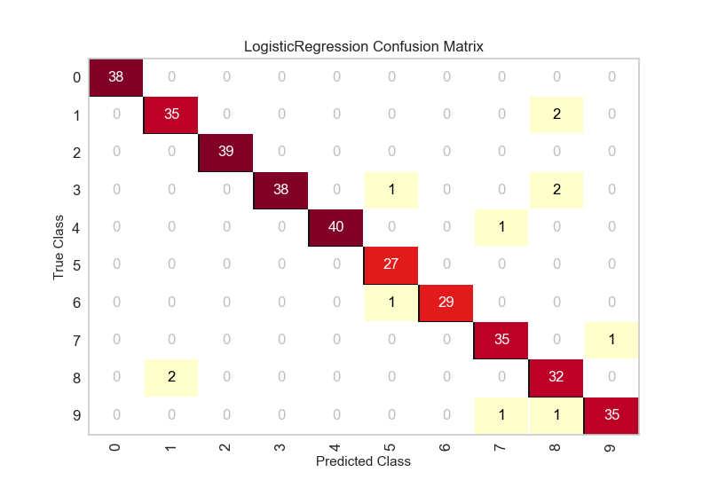

.. -*- mode: rst -*-

Confusion Matrix
================

The ``ConfusionMatrix`` visualizer is a ScoreVisualizer that takes a
fitted Scikit-Learn classifier and a set of test X and y values and
returns a report showing how each of the test values predicted classes
compare to their actual classes. Data scientists use confusion matrices
to understand which classes are most easily confused. These provide
similar information as what is available in a ClassificationReport, but
rather than top-level scores they provide deeper insight into the
classification of individual data points.

Below are a few examples of using the ConfusionMatrix visualizer; more
information can be found by looking at the
Scikit-Learn documentation on `confusion matrices <http://scikit-learn.org/stable/modules/generated/sklearn.metrics.confusion_matrix.html>`_.

.. code:: python

    #First do our imports
    import yellowbrick

    from sklearn.datasets import load_digits
    from sklearn.model_selection import train_test_split
    from sklearn.linear_model import LogisticRegression

    from yellowbrick.classifier import ConfusionMatrix

.. code:: python

    # We'll use the handwritten digits data set from scikit-learn.
    # Each feature of this dataset is an 8x8 pixel image of a handwritten number.
    # Digits.data converts these 64 pixels into a single array of features
    digits = load_digits()
    X = digits.data
    y = digits.target

    X_train, X_test, y_train, y_test = train_test_split(X,y, test_size =0.2, random_state=11)

    model = LogisticRegression()

    #The ConfusionMatrix visualizer taxes a model
    cm = ConfusionMatrix(model, classes=[0,1,2,3,4,5,6,7,8,9])

    #Fit fits the passed model. This is unnecessary if you pass the visualizer a pre-fitted model
    cm.fit(X_train, y_train)

    #To create the ConfusionMatrix, we need some test data. Score runs predict() on the data
    #and then creates the confusion_matrix from scikit learn.
    cm.score(X_test, y_test)

    #How did we do?
    cm.poof()

API Reference
-------------

.. automodule:: yellowbrick.classifier.confusion_matrix
    :members: ConfusionMatrix
    :undoc-members:
    :show-inheritance:
