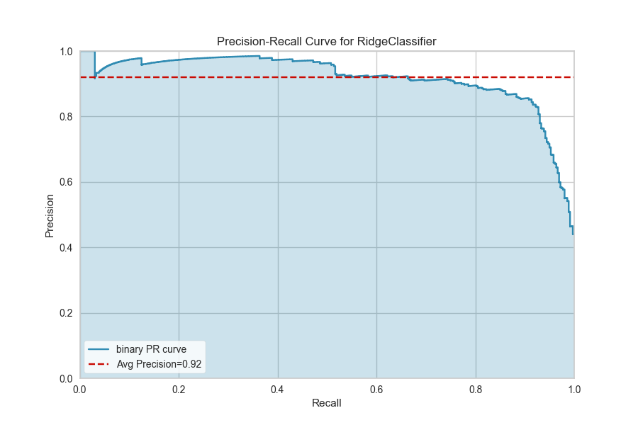
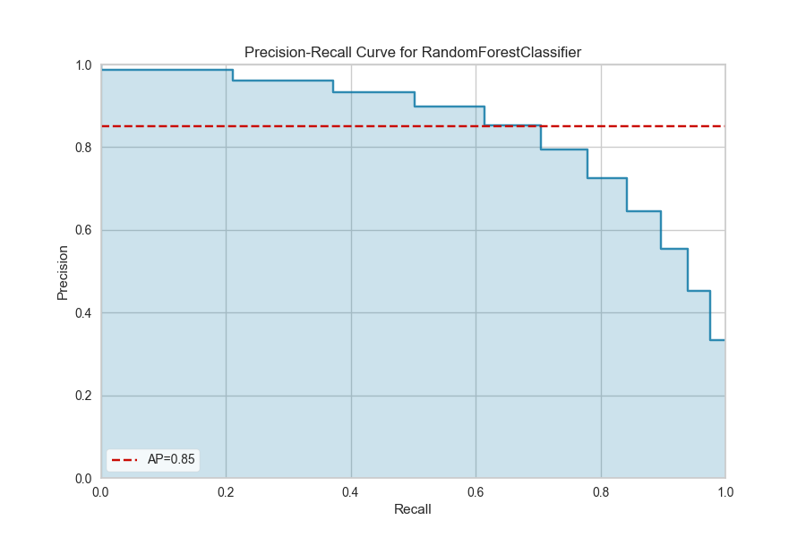

.. -*- mode: rst -*-

Precision-Recall Curves
=======================

Precision-Recall curves are a metric used to evaluate a classifier's quality,
particularly when classes are very imbalanced. The precision-recall curve
shows the tradeoff between precision, a measure of result relevancy, and
recall, a measure of how many relevant results are returned. A large area
under the curve represents both high recall and precision, the best case
scenario for a classifier, showing a model that returns accurate results
for the majority of classes it selects.

Binary Classification
---------------------

.. code:: python

    from sklearn.linear_model import RidgeClassifier
    from sklearn.model_selection import train_test_split as tts
    from yellowbrick.classifier import PrecisionRecallCurve

    # Load the dataset and split into train/test splits
    data = load_spam()
    X = data[[col for col in data.columns if col != "is_spam"]]
    y = data["is_spam"]

    X_train, X_test, y_train, y_test = tts(X, y, test_size=0.2, shuffle=True)

    # Create the visualizer, fit, score, and poof it
    viz = PrecisionRecallCurve(RidgeClassifier())
    viz.fit(X_train, y_train)
    viz.score(X_test, y_test)
    viz.poof()

The base case for precision-recall curves is the binary classification case, and this case is also the most visually interpretable. In the figure above we can see the precision plotted on the y-axis against the recall on the x-axis. The larger the filled in area, the stronger the classifier is. The red line annotates the *average precision*, a summary of the entire plot computed as the weighted average of precision achieved at each threshold such that the weight is the difference in recall from the previous threshold.

Multi-Label Classification
--------------------------

To support multi-label classification, the estimator is wrapped in a `OneVsRestClassifier <http://scikit-learn.org/stable/modules/generated/sklearn.multiclass.OneVsRestClassifier.html>`_ to produce binary comparisons for each class (e.g. the positive case is the class and the negative case is any other class). The Precision-Recall curve is then computed as the micro-average of the precision and recall for all classes:

.. code:: python

    from sklearn.ensemble import RandomForestClassifier
    from sklearn.preprocessing import LabelEncoder

    # Load dataset and encode categorical variables
    data = load_game()
    data.replace({'x':0, 'o':1, 'b':2}, inplace=True)

    # Create train/test splits
    X = data.iloc[:, data.columns != 'outcome']
    y = LabelEncoder().fit_transform(data['outcome'])

    X_train, X_test, y_train, y_test = tts(X, y, test_size=0.2, shuffle=True)

    # Create the visualizer, fit, score, and poof it
    viz = PrecisionRecallCurve(RandomForestClassifier())
    viz.fit(X_train, y_train)
    viz.score(X_test, y_test)
    viz.poof()

A more complex Precision-Recall curve can be computed, however, displaying each curve individually, along with F1-score ISO curves (e.g. that show the relationship between precision and recall for various F1 scores).

.. code:: python

    from sklearn.naive_bayes import MultinomialNB

    oz = PrecisionRecallCurve(
        MultinomialNB(), per_class=True, iso_f1_curves=True,
        fill_area=False, micro=False
    )
    viz.fit(X_train, y_train)
    viz.score(X_test, y_test)
    viz.poof()

.. image:: images/multiclass_precision_recall_full.png

.. seealso:: `Scikit-Learn: Model Selection with Precision Recall Curves <http://scikit-learn.org/stable/auto_examples/model_selection/plot_precision_recall.html>`_

API Reference
-------------

.. automodule:: yellowbrick.classifier.prcurve
    :members: PrecisionRecallCurve
    :undoc-members:
    :show-inheritance:
