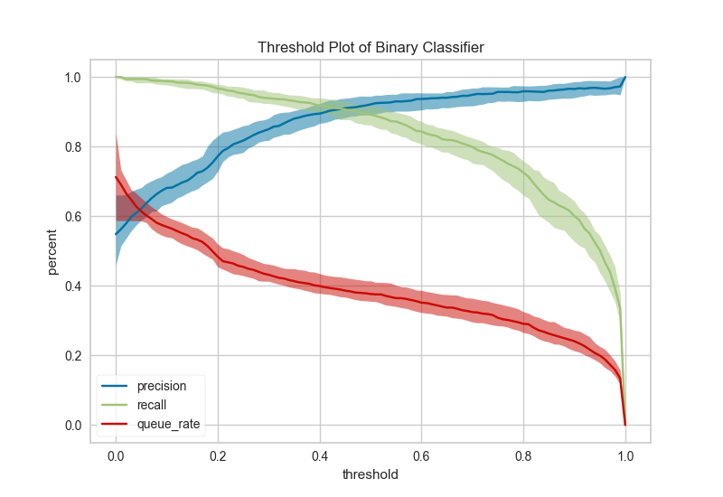

.. -*- mode: rst -*-

Threshold
=========

The Threshold visualizer shows the bounds of precision, recall and queue rate for different thresholds for binary targets after a given number of trials.

.. code:: python

    # Load the data set
    data = pd.read_csv('https://archive.ics.uci.edu/ml/machine-learning-databases/spambase/spambase.data', header=None)
    data.rename(columns={57:'is_spam'}, inplace=True)

    features = [col for col in data.columns if col != 'is_spam']

    # Extract the numpy arrays from the data frame
    X = data[features].as_matrix()
    y = data.is_spam.as_matrix()

.. code:: python

    # Instantiate the classification model and visualizer
    logistic = LogisticRegression()
    visualizer = ThreshViz(logistic)

    visualizer.fit(X, y)  # Fit the training data to the visualizer
    g = visualizer.poof() # Draw/show/poof the data

API Reference
-------------

.. automodule:: yellowbrick.classifier.threshold
    :members: ThreshViz
    :undoc-members:
    :show-inheritance:
