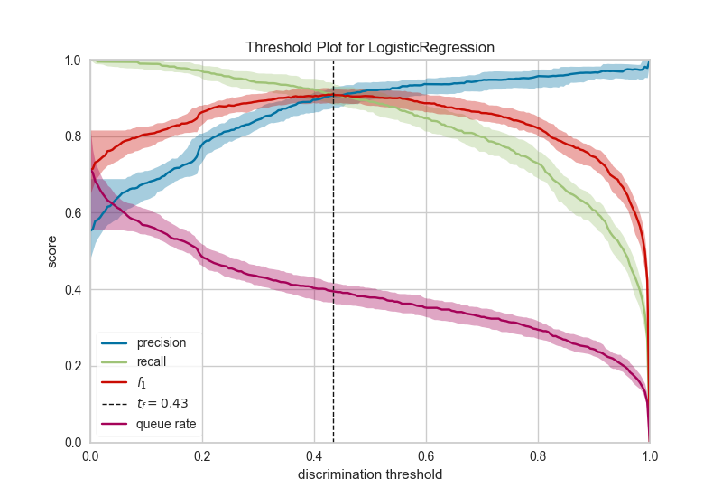

.. -*- mode: rst -*-

Discrimination Threshold
========================

.. caution:: This visualizer only works for *binary* classification.

A visualization of precision, recall, f1 score, and queue rate with respect to the discrimination threshold of a binary classifier. The *discrimination threshold* is the probability or score at which the positive class is chosen over the negative class. Generally, this is set to 50% but the threshold can be adjusted to increase or decrease the sensitivity to false positives or to other application factors.

.. code:: python

    # Load a binary classification dataset
    data = load_data("spam")
    target = "is_spam"
    features = [col for col in data.columns if col != target]

    # Extract the instances and target from the dataset
    X = data[features]
    y = data[target]

.. code:: python

    from sklearn.linear_model import LogisticRegression
    from yellowbrick.classifier import DiscriminationThreshold

    # Instantiate the classification model and visualizer
    logistic = LogisticRegression()
    visualizer = DiscriminationThreshold(logistic)

    visualizer.fit(X, y)  # Fit the training data to the visualizer
    visualizer.poof()     # Draw/show/poof the data

One common use of binary classification algorithms is to use the score or probability they produce to determine cases that require special treatment. For example, a fraud prevention application might use a classification algorithm to determine if a transaction is likely fraudulent and needs to be investigated in detail. In the figure above, we present an example where a binary classifier determines if an email is "spam" (the positive case) or "not spam" (the negative case). Emails that are detected as spam are moved to a hidden folder and eventually deleted.

Many classifiers use either a ``decision_function`` to score the positive class or a ``predict_proba`` function to compute the probability of the positive class. If the score or probability is greater than some discrimination threshold then the positive class is selected, otherwise, the negative class is.

Generally speaking, the threshold is balanced between cases and set to 0.5 or 50% probability. However, this threshold may not be the optimal threshold: often there is an inverse relationship between precision and recall with respect to a discrimination threshold. By adjusting the threshold of the classifier, it is possible to tune the F1 score (the harmonic mean of precision and recall) to the best possible fit or to adjust the classifier to behave optimally for the specific application. Classifiers are tuned by considering the following metrics:

- **Precision**: An increase in precision is a reduction in the number of false positives; this metric should be optimized when the cost of special treatment is high (e.g. wasted time in fraud preventing or missing an important email).

- **Recall**: An increase in recall decrease the likelihood that the positive class is missed; this metric should be optimized when it is vital to catch the case even at the cost of more false positives.

- **F1 Score**: The F1 score is the harmonic mean between precision and recall. The ``fbeta`` parameter determines the relative weight of precision and recall when computing this metric, by default set to 1 or F1. Optimizing this metric produces the best balance between precision and recall.

- **Queue Rate**: The "queue" is the spam folder or the inbox of the fraud investigation desk. This metric describes the percentage of instances that must be reviewed. If review has a high cost (e.g. fraud prevention) then this must be minimized with respect to business requirements; if it doesn't (e.g. spam filter), this could be optimized to ensure the inbox stays clean.

In the figure above we see the visualizer tuned to look for the optimal F1 score, which is annotated as a threshold of 0.43. The model is run multiple times over multiple train/test splits in order to account for the variability of the model with respect to the metrics (shown as the fill area around the median curve). 

API Reference
-------------

.. automodule:: yellowbrick.classifier.threshold
    :members: DiscriminationThreshold
    :undoc-members:
    :show-inheritance:
