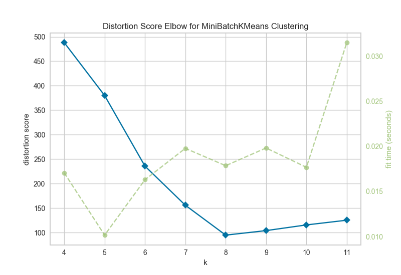

.. -*- mode: rst -*-

Elbow Method
============

The elbow method for :math:`K` selection visualizes multiple clustering models with different values for :math:`K`. Model selection is based on whether or not there is an "elbow" in the curve; e.g. if the curve looks like an arm, if there is a clear change in angle from one part of the curve to another.

.. code:: python

    # Make 8 blobs dataset
    X, y = make_blobs(centers=8)

.. code:: python

    # Instantiate the clustering model and visualizer
    visualizer = KElbowVisualizer(MiniBatchKMeans(), k=(4,12))

    visualizer.fit(X) # Fit the training data to the visualizer
    visualizer.poof() # Draw/show/poof the data

API Reference
-------------

.. automodule:: yellowbrick.cluster.elbow
    :members: KElbowVisualizer
    :undoc-members:
    :show-inheritance:
