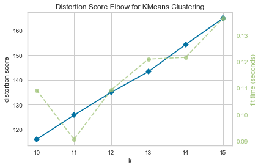

.. -*- mode: rst -*-

Elbow Method
============

The elbow method for :math:`K` selection visualizes multiple clustering models with different values for :math:`K`. Model selection is based on whether or not there is an "elbow" in the curve; e.g. if the curve looks like an arm, if there is a clear change in angle from one part of the curve to another. Based off the given example in the first chart below, the best :math:`K` is 8.

The best :math:`K` value is one which the SSE (sum of square error) decreases abruptly. In essence, the "start" of the elbow.

For a given :math:`K` value, single integer or iterable, if there is no visible elbow, the elbow may be beyond or behind the given :math:`K`. Take the second chart displayed below. Displayed is a chart using the same data as the first, however the given :math:`K` starts after the elbow, as seen in the chart above.

In the event that there is no elbow or multiple elbows are found, the use of k-means may need to be re-evaluated based on the context of the current issue.

.. code:: python

    from sklearn.datasets import make_blobs

    # Make 8 blobs dataset
    X, y = make_blobs(centers=8)

.. code:: python

    from sklearn.cluster import MiniBatchKMeans

    from yellowbrick.cluster import KElbowVisualizer

    # Instantiate the clustering model and visualizer
    visualizer = KElbowVisualizer(MiniBatchKMeans(), k=(4,12))

    visualizer.fit(X) # Fit the training data to the visualizer
    visualizer.poof() # Draw/show/poof the data
    
.. image:: images/elbow.png

.. code:: python
    # Poor choice for k, where the best k lies lower than 10
    # Same data as above
    visualizer = KElbowVisualizer(model, k=(10,16))

    visualizer.fit(X)    # Fit the data to the visualizer
    visualizer.poof()    # Draw/show/poof the data

API Reference
-------------

.. automodule:: yellowbrick.cluster.elbow
    :members: KElbowVisualizer
    :undoc-members:
    :show-inheritance:
