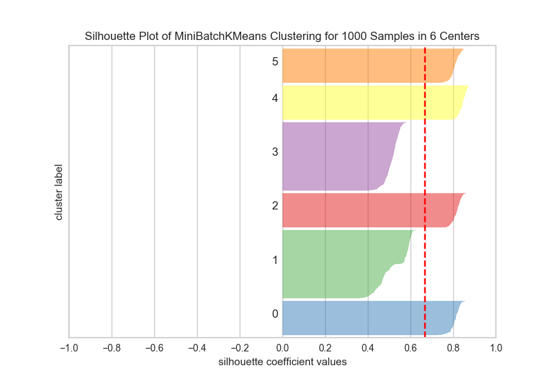

.. -*- mode: rst -*-

Silhouette Visualizer
=====================

The Silhouette Coefficient is used when the ground-truth about the dataset is unknown and computes the density of clusters computed by the model. The score is computed by averaging the silhouette coefficient for each sample, computed as the difference between the average intra-cluster distance and the mean nearest-cluster distance for each sample, normalized by the maximum value. This produces a score between 1 and -1, where 1 is highly dense clusters and -1 is completely incorrect clustering.

The Silhouette Visualizer displays the silhouette coefficient for each sample on a per-cluster basis, visualizing which clusters are dense and which are not. This is particularly useful for determining cluster imbalance, or for selecting a value for $K$ by comparing multiple visualizers.

.. code:: python

    # Make 8 blobs dataset
    X, y = make_blobs(centers=8)

.. code:: python

    # Instantiate the clustering model and visualizer
    model = MiniBatchKMeans(6)
    visualizer = SilhouetteVisualizer(model)

    visualizer.fit(X) # Fit the training data to the visualizer
    visualizer.poof() # Draw/show/poof the data

API Reference
-------------

.. automodule:: yellowbrick.cluster.silhouette
    :members: SilhouetteVisualizer
    :undoc-members:
    :show-inheritance:
