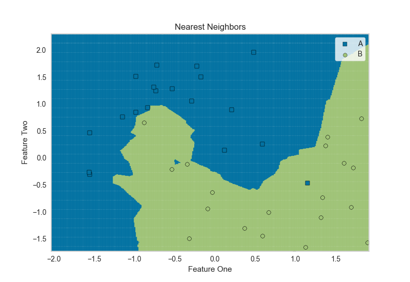

.. -*- mode: rst -*-

DecisionBoundaries Vizualizer
=============================

The DecisionBoundariesVisualizer is a bivariate data visualization algorithm that plots the decision boundaries of each class.

.. code:: python

    from sklearn.model_selection import train_test_split
    from sklearn.preprocessing import StandardScaler
    from sklearn.datasets import make_moons, make_classification

    # Create dummy data
    X, y = make_classification(n_features=2, n_redundant=0, n_informative=2,
                               random_state=1, n_clusters_per_class=1)

    rng = np.random.RandomState(2)
    X += 2 * rng.uniform(size=X.shape)
    linearly_separable = (X, y)

    data_set = make_moons(noise=0.3, random_state=0)

    X, y = data_set
    X = StandardScaler().fit_transform(X)
    X_train, X_test, y_train, y_test = train_test_split(X, y, test_size=.4, random_state=42)

.. code:: python

    from sklearn.neighbors import KNeighborsClassifier
    from yellowbrick.contrib.classifier import DecisionViz

    viz = DecisionViz(KNeighborsClassifier(3), title="Nearest Neighbors", features=['Feature One', 'Feature Two'], classes=['A', 'B'])
    viz.fit(X_train, y_train)
    viz.draw(X_test, y_test)
    viz.poof(outpath="images/knn_decisionviz.png")

API Reference
-------------

.. automodule:: yellowbrick.contrib.classifier.boundaries
    :members: DecisionBoundariesVisualizer
    :undoc-members:
    :show-inheritance:
