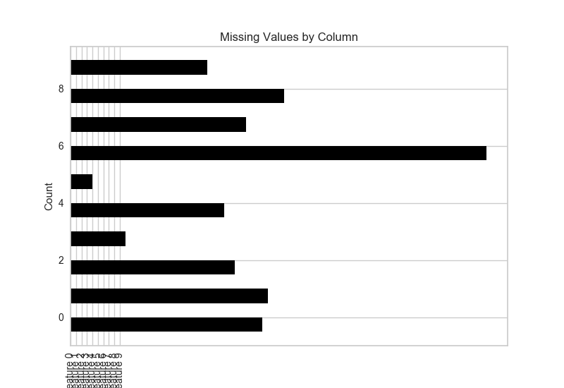

.. -*- mode: rst -*-

MissingValues Bar
=============================

The MissingValues Bar visualizer creates a bar graph that counts the number of missing values per feature column.

.. code:: python

    import numpy as np
    from sklearn.datasets import make_classification

    X, y = make_classification(
            n_samples=400, n_features=10, n_informative=2, n_redundant=3,
            n_classes=2, n_clusters_per_class=2, random_state=854
        )
    # assign some NaN values
    X[X > 1.5] = np.nan
    features = ["Feature {}".format(str(n)) for n in range(10)]

.. code:: python

    from yellowbrick.contrib.missing import MissingValuesBar

    viz = MissingValuesBar(features=features)
    viz.fit(X)
    viz.poof()

API Reference
-------------

.. automodule:: yellowbrick.contrib.missing.bar
    :members: MissingValuesBar
    :undoc-members:
    :show-inheritance:
