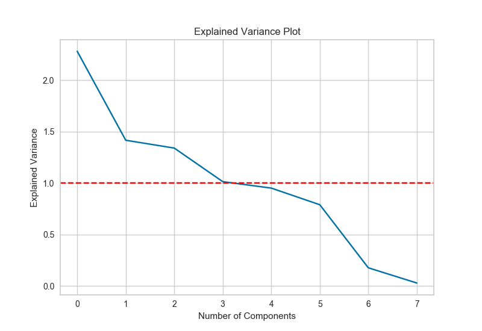
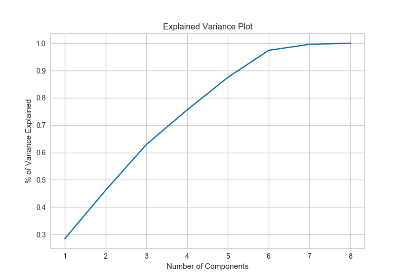

.. -*- mode: rst -*-

ExplainedVariance Visualizer
============================

``ExplainedVariance`` is a visualizer for PCA that shows the contribution
of each the features in the analysis to the total variance of the dataset.

By default, ExplainedVariance will display a plot of each feature's variance
over its index. In this plot, the ``kaiser`` option, if set to ``True`,
will draw a horizontal line along the ``y`` value of ``1`` variance. The
threshold for the Kaiser rule may also be changed, using the ``kaiser_thresh``
argument. This has a default value of ``1``.

If the ``scree`` option is set to ``True``, the visualizer will return a
Scree plot, showing the fraction of total variance that all principal components
including and before the ``n``\ th component explain.

.. plot::
    :context: close-figs
    :alt: ExplainedVariance on the Concrete Dataset

    from yellowbrick.datasets import load_concrete
    from yellowbrick.features import ExplainedVariance

    # Load the dataset
    X, y = load_concrete()

    # Plotting individual variances + Kaiser
    viz = ExplainedVariance(kaiser=True)
    viz.fit(X)              # Fit the data to the visualizer
    viz.transform(X)        # Transform the data
    viz.poof()              # Draw/show/poof the data

    # Scree plot
    viz2 = ExplainedVariance(screen=True)
    viz2.fit(X)
    viz2.transform(X)
    viz2.poof()

    
API Reference
-------------

.. automodule:: yellowbrick.features.explainedvariance
    :members: ExplainedVariance
    :undoc-members:
    :show-inheritance:
