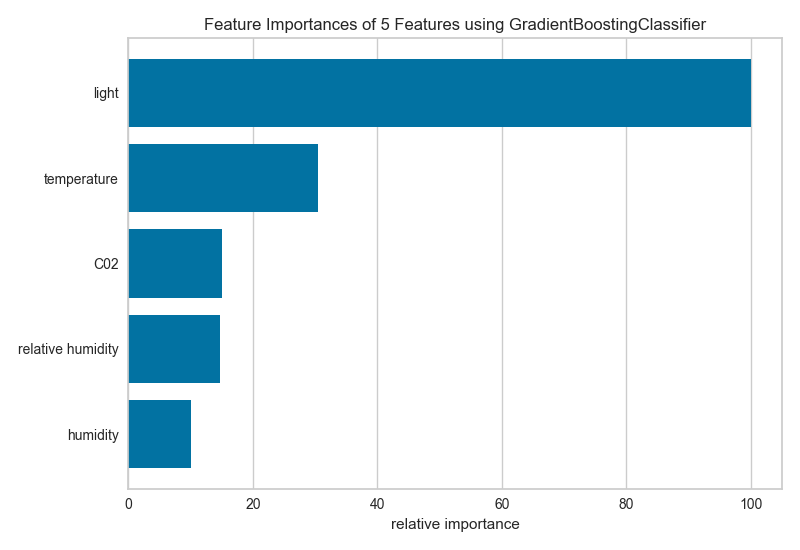

.. -*- mode: rst -*-

Feature Importances
===================

The feature engineering process involves selecting the *minimum* required
features to produce a valid model because the more features a model contains,
the more complex it is (and the more sparse the data), therefore the more
sensitive the model is to errors due to variance. A common approach to
eliminating features is to describe their relative importance to a model,
then eliminate weak features or combinations of features and re-evalute to
see if the model fairs better during cross-validation.

Many model forms describe the underlying impact of features relative to each
other. In Scikit-Learn, Decision Tree models and ensembles of trees such as
Random Forest, Gradient Boosting, and Ada Boost provide a
``feature_importances_`` attribute when fitted. The Yellowbrick
``FeatureImportances`` visualizer utilizes this attribute to rank and plot
relative importances. Let's start with an example; first load a
classification dataset as follows:

.. code:: python

    # Load the classification data set
    data = load_data('occupancy')

    # Specify the features of interest
    features = [
        "temperature", "relative humidity", "light", "C02", "humidity"
    ]

    # Extract the instances and target
    X = data[features]
    y = data.occupancy

Once the dataset has been loaded, we can create a new figure (this is
optional, if an ``Axes`` isn't specified, Yellowbrick will use the current
figure or create one). We can then fit a ``FeatureImportances`` visualizer
with a ``GradientBoostingClassifier`` to visualize the ranked features:

.. code:: python

    from sklearn.ensemble import GradientBoostingClassifier
    from yellowbrick.features import FeatureImportances

    # Create a new matplotlib figure
    fig = plt.figure()
    ax = fig.add_subplot()

    viz = FeatureImportances(GradientBoostingClassifier(), ax=ax)
    viz.fit(X, y)
    viz.poof()

The above figure shows the features ranked according to the explained variance
each feature contributes to the model. In this case the features are plotted
against their *relative importance*, that is the percent importance of the
most important feature. The visualizer also contains ``features_`` and
``feature_importances_`` attributes to get the ranked numeric values.

For models that do not support a ``feature_importances_`` attribute, the
``FeatureImportances`` visualizer will also draw a bar plot for the ``coef_``
attribute that many linear models provide. First we start by loading a
regression dataset:

.. code:: python

    # Load a regression data set
    data = load_data("concrete")

    # Specify the features of interest
    features = [
        'cement','slag','ash','water','splast','coarse','fine','age'
    ]

    # Extract the instances and target
    X = concrete[feats]
    y = concrete.strength

When using a model with a ``coef_`` attribute, it is better to set
``relative=False`` to draw the true magnitude of the coefficient (which may
be negative). We can also specify our own set of labels if the dataset does
not have column names or to print better titles. In the example below we
title case our features for better readability:

.. code:: python

    # Create a new figure
    fig = plt.figure()
    ax = fig.add_subplot()

    # Title case the feature for better display and create the visualizer
    labels = list(map(lambda s: s.title(), features))
    viz = FeatureImportances(Lasso(), ax=ax, labels=labels, relative=False)

    # Fit and show the feature importances
    viz.fit(X, y)
    viz.poof()

.. image:: images/feature_importances_coef.png

.. NOTE:: The interpretation of the importance of coeficients depends on the model; see the discussion below for more details.

Discussion
----------

Generalized linear models compute a predicted independent variable via the
linear combination of an array of coefficients with an array of dependent
variables. GLMs are fit by modifying the coefficients so as to minimize error
and regularization techniques specify how the model modifies coefficients in
relation to each other. As a result, an opportunity presents itself: larger
coefficients are necessarily "more informative" because they contribute a
greater weight to the final prediction in most cases.

Additionally we may say  that instance features may also be more or less
"informative" depending on  the product of the instance feature value with
the feature coefficient. This  creates two possibilities:

1. We can compare models based on ranking of coefficients, such that a higher coefficient is "more informative".
2. We can compare instances based on ranking of feature/coefficient products such that a higher product is "more informative".

In both cases, because the coefficient may be negative (indicating a strong negative correlation) we must rank features by the absolute values of their coefficients. Visualizing a model or multiple models by most informative feature is usually done via bar chart where the y-axis is the feature names and the x-axis is numeric value of the coefficient such that the x-axis has both a positive and negative quadrant. The bigger the size of the bar, the more informative that feature is.

This method may also be used for instances; but generally there are very many instances relative to the number models being compared. Instead a heatmap grid is a better choice to inspect the influence of features on individual instances. Here the grid is constructed such that the x-axis represents individual features, and the y-axis represents individual instances. The color of each cell (an instance, feature pair) represents the magnitude of the product of the instance value with the feature's coefficient for a single model. Visual inspection of this diagnostic may reveal a set of instances for which one feature is more predictive than another; or other types of regions of information in the model itself.

API Reference
-------------

.. automodule:: yellowbrick.features.importances
    :members: FeatureImportances
    :undoc-members:
    :show-inheritance:
