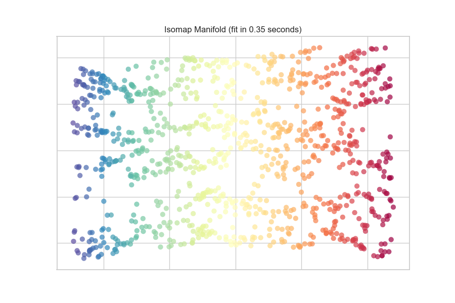

.. -*- mode: rst -*-

Manifold Visualization
======================

- classification manifold
- select k best features
- regression manifold
- warnings about time and memory consumption

.. code:: python

    # Load the classification data set
    data = load_data('credit')

    # Specify the features of interest
    features = [
        'limit', 'sex', 'edu', 'married', 'age', 'apr_delay', 'may_delay',
        'jun_delay', 'jul_delay', 'aug_delay', 'sep_delay', 'apr_bill', 'may_bill',
        'jun_bill', 'jul_bill', 'aug_bill', 'sep_bill', 'apr_pay', 'may_pay', 'jun_pay',
        'jul_pay', 'aug_pay', 'sep_pay',
    ]

    # Extract the numpy arrays from the data frame
    X = data[features].as_matrix()
    y = data.default.as_matrix()

.. code:: python

    from yellowbrick.features.manifold import Manifold

    visualizer = Manifold()
    visualizer.fit_transform(X,y)
    visualizer.poof()

API Reference
-------------

.. automodule:: yellowbrick.features.manifold
    :members: Manifold
    :undoc-members:
    :show-inheritance:
