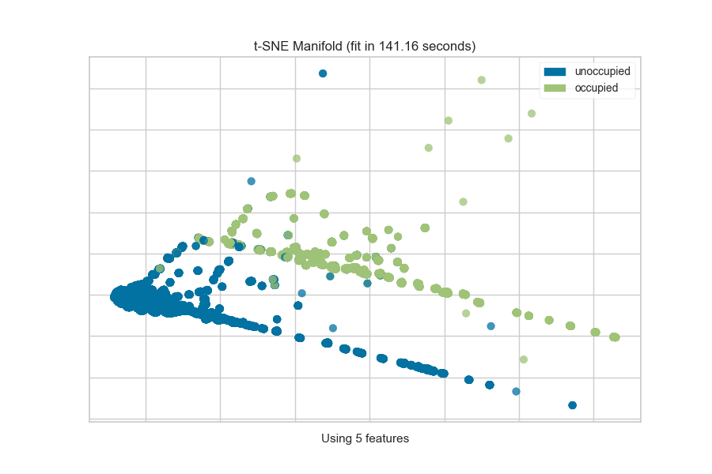
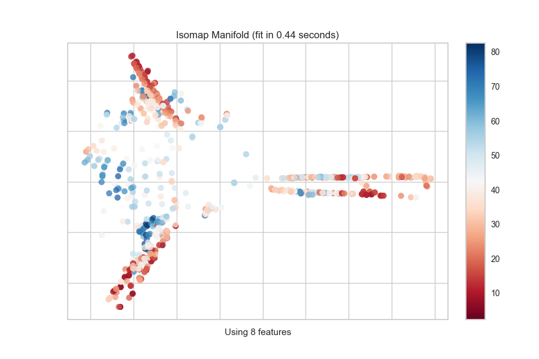

.. -*- mode: rst -*-

Manifold Visualization
======================

The ``Manifold`` visualizer provides high dimensional visualization using
`manifold learning`_
to embed instances described by many dimensions into 2, thus allowing the
creation of a scatter plot that shows latent structures in data. Unlike
decomposition methods such as PCA and SVD, manifolds generally use
nearest-neighbors approaches to embedding, allowing them to capture non-linear
structures that would be otherwise lost. The projections that are produced
can then be analyzed for noise or separability to determine if it is possible
to create a decision space in the data.

=================   =================
Visualizer           :class:`~yellowbrick.features.manifold.Manifold`
Quick Method         :func:`~yellowbrick.features.manifold.manifold_embedding`
Models               Classification, Regression
Workflow             Feature Engineering
=================   =================

.. image:: images/concrete_tsne_manifold.png

The ``Manifold`` visualizer allows access to all currently available
scikit-learn manifold implementations by specifying the manifold as a string to the visualizer. The currently implemented default manifolds are as follows:

==============  ============================================================
Manifold        Description
--------------  ------------------------------------------------------------
``"lle"``       `Locally Linear Embedding`_ (LLE) uses many local linear
                decompositions to preserve globally non-linear structures.
``"ltsa"``      `LTSA LLE`_: local tangent space alignment is similar to LLE
                in that it uses locality to preserve neighborhood distances.
``"hessian"``   `Hessian LLE`_ an LLE regularization method that applies a
                hessian-based quadratic form at each neighborhood
``"modified"``  `Modified LLE`_ applies a regularization parameter to LLE.
``"isomap"``    `Isomap`_ seeks a lower dimensional embedding that maintains
                geometric distances between each instance.
``"mds"``       `MDS`_: multi-dimensional scaling uses similarity to plot
                points that are near to each other close in the embedding.
``"spectral"``  `Spectral Embedding`_ a discrete approximation of the low
                dimensional manifold using a graph representation.
``"tsne"``      `t-SNE`_: converts the similarity of points into probabilities
                then uses those probabilities to create an embedding.
==============  ============================================================

Each manifold algorithm produces a different embedding and takes advantage of
different properties of the underlying data. Generally speaking, it requires
multiple attempts on new data to determine the manifold that works best for
the structures latent in your data. Note however, that different manifold
algorithms have different time, complexity, and resource requirements.

Manifolds can be used on many types of problems, and the color used in the
scatter plot can describe the target instance. In an unsupervised or
clustering problem, a single color is used to show structure and overlap. In
a classification problem discrete colors are used for each class. In a
regression problem, a color map can be used to describe points as a heat map
of their regression values.

Discrete Target
---------------

In a classification or clustering problem, the instances can be described by
discrete labels - the classes or categories in the supervised problem, or the
clusters they belong to in the unsupervised version. The manifold visualizes
this by assigning a color to each label and showing the labels in a legend.

.. note to contributors: the below code takes a long time to run so has not been
   modified with a plot directive. See manifold.py to regenerate images.

.. code:: python

    from yellowbrick.features import Manifold
    from yellowbrick.datasets import load_occupancy

    # Load the classification dataset
    X, y = load_occupancy()
    classes = ["unoccupied", "occupied"]

    # Instantiate the visualizer
    viz = Manifold(manifold="tsne", classes=classes)

    viz.fit_transform(X, y)  # Fit the data to the visualizer
    viz.show()               # Finalize and render the figure

The visualization also displays the amount of time it takes to generate the
embedding; as you can see, this can take a long time even for relatively
small datasets. One tip is scale your data using the ``StandardScalar``;
another is to sample your instances (e.g. using ``train_test_split`` to
preserve class stratification) or to filter features to decrease sparsity in
the dataset.

One common mechanism is to use ``SelectKBest`` to select the features that have
a statistical correlation with the target dataset. For example, we can use
the ``f_classif`` score to find the 3 best features in our occupancy dataset.

.. note to contributors: the below code takes a long time to run so has not been
   modified with a plot directive. See manifold.py to regenerate images.

.. code:: python

    from sklearn.pipeline import Pipeline
    from sklearn.feature_selection import f_classif, SelectKBest

    from yellowbrick.features import Manifold
    from yellowbrick.datasets import load_occupancy

    # Load the classification dataset
    X, y = load_occupancy()
    classes = ["unoccupied", "occupied"]

    # Create a pipeline
    model = Pipeline([
        ("selectk", SelectKBest(k=3, score_func=f_classif)),
        ("viz", Manifold(manifold="isomap", n_neighbors=10, classes=classes)),
    ])

    model.fit_transform(X, y)          # Fit the data to the model
    model.named_steps['viz'].show()   # Finalize and render the figure

.. image:: images/occupancy_select_k_best_isomap_manifold.png

Continuous Target
-----------------

For a regression target or to specify color as a heat-map of continuous
values, specify ``target_type="continuous"``. Note that by default the param
``target_type="auto"`` is set, which determines if the target is discrete or
continuous by counting the number of unique values in ``y``.

.. note to contributors: the below code takes a long time to run so has not been
   modified with a plot directive. See manifold.py to regenerate images.

.. code:: python

    from yellowbrick.features import Manifold
    from yellowbrick.datasets import load_concrete

    # Load the regression dataset
    X, y = load_concrete()

    # Instantiate the visualizer
    viz = Manifold(manifold="isomap", n_neighbors=10)

    viz.fit_transform(X, y)  # Fit the data to the visualizer
    viz.show()               # Finalize and render the figure

.. image:: images/concrete_isomap_manifold.png

Quick Method
------------

The same functionality above can be achieved with the associated quick method ``manifold_embedding``. This method will build the ``Manifold`` object with the associated arguments, fit it, then (optionally) immediately show the visualization.

.. note to contributors: the below code takes a long time to run so has not been
   modified with a plot directive. See manifold.py to regenerate images.

.. code:: python

    from yellowbrick.features.manifold import manifold_embedding
    from yellowbrick.datasets import load_concrete

    # Load the regression dataset
    X, y = load_concrete()

    # Instantiate the visualizer
    manifold_embedding(X, y, manifold="isomap", n_neighbors=10)

API Reference
-------------

.. automodule:: yellowbrick.features.manifold
    :members: Manifold, manifold_embedding
    :undoc-members:
    :show-inheritance:

.. _`manifold learning`: http://scikit-learn.org/stable/modules/manifold.html
.. _`manifold comparisons`: http://scikit-learn.org/stable/auto_examples/manifold/plot_compare_methods.html
.. _`Locally Linear Embedding`: http://scikit-learn.org/stable/modules/manifold.html#locally-linear-embedding
.. _`LTSA LLE`: http://scikit-learn.org/stable/modules/manifold.html#local-tangent-space-alignment
.. _`Hessian LLE`: http://scikit-learn.org/stable/modules/manifold.html#hessian-eigenmapping
.. _`Modified LLE`: http://scikit-learn.org/stable/modules/manifold.html#modified-locally-linear-embedding
.. _`Isomap`: http://scikit-learn.org/stable/modules/manifold.html#isomap
.. _`MDS`: http://scikit-learn.org/stable/modules/manifold.html#multi-dimensional-scaling-mds
.. _`Spectral Embedding`: http://scikit-learn.org/stable/modules/manifold.html#spectral-embedding
.. _`t-SNE`: http://scikit-learn.org/stable/modules/manifold.html#t-distributed-stochastic-neighbor-embedding-t-sne
