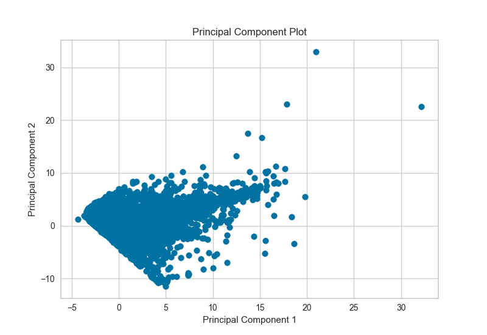
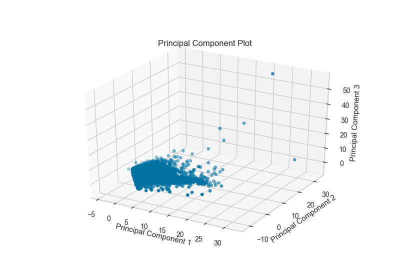

.. -*- mode: rst -*-

PCA Projection
==============

The PCA Decomposition visualizer utilizes principle component analysis to decompose high dimensional data into two or three dimensions so that each instance can be plotted in a scatter plot. The use of PCA means that the projected dataset can be analyzed along axes of principle variation and can be interpreted to determine if spherical distance metrics can be utilized.

.. code:: python

    # Load the classification data set
    data = load_data('credit')

    # Specify the features of interest
    features = [
        'limit', 'sex', 'edu', 'married', 'age', 'apr_delay', 'may_delay',
        'jun_delay', 'jul_delay', 'aug_delay', 'sep_delay', 'apr_bill', 'may_bill',
        'jun_bill', 'jul_bill', 'aug_bill', 'sep_bill', 'apr_pay', 'may_pay', 'jun_pay',
        'jul_pay', 'aug_pay', 'sep_pay',
    ]

    # Extract the numpy arrays from the data frame
    X = data[features].as_matrix()
    y = data.default.as_matrix()

.. code:: python

    visualizer = PCADecomposition(scale=True, center=False, col=y)
    visualizer.fit_transform(X,y)
    visualizer.poof()

The PCA projection can also be plotted in three dimensions to attempt to visualize more princple components and get a better sense of the distribution in high dimensions.

.. code:: python

    visualizer = PCADecomposition(scale=True, center=False, col=y, proj_dim=3)
    visualizer.fit_transform(X,y)
    visualizer.poof()

API Reference
-------------

.. automodule:: yellowbrick.features.pca
    :members: PCADecomposition
    :undoc-members:
    :show-inheritance:
