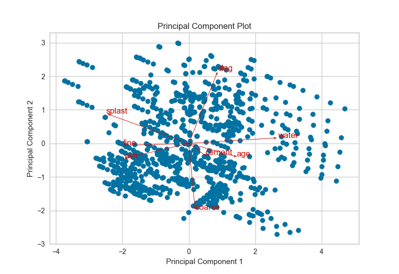
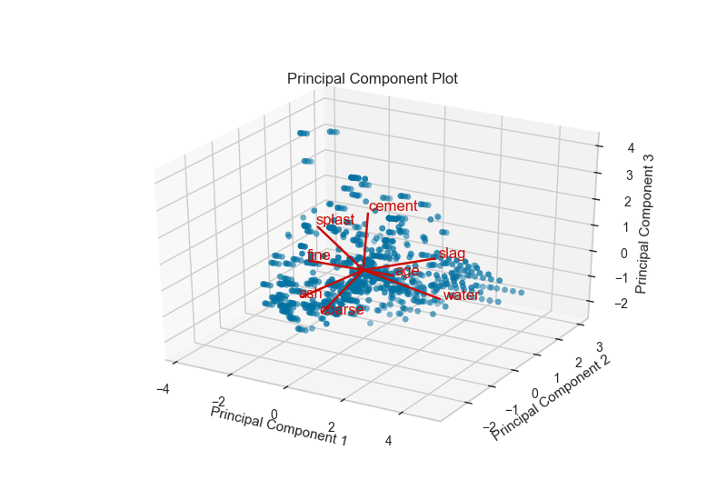

.. -*- mode: rst -*-

PCA Projection
==============

The PCA Decomposition visualizer utilizes principal component analysis to decompose high dimensional data into two or three dimensions so that each instance can be plotted in a scatter plot. The use of PCA means that the projected dataset can be analyzed along axes of principal variation and can be interpreted to determine if spherical distance metrics can be utilized.

.. code:: python

    # Load the classification data set
    data = load_data('credit')

    # Specify the features of interest and the target
    target = "default"
    features = [col for col in data.columns if col != target]

    # Extract the instance data and the target
    X = data[features]
    y = data[target]

    # Create a list of colors to assign to points in the plot
    colors = np.array(['r' if yi else 'b' for yi in y])

.. code:: python

    from yellowbrick.features.pca import PCADecomposition

    visualizer = PCADecomposition(scale=True, color=colors)
    visualizer.fit_transform(X, y)
    visualizer.poof()

.. image:: images/pca_projection_2d.png

The PCA projection can also be plotted in three dimensions to attempt to visualize more principal components and get a better sense of the distribution in high dimensions.

.. code:: python

    visualizer = PCADecomposition(scale=True, color=colors, proj_dim=3)
    visualizer.fit_transform(X, y)
    visualizer.poof()

.. image:: images/pca_projection_3d.png

Biplot
------

The PCA projection can be enhanced to a biplot whose points are the projected instances and whose vectors represent the structure of the data in high dimensional space. By using the ``proj_features=True`` flag, vectors for each feature in the dataset are drawn on the scatter plot in the direction of the maximum variance for that feature. These structures can be used to analyze the importance of a feature to the decomposition or to find features of related variance for further analysis.

.. code:: python

    # Load the classification data set
    data = load_data('concrete')

    # Specify the features of interest and the target
    target = "strength"
    features = [
        'cement', 'slag', 'ash', 'water', 'splast', 'coarse', 'fine', 'age'
    ]

    # Extract the instance data and the target
    X = data[features]
    y = data[target]

.. code:: python

    visualizer = PCADecomposition(scale=True, proj_features=True)
    visualizer.fit_transform(X, y)
    visualizer.poof()

.. code:: python

    visualizer = PCADecomposition(scale=True, proj_features=True, proj_dim=3)
    visualizer.fit_transform(X, y)
    visualizer.poof()

API Reference
-------------

.. automodule:: yellowbrick.features.pca
    :members: PCADecomposition
    :undoc-members:
    :show-inheritance:
