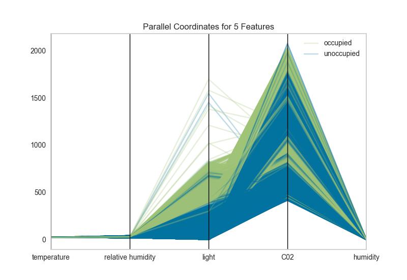
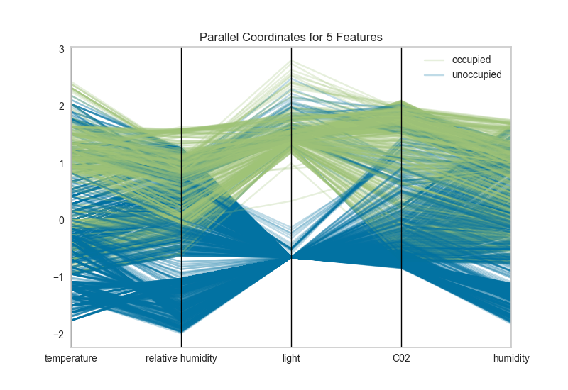

.. -*- mode: rst -*-

Parallel Coordinates
====================

Parallel coordinates displays each feature as a vertical axis spaced
evenly along the horizontal, and each instance as a line drawn between
each individual axis. This allows many dimensions; in fact given
infinite horizontal space (e.g. a scrollbar), an infinite number of
dimensions can be displayed!

Data scientists use this method to detect clusters of instances that
have similar classes, and to note features that have high variance or
different distributions.

.. code:: python

    # Load the classification data set
    data = load_data('occupancy')

    # Specify the features of interest and the classes of the target
    features = ["temperature", "relative humidity", "light", "C02", "humidity"]
    classes = ['unoccupied', 'occupied']

    # Extract the numpy arrays from the data frame
    X = data[features].as_matrix()
    y = data.occupancy.as_matrix()

.. code:: python

    # Instantiate the visualizer
    visualizer = ParallelCoordinates(classes=classes, features=features)

    visualizer.fit(X, y)      # Fit the data to the visualizer
    visualizer.transform(X)   # Transform the data
    visualizer.poof()         # Draw/show/poof the data

Parallel coordinates can take a long time to draw since each instance is represented by a line for each feature. Worse, this time is not well spent since a lot of overlap in the visualization makes the parallel coordinates less understandable. To fix this, pass the ``sample`` keyword argument to the visualizer with a percentage to randomly sample from the dataset.

Additionally the domain of each feature may make the visualization hard to interpret. In the above visualization, the domain of the ``light`` feature is from in ``[0, 1600]``, far larger than the range of temperature in ``[50, 96]``. A normalization methodology can be applied to change the range of features to ``[0,1]``. Try using ``minmax``, ``minabs``, ``standard``, ``l1``, or ``l2`` normalization to change perspectives in the parallel coordinates:

.. code:: python

    # Instantiate the visualizer
    visualizer = ParallelCoordinates(
        classes=classes, features=features,
        normalize='standard', sample=0.1,
    )

    visualizer.fit(X, y)      # Fit the data to the visualizer
    visualizer.transform(X)   # Transform the data
    visualizer.poof()         # Draw/show/poof the data

API Reference
-------------

.. automodule:: yellowbrick.features.pcoords
    :members: ParallelCoordinates
    :undoc-members:
    :show-inheritance:
