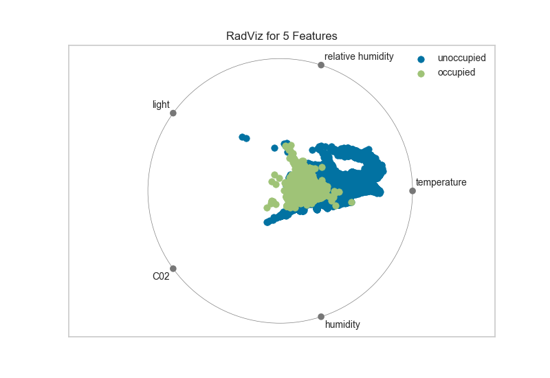

.. -*- mode: rst -*-

RadViz Visualizer
=================

RadViz is a multivariate data visualization algorithm that plots each
feature dimension uniformly around the circumference of a circle then
plots points on the interior of the circle such that the point
normalizes its values on the axes from the center to each arc. This
mechanism allows as many dimensions as will easily fit on a circle,
greatly expanding the dimensionality of the visualization.

Data scientists use this method to detect separability between classes.
E.g. is there an opportunity to learn from the feature set or is there
just too much noise?

If your data contains rows with missing values (numpy.nan), those missing
values will not be plotted. In other words, you may not get the entire
picture of your data. RadViz will raise a DataWarning to inform you of the
percent missing.

If you do receive this warning, you may want to look at imputation strategies.
A good starting place is `scikit-learn Imputer. <http://scikit-learn.org/stable/modules/generated/sklearn.preprocessing.Imputer.html>`_

.. code:: python

    # Load the classification data set
    data = load_data('occupancy')

    # Specify the features of interest and the classes of the target
    features = ["temperature", "relative humidity", "light", "C02", "humidity"]
    classes = ['unoccupied', 'occupied']

    # Extract the numpy arrays from the data frame
    X = data[features].as_matrix()
    y = data.occupancy.as_matrix()

.. code:: python

    # Import the visualizer
    from yellowbrick.features import RadViz

    # Instantiate the visualizer
    visualizer = RadViz(classes=classes, features=features)

    visualizer.fit(X, y)      # Fit the data to the visualizer
    visualizer.transform(X)   # Transform the data
    visualizer.poof()         # Draw/show/poof the data

For regression, the RadViz visualizer should use a color sequence to
display the target information, as opposed to discrete colors.

API Reference
-------------

.. automodule:: yellowbrick.features.radviz
    :members: RadialVisualizer, RadViz
    :undoc-members:
    :show-inheritance:
