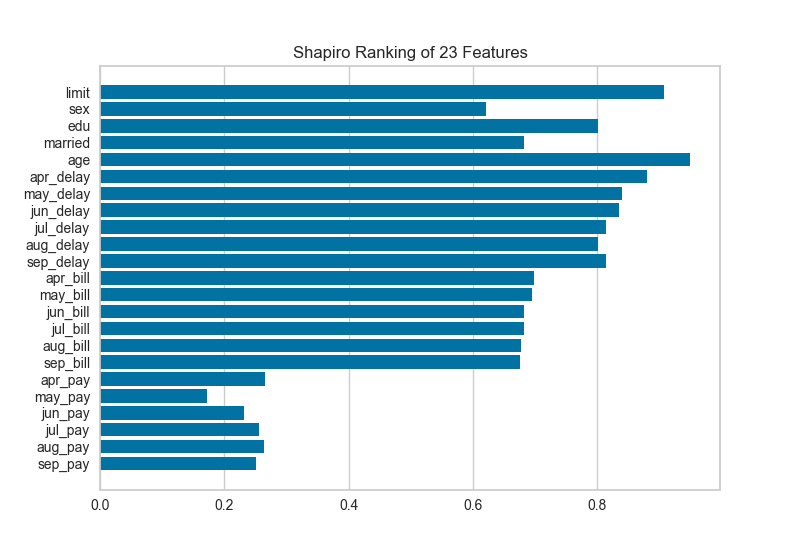
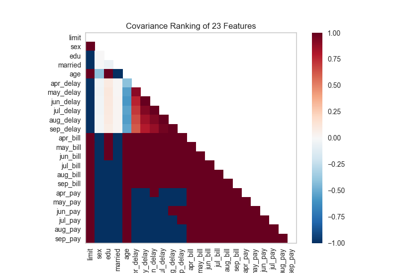
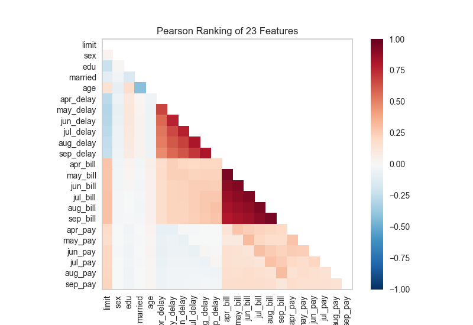

.. -*- mode: rst -*-

Rank Features
=============

Rank1D and Rank2D evaluate single features or pairs of features using a variety of metrics that score the features on the scale [-1, 1] or [0, 1] allowing them to be ranked. A similar concept to SPLOMs, the scores are visualized on a lower-left triangle heatmap so that patterns between pairs of features can be easily discerned for downstream analysis.

In this example, we'll use the credit default data set from the UCI Machine Learning repository to rank features. The code below creates our instance matrix and target vector.

.. code:: python

    # Load the dataset
    data = load_data('credit')

    # Specify the features of interest
    features = [
            'limit', 'sex', 'edu', 'married', 'age', 'apr_delay', 'may_delay',
            'jun_delay', 'jul_delay', 'aug_delay', 'sep_delay', 'apr_bill', 'may_bill',
            'jun_bill', 'jul_bill', 'aug_bill', 'sep_bill', 'apr_pay', 'may_pay', 'jun_pay',
            'jul_pay', 'aug_pay', 'sep_pay',
        ]

    # Extract the numpy arrays from the data frame
    X = data[features].as_matrix()
    y = data.default.as_matrix()

Rank 1D
-------

A one dimensional ranking of features utilizes a ranking algorithm that takes into account only a single feature at a time (e.g. histogram analysis). By default we utilize the Shapiro-Wilk algorithm to assess the normality of the distribution of instances with respect to the feature. A barplot is then drawn showing the relative ranks of each feature.

.. code:: python

    # Instantiate the 1D visualizer with the Sharpiro ranking algorithm
    visualizer = Rank1D(features=features, algorithm='shapiro')

    visualizer.fit(X, y)                # Fit the data to the visualizer
    visualizer.transform(X)             # Transform the data
    visualizer.poof()                   # Draw/show/poof the data

Rank 2D
-------

A two dimensional ranking of features utilizes a ranking algorithm that takes into account pairs of features at a time (e.g. joint plot analysis). The pairs of features are then ranked by score and visualized using the lower left triangle of a feature co-occurence matrix.

The default ranking algorithm is covariance, which attempts to compute the mean value of the product of deviations of variates from their respective means. Covariance loosely attempts to detect a colinear relationship between features.

.. code:: python

    # Instantiate the visualizer with the Covariance ranking algorithm
    visualizer = Rank2D(features=features, algorithm='covariance')

    visualizer.fit(X, y)                # Fit the data to the visualizer
    visualizer.transform(X)             # Transform the data
    visualizer.poof()                   # Draw/show/poof the data

Alternatively we can utilize a linear correlation algorithm such as a Pearson score to similarly detect colinear relationships. Compare the output from Pearson below to the covariance ranking above.

.. code:: python

    # Instantiate the visualizer with the Pearson ranking algorithm
    visualizer = Rank2D(features=features, algorithm='pearson')

    visualizer.fit(X, y)                # Fit the data to the visualizer
    visualizer.transform(X)             # Transform the data
    visualizer.poof()                   # Draw/show/poof the data

API Reference
-------------

.. automodule:: yellowbrick.features.rankd
    :members: Rank1D, Rank2D
    :undoc-members:
    :show-inheritance:
