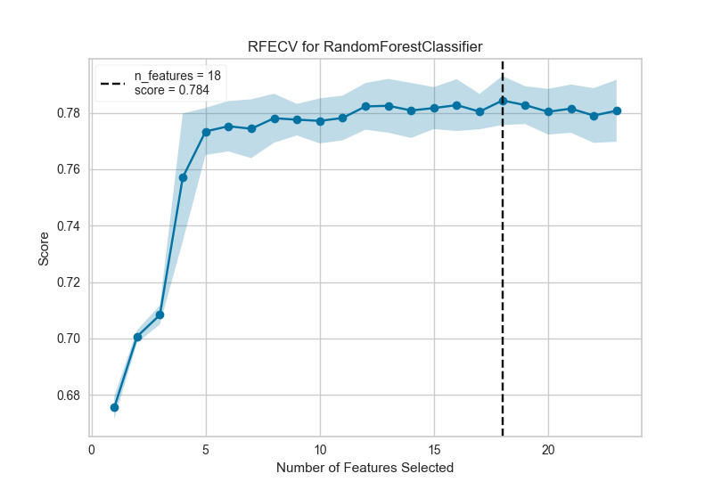

.. -*- mode: rst -*-

Recursive Feature Elimination
=============================

Recursive feature elimination (RFE) is a feature selection method that fits a model and removes the weakest feature (or features) until the specified number of features is reached. Features are ranked by the model's ``coef_`` or ``feature_importances_`` attributes, and by recursively eliminating a small number of features per loop, RFE attempts to eliminate dependencies and collinearity that may exist in the model.

RFE requires a specified number of features to keep, however it is often not known in advance how many features are valid. To find the optimal number of features cross-validation is used with RFE to score different feature subsets and select the best scoring collection of features. The ``RFECV`` visualizer plots the number of features in the model along with their cross-validated test score and variability and visualizes the selected number of features.

To show how this works in practice, we'll start with a contrived example using a dataset that has only 3 informative features out of 25.

.. code:: python

    from sklearn.svm import SVC
    from sklearn.datasets import make_classification

    from yellowbrick.features import RFECV

    # Create a dataset with only 3 informative features
    X, y = make_classification(
        n_samples=1000, n_features=25, n_informative=3, n_redundant=2,
        n_repeated=0, n_classes=8, n_clusters_per_class=1, random_state=0
    )

    # Create RFECV visualizer with linear SVM classifier
    viz = RFECV(SVC(kernel='linear', C=1))
    viz.fit(X, y)
    viz.poof()

.. image:: images/rfecv_sklearn_example.png

This figure shows an ideal RFECV curve, the curve jumps to an excellent accuracy when the three informative features are captured, then gradually decreases in accuracy as the non informative features are added into the model. The shaded area represents the variability of cross-validation, one standard deviation above and below the mean accuracy score drawn by the curve.

Exploring a real dataset, we can see the impact of RFECV on a credit default binary classifier.

.. code:: python

    from sklearn.ensemble import RandomForestClassifier
    from sklearn.model_selection import StratifiedKFold

    df = load_data('credit')

    target = 'default'
    features = [col for col in data.columns if col != target]

    X = data[features]
    y = data[target]

    cv = StratifiedKFold(5)
    oz = RFECV(RandomForestClassifier(), cv=cv, scoring='f1_weighted')

    oz.fit(X, y)
    oz.poof()

In this example we can see that 19 features were selected, though there doesn't appear to be much improvement in the f1 score of the model after around 5 features. Selection of the features to eliminate plays a large role in determining the outcome of each recursion; modifying the ``step`` parameter to eliminate more than one feature at each step may help to eliminate the worst features early, strengthening the remaining features (and can also be used to speed up feature elimination for datasets with a large number of features).

.. seealso:: This visualizer is is based off of the visualization in the scikit-learn documentation: `recursive feature elimination with cross-validation <http://scikit-learn.org/stable/auto_examples/feature_selection/plot_rfe_with_cross_validation.html>`_. However, the Yellowbrick version does not use ``sklearn.feature_selection.RFECV`` but instead wraps ``sklearn.feature_selection.RFE`` models. The fitted model can be accessed on the visualizer using the ``viz.rfe_estimator_`` attribute, and in fact the visualizer acts as the fitted model when using ``predict()`` or ``score()``.

API Reference
-------------

.. automodule:: yellowbrick.features.rfecv
    :members: RFECV
    :undoc-members:
    :show-inheritance:
