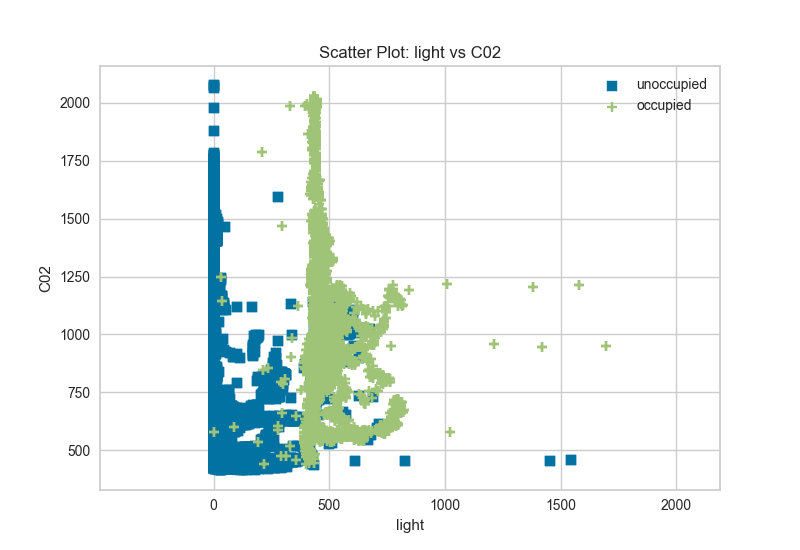
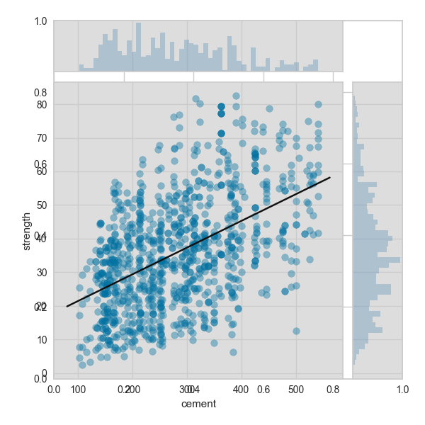
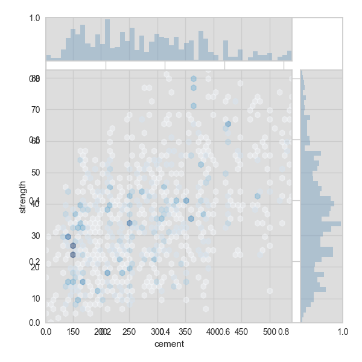

.. -*- mode: rst -*-

Direct Data Visualization
=========================

Sometimes for feature analysis you simply need a scatter plot to determine the distribution of data. Machine learning operates on high dimensional data, so the number of dimensions has to be filtered. As a result these visualizations are typically used as the base for larger visualizers; however you can also use them to quickly plot data during ML analysis.

Scatter Visualization
---------------------

A scatter visualizer simply plots two features against each other and colors the points according to the target. This can be useful in assessing the relationship of pairs of features to an individual target.

.. code:: python

    # Load the classification data set
    data = load_data('occupancy')

    # Specify the features of interest and the classes of the target
    features = ["temperature", "relative humidity", "light", "C02", "humidity"]
    classes = ['unoccupied', 'occupied']

    # Extract the numpy arrays from the data frame
    X = data[features]
    y = data.occupancy

.. code:: python

    from yellowbrick.features import ScatterVisualizer

    visualizer = ScatterVisualizer(x='light', y='C02', classes=classes)

    visualizer.fit(X, y)
    visualizer.transform(X)
    visualizer.poof()

Joint Plot Visualization
------------------------

A joint plot visualizer plots a feature against the target and shows the distribution of each via a histogram on each axis.

.. code:: python

    # Load the data
    df = load_data('concrete')
    feature = 'cement'
    target = 'strength'

    # Get the X and y data from the DataFrame
    X = df[feature]
    y = df[target]

.. code:: python

    visualizer = JointPlotVisualizer(feature=feature, target=target)

    visualizer.fit(X, y)
    visualizer.poof()

The joint plot visualizer can also be plotted with hexbins in the case of many, many points.

.. code:: python

    visualizer = JointPlotVisualizer(
        feature=feature, target=target, joint_plot='hex'
    )

    visualizer.fit(X, y)
    visualizer.poof()

API Reference
-------------

.. automodule:: yellowbrick.features.scatter
    :members: ScatterVisualizer
    :undoc-members:
    :show-inheritance:

.. automodule:: yellowbrick.features.jointplot
    :members: JointPlotVisualizer
    :undoc-members:
    :show-inheritance:
