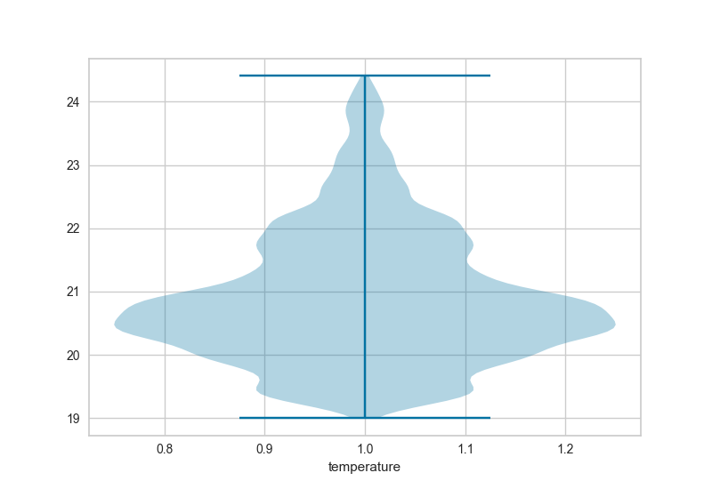
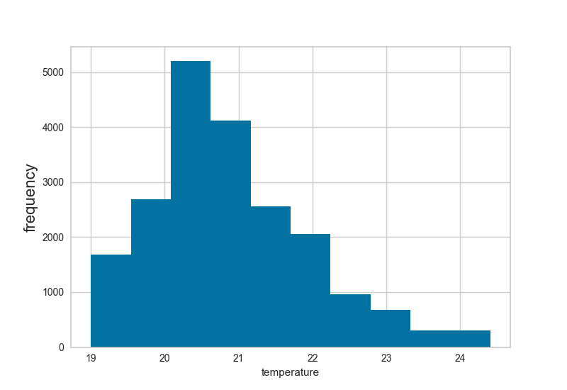
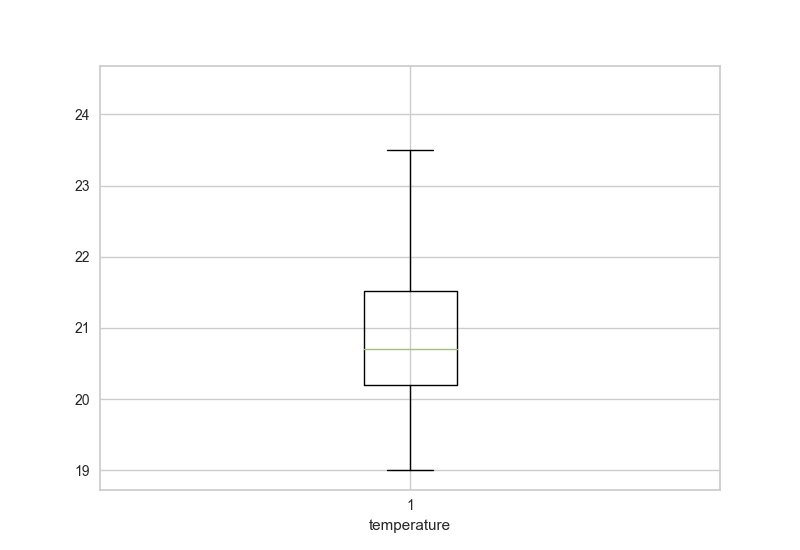

.. -*- mode: rst -*-

RadViz Visualizer
=================

``SingleFeatureViz`` is a single variable data visualizer that plots
the distribution of a single variable in a given sample. It allows
for the isolation and analysis of single features in a large dataset.

``SingleFeatureViz`` offers three visualization types: a violin plot:

a histogram:

and a boxplot:

The index of the single feature to be analyzed may be specified
as either an integer or a string. However, what the visualizer
requires does depend on your data type; ``Pandas`` ``DataFrame``
objects must have ``idx`` set to a string value (the name of the
column), and ``Numpy`` arrays must have an integer ``idx``, unless
a ``features`` array of ``str`` column names are specified.

.. plot::
    :context: close-figs
    :alt: SingleFeatureViz on the Occupancy Dataset

    from yellowbrick.datasets import load_occupancy
    from yellowbrick.features import SingleFeatureViz

    # Load the classification dataset
    X, y = load_occupancy()

    # Specify the target features
    features = ["temperature", "relative humidity", "light", "C02", "humidity"]

    # Instantiate the visualizer
    visualizer = SingleFeatureViz(idx="temperature",
                                  features=features)

    visualizer.fit(X, y)           # Fit the data to the visualizer
    visualizer.poof()              # Draw/show/poof the data

API Reference
-------------

.. automodule:: yellowbrick.features.singlefeatureviz
    :members: SingleFeatureViz
    :undoc-members:
    :show-inheritance:
