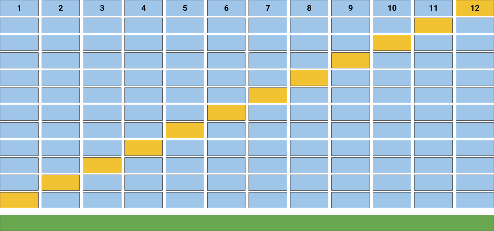

.. -*- mode: rst -*-

Cross Validation Scores
=======================

=================   =====================
 Visualizer          :class:`~yellowbrick.model_selection.cross_validation.CVScores`
 Quick Method        :func:`~yellowbrick.model_selection.cross_validation.cv_scores`
 Models               Classification, Regression
 Workflow             Model Selection
=================   =====================

Generally we determine whether a given model is optimal by looking at it's F1, precision, recall, and accuracy (for classification), or it's coefficient of determination (R2) and error (for regression). However, real world data is often distributed somewhat unevenly, meaning that the fitted model is likely to perform better on some sections of the data than on others. Yellowbrick's ``CVScores`` visualizer enables us to visually explore these variations in performance using different cross validation strategies.

Cross Validation
----------------

Cross-validation starts by shuffling the data (to prevent any unintentional ordering errors) and splitting it into `k` folds. Then `k` models are fit on :math:`\frac{k-1} {k}` of the data (called the training split) and evaluated on :math:`\frac {1} {k}` of the data (called the test split). The results from each evaluation are averaged together for a final score, then the final model is fit on the entire dataset for operationalization.

In Yellowbrick, the ``CVScores`` visualizer displays cross-validated scores as a bar chart (one bar for each fold) with the average score across all folds plotted as a horizontal dotted line.

Classification
--------------

In the following example, we show how to visualize cross-validated scores for a classification model. After loading our occupancy data as a ``DataFrame``, we created a ``StratifiedKFold`` cross-validation strategy to ensure all of our classes in each split are represented with the same proportion. We then fit the ``CVScores`` visualizer using the ``f1_weighted`` scoring metric as opposed to the default metric, accuracy, to get a better sense of the relationship of precision and recall in our classifier across all of our folds.

.. plot::
    :context: close-figs
    :alt: Cross validation on the occupancy data set using StratifiedKFold

    from sklearn.model_selection import StratifiedKFold
    from sklearn.naive_bayes import MultinomialNB

    from yellowbrick.datasets import load_occupancy
    from yellowbrick.model_selection import CVScores

    # Load the classification dataset
    X, y = load_occupancy()

    # Create a cross-validation strategy
    cv = StratifiedKFold(n_splits=12, random_state=42)

    # Instantiate the classification model and visualizer
    model = MultinomialNB()
    visualizer = CVScores(model, cv=cv, scoring='f1_weighted')

    visualizer.fit(X, y)        # Fit the data to the visualizer
    visualizer.show()           # Finalize and render the figure

Our resulting visualization shows that while our average cross-validation score is quite high, there are some splits for which our fitted ``MultinomialNB`` classifier performs significantly less well.

Regression
----------

In this next example we show how to visualize cross-validated scores for a regression model. After loading our energy data as a ``DataFrame``, we instantiated a simple ``KFold`` cross-validation strategy. We then fit the ``CVScores`` visualizer using the ``r2`` scoring metric, to get a sense of the coefficient of determination for our regressor across all of our folds.

.. plot::
    :context: close-figs
    :alt: Cross validation on the energy data set using KFold

    from sklearn.linear_model import Ridge
    from sklearn.model_selection import KFold

    from yellowbrick.datasets import load_energy
    from yellowbrick.model_selection import CVScores

    # Load the regression dataset
    X, y = load_energy()

    # Instantiate the regression model and visualizer
    cv = KFold(n_splits=12, random_state=42)

    model = Ridge()
    visualizer = CVScores(model, cv=cv, scoring='r2')

    visualizer.fit(X, y)        # Fit the data to the visualizer
    visualizer.show()           # Finalize and render the figure

As with our classification ``CVScores`` visualization, our regression visualization suggests that our ``Ridge`` regressor performs very well (e.g. produces a high coefficient of determination) across nearly every fold, resulting in another fairly high overall R2 score.

Quick Method
------------

 The same functionality above can be achieved with the associated quick method ``cv_scores``. This method will build the ``CVScores`` object with the associated arguments, fit it, then (optionally) immediately show the visualization.

.. plot::
    :context: close-figs
    :alt: Cross validation on the energy data set using KFold

    from sklearn.linear_model import Ridge
    from sklearn.model_selection import KFold

    from yellowbrick.datasets import load_energy
    from yellowbrick.model_selection import cv_scores

    # Load the regression dataset
    X, y = load_energy()

    # Instantiate the regression model and visualizer
    cv = KFold(n_splits=12, random_state=42)

    model = Ridge()
    visualizer = cv_scores(model, X, y, cv=cv, scoring='r2')

API Reference
-------------

.. automodule:: yellowbrick.model_selection.cross_validation
    :members: CVScores, cv_scores
    :undoc-members:
    :show-inheritance:
