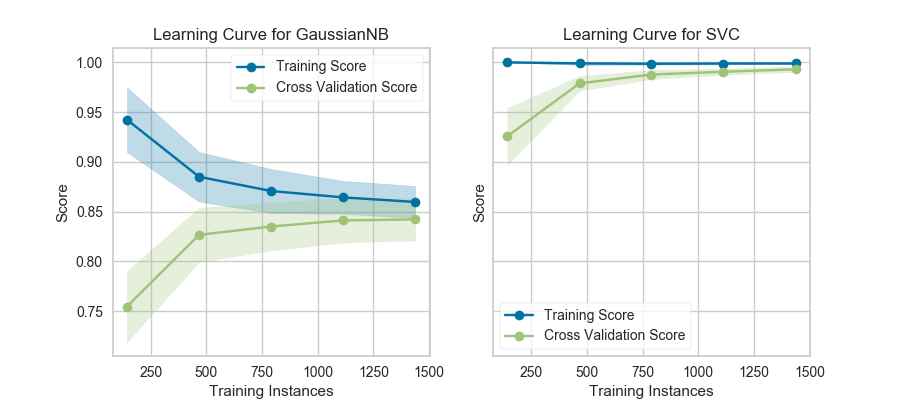

.. -*- mode: rst -*-

Learning Curve
==============

=================   =====================
 Visualizer           :class:`~yellowbrick.model_selection.learning_curve.LearningCurve`
 Quick Method         :func:`~yellowbrick.model_selection.learning_curve.learning_curve`
 Models               Classification, Regression, Clustering
 Workflow             Model Selection
=================   =====================

A learning curve shows the relationship of the training score versus the cross validated test score for an estimator with a varying number of training samples. This visualization is typically used to show two things:

1. How much the estimator benefits from more data (e.g. do we have "enough data" or will the estimator get better if used in an online fashion).
2. If the estimator is more sensitive to error due to variance vs. error due to bias.

Consider the following learning curves (generated with Yellowbrick, but from `Plotting Learning Curves <http://scikit-learn.org/stable/auto_examples/model_selection/plot_learning_curve.html>`_ in the scikit-learn documentation):

If the training and cross-validation scores converge together as more data is added (shown in the left figure), then the model will probably not benefit from more data. If the training score is much greater than the validation score then the model probably requires more training examples in order to generalize more effectively.

The curves are plotted with the mean scores, however variability during cross-validation is shown with the shaded areas that represent a standard deviation above and below the mean for all cross-validations. If the model suffers from error due to bias, then there will likely be more variability around the training score curve. If the model suffers from error due to variance, then there will be more variability around the cross validated score.

.. note:: Learning curves can be generated for all estimators that have ``fit()`` and ``predict()`` methods as well as a single scoring metric. This includes classifiers, regressors, and clustering as we will see in the following examples.

Classification
--------------

In the following example, we show how to visualize the learning curve of a classification model. After loading a ``DataFrame`` and performing categorical encoding, we create a ``StratifiedKFold`` cross-validation strategy to ensure all of our classes in each split are represented with the same proportion. We then fit the visualizer using the ``f1_weighted`` scoring metric as opposed to the default metric, accuracy, to get a better sense of the relationship of precision and recall in our classifier.

.. plot::
    :context: close-figs
    :alt: Learning Curve on the Game dataset using StratifiedKFold

    import numpy as np

    from sklearn.model_selection import StratifiedKFold
    from sklearn.naive_bayes import MultinomialNB
    from sklearn.preprocessing import OneHotEncoder, LabelEncoder

    from yellowbrick.datasets import load_game
    from yellowbrick.model_selection import LearningCurve

    # Load a classification dataset
    X, y = load_game()

    # Encode the categorical data
    X = OneHotEncoder().fit_transform(X)
    y = LabelEncoder().fit_transform(y)

    # Create the learning curve visualizer
    cv = StratifiedKFold(n_splits=12)
    sizes = np.linspace(0.3, 1.0, 10)

    # Instantiate the classification model and visualizer
    model = MultinomialNB()
    visualizer = LearningCurve(
        model, cv=cv, scoring='f1_weighted', train_sizes=sizes, n_jobs=4
    )

    visualizer.fit(X, y)        # Fit the data to the visualizer
    visualizer.show()           # Finalize and render the figure

This learning curve shows high test variability and a low score up to around 30,000 instances, however after this level the model begins to converge on an F1 score of around 0.6. We can see that the training and test scores have not yet converged, so potentially this model would benefit from more training data. Finally, this model suffers primarily from error due to variance (the CV scores for the test data are more variable than for training data) so it is possible that the model is overfitting.

Regression
----------

Building a learning curve for a regression is straight forward and very similar. In the below example, after loading our data and selecting our target, we explore the learning curve score according to the coefficient of determination or R2 score.

.. plot::
    :context: close-figs
    :alt: Learning Curve on the Energy dataset using RidgeCV

    from sklearn.linear_model import RidgeCV

    from yellowbrick.datasets import load_energy
    from yellowbrick.model_selection import LearningCurve

    # Load a regression dataset
    X, y = load_energy()

    # Instantiate the regression model and visualizer
    model = RidgeCV()
    visualizer = LearningCurve(model, scoring='r2')

    visualizer.fit(X, y)        # Fit the data to the visualizer
    visualizer.show()           # Finalize and render the figure

This learning curve shows a very high variability and much lower score until about 350 instances. It is clear that this model could benefit from more data because it is converging at a very high score. Potentially, with more data and a larger alpha for regularization, this model would become far less variable in the test data.

Clustering
----------

Learning curves also work for clustering models and can use metrics that specify the shape or organization of clusters such as silhouette scores or density scores. If the membership is known in advance, then rand scores can be used to compare clustering performance as shown below:

.. plot::
    :context: close-figs
    :alt: Learning Curve on clustering models

    from sklearn.cluster import KMeans
    from sklearn.datasets import make_blobs

    from yellowbrick.model_selection import LearningCurve

    # Generate synthetic dataset with 5 random clusters
    X, y = make_blobs(n_samples=1000, centers=5, random_state=42)

    # Instantiate the clustering model and visualizer
    model = KMeans()
    visualizer = LearningCurve(model, scoring="adjusted_rand_score", random_state=42)

    visualizer.fit(X, y)        # Fit the data to the visualizer
    visualizer.show()           # Finalize and render the figure

Unfortunately, with random data these curves are highly variable, but serve to point out some clustering-specific items. First, note the y-axis is very narrow, roughly speaking these curves are converged and actually the clustering algorithm is performing very well. Second, for clustering, convergence for data points is not necessarily a bad thing; in fact we want to ensure as more data is added, the training and cross-validation scores do not diverge.

Quick Method
------------
The same functionality can be achieved with the associated quick method ``learning_curve``. This method will build the ``LearningCurve`` object with the associated arguments, fit it, then (optionally) immediately show the visualization.

.. plot::
    :context: close-figs
    :alt: Learning Curve Quick Method on the Energy dataset using RidgeCV

    from sklearn.linear_model import RidgeCV

    from yellowbrick.datasets import load_energy
    from yellowbrick.model_selection import learning_curve

    # Load a regression dataset
    X, y = load_energy()

    learning_curve(RidgeCV(), X, y, scoring='r2')

.. seealso::
    This visualizer is based on the validation curve described in the scikit-learn documentation: `Learning Curves <http://scikit-learn.org/stable/modules/learning_curve.html#learning-curve>`_. The visualizer wraps the `learning_curve <http://scikit-learn.org/stable/modules/generated/sklearn.model_selection.learning_curve.html#sklearn.model_selection.learning_curve>`_ function and most of the arguments are passed directly to it.

API Reference
-------------

.. automodule:: yellowbrick.model_selection.learning_curve
    :members: LearningCurve, learning_curve
    :undoc-members:
    :show-inheritance:
