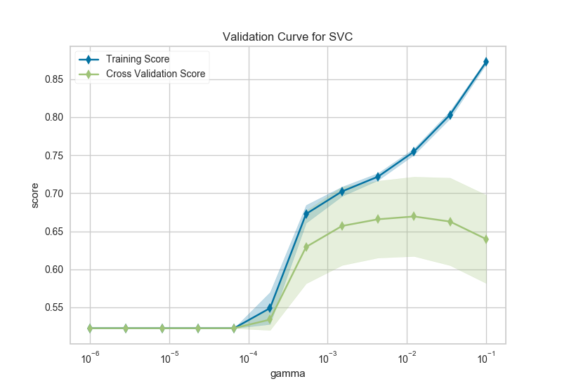
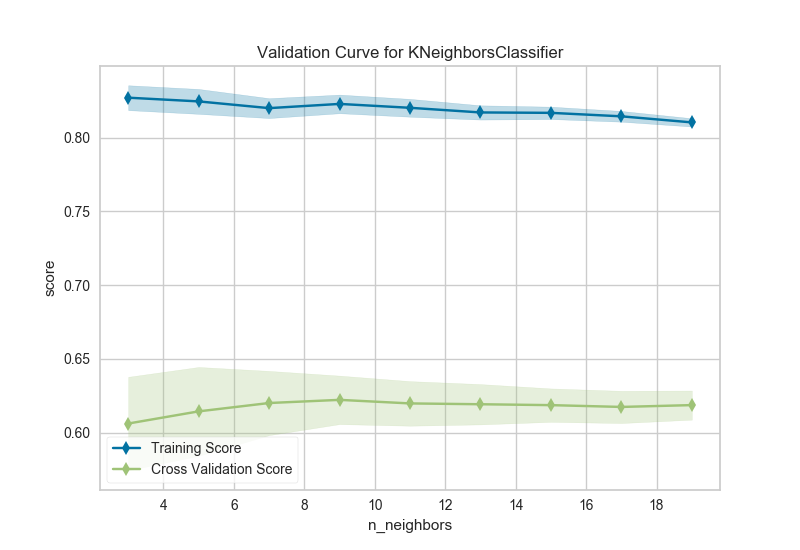

.. -*- mode: rst -*-

Validation Curve
================

Model validation is used to determine how effective an estimator is on data that it has been trained on as well as how generalizable it is to new input. To measure a model's performance we first split the dataset into training and test splits, fitting the model on the training data and scoring it on the reserved test data.

In order to maximize the score, the hyperparameters of the model must be selected which best allow the model to operate in the specified feature space. Most models have multiple hyperparameters and the best way to choose a combination of those parameters is with a grid search. However, it is sometimes useful to plot the influence of a single hyperparameter on the training and test data to determine if the estimator is underfitting or overfitting for some hyperparameter values.

=================   ==============================
Visualizer           :class:`~yellowbrick.model_selection.validation_curve.ValidationCurve`
Quick Method         :func:`~yellowbrick.model_selection.validation_curve.validation_curve`
Models               Classification and Regression
Workflow             Model Selection
=================   ==============================

In our first example, we'll explore using the ``ValidationCurve`` visualizer with a regression dataset and in the second, a classification dataset. Note that any estimator that implements ``fit()`` and ``predict()`` and has an appropriate scoring mechanism can be used with this visualizer.

.. plot::
    :context: close-figs
    :alt: Validation Curve for Max Depth of Decision Tree regressor

    import numpy as np

    from yellowbrick.datasets import load_energy
    from yellowbrick.model_selection import ValidationCurve

    from sklearn.tree import DecisionTreeRegressor

    # Load a regression dataset
    X, y = load_energy()

    viz = ValidationCurve(
        DecisionTreeRegressor(), param_name="max_depth",
        param_range=np.arange(1, 11), cv=10, scoring="r2"
    )

    # Fit and show the visualizer
    viz.fit(X, y)
    viz.show()

After loading and wrangling the data, we initialize the ``ValidationCurve`` with a ``DecisionTreeRegressor``. Decision trees become more overfit the deeper they are because at each level of the tree the partitions are dealing with a smaller subset of data. One way to deal with this overfitting process is to limit the depth of the tree. The validation curve explores the relationship of the ``"max_depth"`` parameter to the R2 score with 10 shuffle split cross-validation. The ``param_range`` argument specifies the values of ``max_depth``, here from 1 to 10 inclusive.

We can see in the resulting visualization that a depth limit of less than 5 levels severely underfits the model on this data set because the training score and testing score climb together in this parameter range, and because of the high variability of cross validation on the test scores. After a depth of 7, the training and test scores diverge, this is because deeper trees are beginning to overfit the training data, providing no generalizability to the model. However, because the cross validation score does not necessarily decrease, the model is not suffering from high error due to variance.

In the next visualizer, we will see an example that more dramatically visualizes the bias/variance tradeoff.

.. note to contributors: the below code takes a long time to run so has not been
   modified with a plot directive. See validation_curve.py to regenerate images.

.. code:: python

    from sklearn.svm import SVC
    from sklearn.preprocessing import OneHotEncoder
    from sklearn.model_selection import StratifiedKFold

    # Load a classification data set
    X, y = load_game()

    # Encode the categorical data with one-hot encoding
    X = OneHotEncoder().fit_transform(X)

    # Create the validation curve visualizer
    cv = StratifiedKFold(12)
    param_range = np.logspace(-6, -1, 12)

    viz = ValidationCurve(
        SVC(), param_name="gamma", param_range=param_range,
        logx=True, cv=cv, scoring="f1_weighted", n_jobs=8,
    )

    viz.fit(X, y)
    viz.show()

After loading data and one-hot encoding it using the Pandas ``get_dummies`` function, we create a stratified k-folds cross-validation strategy. The hyperparameter of interest is the gamma of a support vector classifier, the coefficient of the RBF kernel. Gamma controls how much influence a single example has, the larger gamma is, the tighter the support vector is around single points (overfitting the model).

In this visualization we see a definite inflection point around ``gamma=0.1``. At this point the training score climbs rapidly as the SVC memorizes the data, while the cross-validation score begins to decrease as the model cannot generalize to unseen data.

.. warning:: Note that running this and the next example may take a long time. Even with parallelism using n_jobs=8, it can take several hours to go through all the combinations. Reducing the parameter range and minimizing the amount of cross-validation can speed up the validation curve visualization.

Validation curves can be performance intensive since they are training ``n_params * n_splits`` models and scoring them. It is critically important to ensure that the specified hyperparameter range is correct, as we will see in the next example.

.. note to contributors: the below code takes a long time to run so has not been
   modified with a plot directive. See validation_curve.py to regenerate images.

.. code:: python

    from sklearn.neighbors import KNeighborsClassifier

    cv = StratifiedKFold(4)
    param_range = np.arange(3, 20, 2)

    oz = ValidationCurve(
        KNeighborsClassifier(), param_name="n_neighbors",
        param_range=param_range, cv=cv, scoring="f1_weighted", n_jobs=4,
    )

    # Using the same game dataset as in the SVC example
    oz.fit(X, y)
    oz.show()

The k nearest neighbors (kNN) model is commonly used when similarity is important to the interpretation of the model. Choosing k is difficult, the higher k is the more data is included in a classification, creating more complex decision topologies, whereas the lower k is, the simpler the model is and the less it may generalize. Using a validation curve seems like an excellent strategy for choosing k, and often it is. However in the example above, all we can see is a decreasing variability in the cross-validated scores.

This validation curve poses two possibilities: first, that we do not have the correct ``param_range`` to find the best k and need to expand our search to larger values. The second is that other hyperparameters (such as uniform or distance based weighting, or even the distance metric) may have more influence on the default model than k by itself does. Although validation curves can give us some intuition about the performance of a model to a single hyperparameter, grid search is required to understand the performance of a model with respect to multiple hyperparameters.

.. seealso::
    This visualizer is based on the validation curve described in the scikit-learn documentation: `Validation Curves <http://scikit-learn.org/stable/modules/learning_curve.html#validation-curve>`_. The visualizer wraps the `validation_curve <http://scikit-learn.org/stable/modules/generated/sklearn.model_selection.validation_curve.html#sklearn.model_selection.validation_curve>`_ function and most of the arguments are passed directly to it.

Quick Method
------------

Similar functionality as above can be achieved in one line using the associated quick method, ``validation_curve``. This method will instantiate and fit a ``ValidationCurve`` visualizer.

.. plot::
    :context: close-figs
    :alt: Validation Curve quickmethod for Max Depth of Decision Tree regressor

    import numpy as np

    from yellowbrick.datasets import load_energy
    from yellowbrick.model_selection import validation_curve

    from sklearn.tree import DecisionTreeRegressor

    # Load a regression dataset
    X, y = load_energy()

    viz = validation_curve(
        DecisionTreeRegressor(), X, y, param_name="max_depth",
        param_range=np.arange(1, 11), cv=10, scoring="r2",
    )

API Reference
-------------

.. automodule:: yellowbrick.model_selection.validation_curve
    :members: ValidationCurve, validation_curve
    :undoc-members:
    :show-inheritance:
