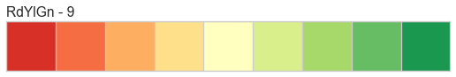
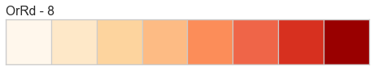
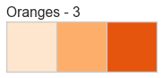
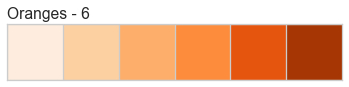
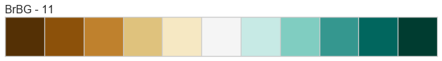

.. -*- mode: rst -*-

Colors and Style
================

Yellowbrick believes that visual diagnostics are more effective if visualizations are appealing. As a result, we have borrowed familiar styles from `Seaborn <http://seaborn.pydata.org/tutorial/aesthetics.html>`_ and use the new `Matplotlib 2.0 styles <https://matplotlib.org/users/colormaps.html>`_. We hope that these out of the box styles will make your visualizations publication ready, though of course you can customize your own look and feel by directly modifying the visualization with matplotlib.

Yellowbrick prioritizes color in its visualizations for most visualizers. There are two types of color sets that can be provided to a visualizer: a palette and a sequence. Palettes are discrete color values usually of a fixed length and are typically used for classification or clustering by showing each class, cluster or topic. Sequences are continuous color values that do not have a fixed length but rather a range and are typically used for regression or clustering, showing all possible values in the target or distances between items in clusters.

In order to make the distinction easy, most matplotlib colors (both palettes and sequences) can be referred to by name. A complete listing can be imported as follows:

.. code:: python

    import matplotlib.pyplot as plt
    from yellowbrick.style.palettes import PALETTES, SEQUENCES, color_palette

Palettes and sequences can be passed to visualizers as follows:

.. code:: python

    visualizer = Visualizer(color="bold")

Refer to the API listing of each visualizer for specifications about how each color argument is handled. In the next two sections we will show every possible color palette and sequence currently available in Yellowbrick.

Color Palettes
--------------

Color palettes are discrete color lists that have a fixed length. The most common palettes are ordered as "blue", "green", "red", "maroon", "yellow", "cyan", and an optional "key". This allows you to specify these named colors or by the first character, e.g. 'bgrmyck' for matplotlib visualizations.

To change the global color palette, use the `set_palette` function as follows:

.. code:: python

    from yellowbrick.style import set_palette
    set_palette('flatui')

Color palettes are most often used for classifiers to show the relationship between discrete class labels. They can also be used for clustering algorithms to show membership in discrete clusters.

A complete listing of the Yellowbrick color palettes can be visualized as follows:

.. code:: python

    # ['blue', 'green', 'red', 'maroon', 'yellow', 'cyan']
    for palette in PALETTES.keys():
        color_palette(palette).plot()
        plt.title(palette, loc='left')

.. image:: images/palettes/palettes_2_0.png

.. image:: images/palettes/palettes_2_1.png

.. image:: images/palettes/palettes_2_2.png

.. image:: images/palettes/palettes_2_5.png

.. image:: images/palettes/palettes_2_7.png

.. image:: images/palettes/palettes_2_8.png

.. image:: images/palettes/palettes_2_9.png

.. image:: images/palettes/palettes_2_11.png

.. image:: images/palettes/palettes_2_12.png

Color Sequences
---------------

Color sequences are continuous representations of color and are usually defined as a fixed number of steps between a minimum and maximal value. Sequences must be created with a total number of bins (or length) before plotting to ensure that values are assigned correctly. In the listing below, each sequence is shown with varying lengths to describe the range of colors in detail.

Color sequences are most often used in regressions to show the distribution in the range of target values. They can also be used in clustering and distribution analysis to show distance or histogram data.

Below is a complete listing of all the sequence names available in Yellowbrick:

.. code:: python

    for name, maps in SEQUENCES.items():
        for num, palette in maps.items():
            color_palette(palette).plot()
            plt.title("{} - {}".format(name, num), loc='left')

.. image:: images/palettes/palettes_3_17.png

.. image:: images/palettes/palettes_3_21.png

.. image:: images/palettes/palettes_3_22.png

.. image:: images/palettes/palettes_3_25.png

.. image:: images/palettes/palettes_3_46.png

.. image:: images/palettes/palettes_3_48.png

.. image:: images/palettes/palettes_3_72.png

.. image:: images/palettes/palettes_3_77.png

.. image:: images/palettes/palettes_3_79.png

.. image:: images/palettes/palettes_3_84.png

.. image:: images/palettes/palettes_3_92.png

.. image:: images/palettes/palettes_3_97.png

.. image:: images/palettes/palettes_3_102.png

.. image:: images/palettes/palettes_3_109.png

.. image:: images/palettes/palettes_3_118.png

.. image:: images/palettes/palettes_3_136.png

.. image:: images/palettes/palettes_3_149.png

.. image:: images/palettes/palettes_3_160.png

.. image:: images/palettes/palettes_3_178.png

.. image:: images/palettes/palettes_3_189.png

.. image:: images/palettes/palettes_3_193.png

.. image:: images/palettes/palettes_3_204.png

.. image:: images/palettes/palettes_3_207.png

API Reference
-------------

yellowbrick.style.colors module
~~~~~~~~~~~~~~~~~~~~~~~~~~~~~~~

.. automodule:: yellowbrick.style.colors
    :members:
    :undoc-members:
    :show-inheritance:

yellowbrick.style.palettes module
~~~~~~~~~~~~~~~~~~~~~~~~~~~~~~~~~

.. automodule:: yellowbrick.style.palettes
    :members:
    :undoc-members:
    :show-inheritance:

yellowbrick.style.rcmod module
~~~~~~~~~~~~~~~~~~~~~~~~~~~~~~

.. automodule:: yellowbrick.style.rcmod
    :members:
    :undoc-members:
    :show-inheritance:
