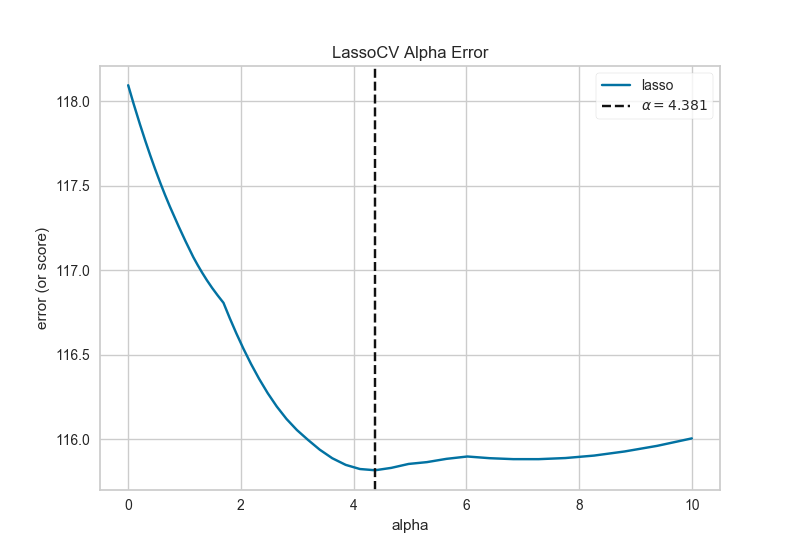

.. -*- mode: rst -*-

Alpha Selection
===============

Regularization is designed to penalize model complexity, therefore the higher the alpha, the less complex the model, decreasing the error due to variance (overfit). Alphas that are too high on the other hand increase the error due to bias (underfit). It is important, therefore to choose an optimal alpha such that the error is minimized in both directions.

The AlphaSelection Visualizer demonstrates how different values of alpha influence model selection during the regularization of linear models. Generally speaking, alpha increases the affect of regularization, e.g. if alpha is zero there is no regularization and the higher the alpha, the more the regularization parameter influences the final model.

.. code:: python

    # Load the data
    df = load_data('concrete')
    feature_names = ['cement', 'slag', 'ash', 'water', 'splast', 'coarse', 'fine', 'age']
    target_name = 'strength'

    # Get the X and y data from the DataFrame
    X = df[feature_names].as_matrix()
    y = df[target_name].as_matrix()

    # Create the train and test data
    X_train, X_test, y_train, y_test = train_test_split(X, y, test_size=0.2)

.. code:: python

    # Create a list of alphas to cross-validate against
    alphas = np.logspace(-12, -0.5, 400)

    # Instantiate the linear model and visualizer
    model = LassoCV(alphas=alphas)
    visualizer = AlphaSelection(model)

    visualizer.fit(X_train, y_train)  # Fit the training data to the visualizer
    g = visualizer.poof()             # Draw/show/poof the data

API Reference
-------------

.. automodule:: yellowbrick.regressor.alphas
    :members: AlphaSelection, ManualAlphaSelection
    :undoc-members:
    :show-inheritance:
