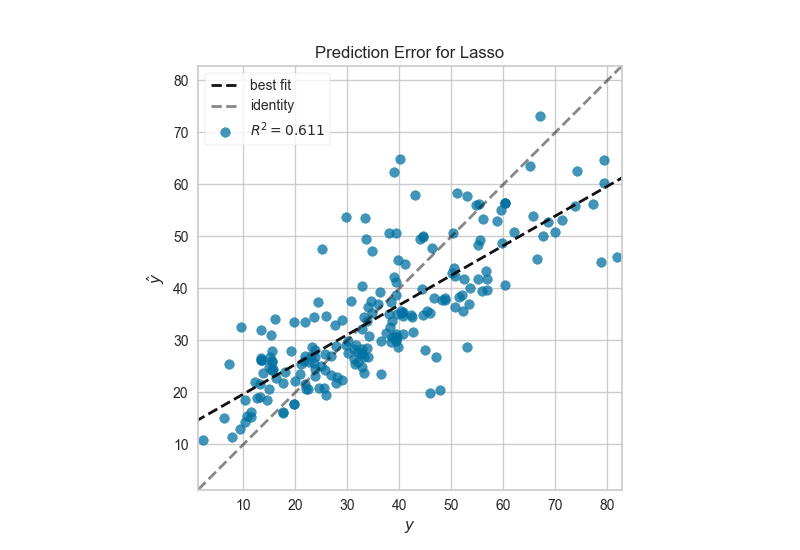

.. -*- mode: rst -*-

Prediction Error Plot
=====================

A prediction error plot shows the actual targets from the dataset against the predicted values generated by our model. This allows us to see how much variance is in the model. Data scientists can diagnose regression models using this plot by comparing against the 45 degree line, where the prediction exactly matches the model.

.. code:: python

    # Load the data
    df = load_data('concrete')
    feature_names = ['cement', 'slag', 'ash', 'water', 'splast', 'coarse', 'fine', 'age']
    target_name = 'strength'

    # Get the X and y data from the DataFrame
    X = df[feature_names].as_matrix()
    y = df[target_name].as_matrix()

    # Create the train and test data
    X_train, X_test, y_train, y_test = train_test_split(X, y, test_size=0.2)

.. code:: python

    # Instantiate the linear model and visualizer
    lasso = Lasso()
    visualizer = PredictionError(lasso)

    visualizer.fit(X_train, y_train)  # Fit the training data to the visualizer
    visualizer.score(X_test, y_test)  # Evaluate the model on the test data
    g = visualizer.poof()             # Draw/show/poof the data

API Reference
-------------

.. automodule:: yellowbrick.regressor.residuals
    :members: PredictionError
    :undoc-members:
    :show-inheritance:
