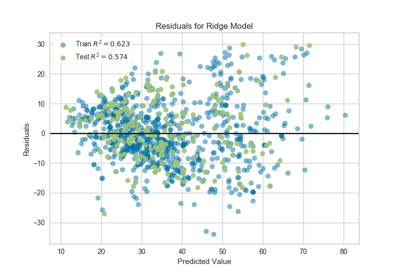

.. -*- mode: rst -*-

Residuals Plot
==============

A residuals plot shows the residuals on the vertical axis and the
independent variable on the horizontal axis. If the points are randomly
dispersed around the horizontal axis, a linear regression model is
appropriate for the data; otherwise, a non-linear model is more
appropriate.

.. code:: python

    # Load the data
    df = load_data('concrete')
    feature_names = ['cement', 'slag', 'ash', 'water', 'splast', 'coarse', 'fine', 'age']
    target_name = 'strength'

    # Get the X and y data from the DataFrame
    X = df[feature_names].as_matrix()
    y = df[target_name].as_matrix()

    # Create the train and test data
    X_train, X_test, y_train, y_test = train_test_split(X, y, test_size=0.2)

.. code:: python

    # Instantiate the linear model and visualizer
    ridge = Ridge()
    visualizer = ResidualsPlot(ridge)

    visualizer.fit(X_train, y_train)  # Fit the training data to the visualizer
    visualizer.score(X_test, y_test)  # Evaluate the model on the test data
    g = visualizer.poof()             # Draw/show/poof the data

API Reference
-------------

.. automodule:: yellowbrick.regressor.residuals
    :members: ResidualsPlot
    :undoc-members:
    :show-inheritance:
