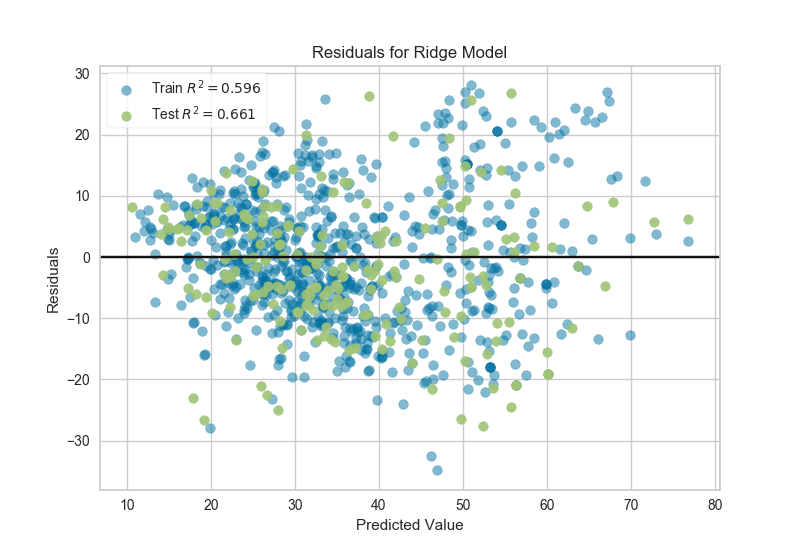

.. -*- mode: rst -*-

Residuals Plot
==============

Residuals, in the context of regression models, are the difference between the observed value of the target variable (y) and the predicted value (ŷ), e.g. the error of the prediction. The residuals plot shows the difference between residuals on the vertical axis and the dependent variable on the horizontal axis, allowing you to detect regions within the target that may be susceptible to more or less error.

.. code:: python

    from sklearn.model_selection import train_test_split

    # Load the data
    df = load_data('concrete')

    # Identify the feature and target columns
    feature_names = [
        'cement', 'slag', 'ash', 'water', 'splast', 'coarse', 'fine', 'age'
    ]
    target_name = 'strength'

    # Separate the instance data from the target data
    X = df[feature_names]
    y = df[target_name]

    # Create the train and test data
    X_train, X_test, y_train, y_test = train_test_split(X, y, test_size=0.2)

.. code:: python

    from sklearn.linear_model import Ridge
    from yellowbrick.regressor import ResidualsPlot

    # Instantiate the linear model and visualizer
    ridge = Ridge()
    visualizer = ResidualsPlot(ridge)

    visualizer.fit(X_train, y_train)  # Fit the training data to the model
    visualizer.score(X_test, y_test)  # Evaluate the model on the test data
    visualizer.poof()                 # Draw/show/poof the data

.. image:: images/residuals.png

A common use of the residuals plot is to analyze the variance of the error of the regressor. If the points are randomly dispersed around the horizontal axis, a linear regression model is usually appropriate for the data; otherwise, a non-linear model is more appropriate. In the case above, we see a fairly random, uniform distribution of the residuals against the target in two dimensions. This seems to indicate that our linear model is performing well. We can also see from the histogram that our error is normally distributed around zero, which also generally indicates a well fitted model.

Note that if the histogram is not desired, it can be turned off with the ``hist=False`` flag:

.. code:: python

    visualizer = ResidualsPlot(ridge, hist=False)
    visualizer.fit(X_train, y_train)
    visualizer.score(X_test, y_test)
    visualizer.poof()

.. warning:: The histogram on the residuals plot requires matplotlib 2.0.2 or greater. If you are using an earlier version of matplotlib, simply set the ``hist=False`` flag so that the histogram is not drawn. 

API Reference
-------------

.. automodule:: yellowbrick.regressor.residuals
    :members: ResidualsPlot
    :undoc-members:
    :show-inheritance:
