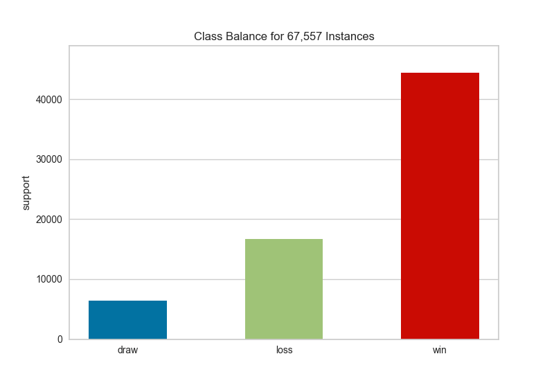

.. -*- mode: rst -*-

Class Balance
=============

One of the biggest challenges for classification models is an imbalance of classes in the training data. Severe class imbalances may be masked by relatively good F1 and accuracy scores -- the classifier is simply guessing the majority class and not making any evaluation on the underrepresented class.

There are several techniques for dealing with class imbalance such as stratified sampling, down sampling the majority class, weighting, etc. But before these actions can be taken, it is important to understand what the class balance is in the training data. The ``ClassBalance`` visualizer supports this by creating a bar chart of the *support* for each class, that is the frequency of the classes' representation in the dataset.

.. code:: python

    from yellowbrick.datasets import load_game
    from yellowbrick.target import ClassBalance

    # Load the classification data set
    data = load_game()
    y = data["outcome"]

    visualizer = ClassBalance(labels=["draw", "loss", "win"])
    visualizer.fit(y)
    visualizer.poof()

The resulting figure allows us to diagnose the severity of the balance issue. In this figure we can see that the ``"win"`` class dominates the other two classes. One potential solution might be to create a binary classifier: ``"win"`` vs ``"not win"`` and combining the ``"loss"`` and ``"draw"`` classes into one class.

.. warning::
    The ``ClassBalance`` visualizer interface has changed in version 0.9, a classification model is no longer required to instantiate the visualizer, it can operate on data only. Additionally the signature of the fit method has changed from ``fit(X, y=None)`` to ``fit(y_train, y_test=None)``, passing in ``X`` is no longer required. 

If a class imbalance must be maintained during evaluation (e.g. the event being classified is actually as rare as the frequency implies) then *stratified sampling* should be used to create train and test splits. This ensures that the test data has roughly the same proportion of classes as the training data. While scikit-learn does this by default in ``train_test_split`` and other ``cv`` methods, it can be useful to compare the support of each class in both splits.

The ``ClassBalance`` visualizer has a "compare" mode, where the train and test data can be passed to ``fit()``, creating a side-by-side bar chart instead of a single bar chart as follows:

.. code:: python

    data = load_occupancy

    features = ["temperature", "relative_humidity", "light", "C02", "humidity"]
    classes = ['unoccupied', 'occupied']

    X = data[features]
    y = data["occupancy"]

    # Create the train and test data
    _, _, y_train, y_test = train_test_split(X, y, test_size=0.2)

    # Instantiate the classification model and visualizer
    visualizer = ClassBalance(labels=classes)

    visualizer.fit(y_train, y_test)
    return visualizer.poof()

.. image:: images/class_balance_compare.png

This visualization allows us to do a quick check to ensure that the proportion of each class is roughly similar in both splits. This visualization should be a first stop particularly when evaluation metrics are highly variable across different splits.

API Reference
-------------

.. automodule:: yellowbrick.target.class_balance
    :members: ClassBalance
    :undoc-members:
    :show-inheritance:
