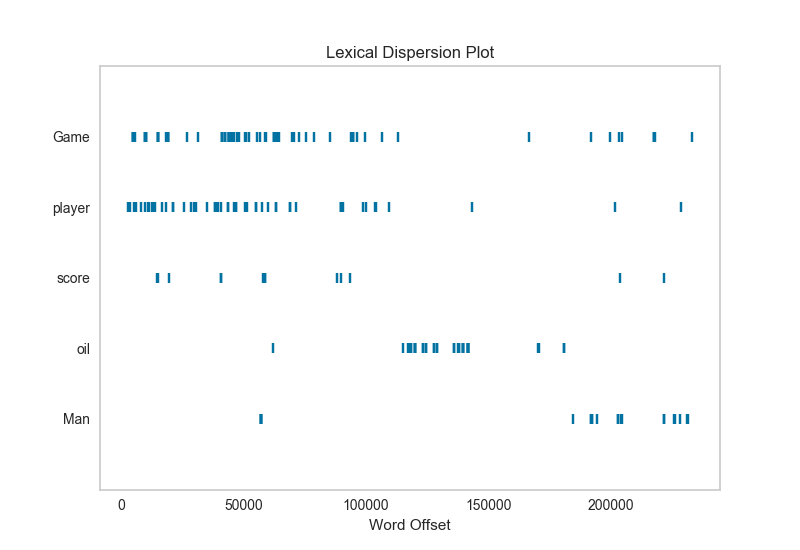

.. -*- mode: rst -*-

Dispersion Plot
===============

A word's importance can be weighed by its dispersion in a corpus.  Lexical dispersion is a measure of a word's homogeneity across the parts of a corpus.  This plot notes the occurrences of a word and how many words from the beginning of the corpus it appears.

.. code:: python

    from yellowbrick.text import DispersionPlot

After importing the visualizer, we can :doc:`load the corpus <corpus>`

.. code:: python

    # Load the text data
    corpus = load_corpus("hobbies")

    # create a list of words from the corpus text
    text = [word for doc in corpus.data for word in doc.split()]

    # Choose words whose occurence in the text will be plotted
    target_words = ['Game', 'player', 'score', 'oil', 'Man']

    # Create the visualizer and draw the plot
    visualizer = DispersionPlot(target_words)
    visualizer.fit(text)
    visualizer.poof()

API Reference
-------------

.. automodule:: yellowbrick.text.dispersion
    :members: DispersionPlot
    :undoc-members:
    :show-inheritance:
