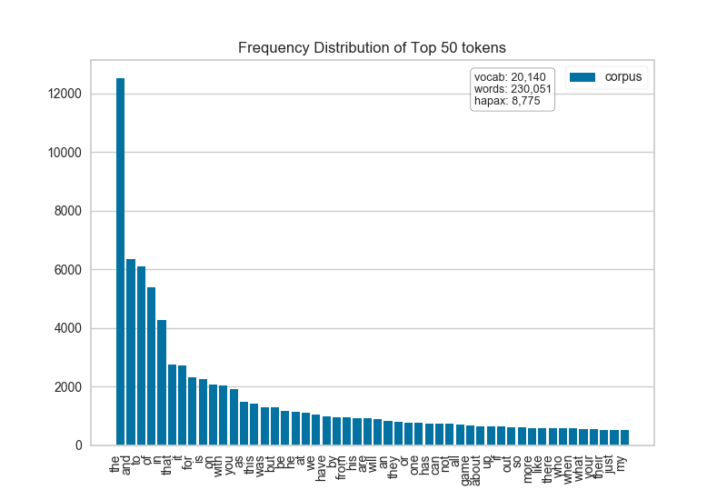
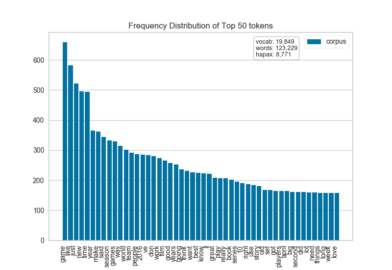
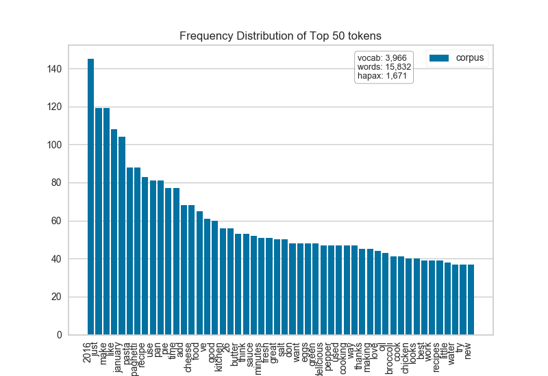
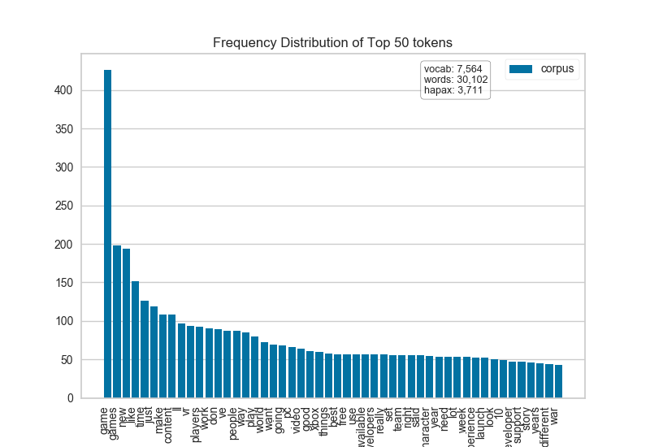

.. -*- mode: rst -*-

Token Frequency Distribution
============================

A method for visualizing the frequency of tokens within and across corpora is frequency distribution. A frequency distribution tells us the frequency of each vocabulary item in the text. In general, it could count any kind of observable event. It is a distribution because it tells us how the total number of word tokens in the text are distributed across the vocabulary items.

.. code:: python

    from yellowbrick.text.freqdist import FreqDistVisualizer
    from sklearn.feature_extraction.text import CountVectorizer

Note that the ``FreqDistVisualizer`` does not perform any normalization or vectorization, and it expects text that has already be count vectorized.

We first instantiate a ``FreqDistVisualizer`` object, and then call ``fit()`` on that object with the count vectorized documents and the features (i.e. the words from the corpus), which computes the frequency distribution. The visualizer then plots a bar chart of the top 50 most frequent terms in the corpus, with the terms listed along the x-axis and frequency counts depicted at y-axis values. As with other Yellowbrick visualizers, when the user invokes ``poof()``, the finalized visualization is shown.

.. code:: python

    vectorizer = CountVectorizer()
    docs       = vectorizer.fit_transform(corpus.data)
    features   = vectorizer.get_feature_names()

    visualizer = FreqDistVisualizer(features=features)
    visualizer.fit(docs)
    visualizer.poof()

It is interesting to compare the results of the ``FreqDistVisualizer`` before and after stopwords have been removed from the corpus:

.. code:: python

    vectorizer = CountVectorizer(stop_words='english')
    docs       = vectorizer.fit_transform(corpus.data)
    features   = vectorizer.get_feature_names()

    visualizer = FreqDistVisualizer(features=features)
    visualizer.fit(docs)
    visualizer.poof()

It is also interesting to explore the differences in tokens across a corpus. The hobbies corpus that comes with Yellowbrick has already been categorized (try ``corpus['categories']``), so let's visually compare the differences in the frequency distributions for two of the categories: *"cooking"* and *"gaming"*.

.. code:: python

    from collections import defaultdict

    hobbies = defaultdict(list)
    for text, label in zip(corpus.data, corpus.label):
        hobbies[label].append(text)

.. code:: python

    vectorizer = CountVectorizer(stop_words='english')
    docs       = vectorizer.fit_transform(text for text in hobbies['cooking'])
    features   = vectorizer.get_feature_names()

    visualizer = FreqDistVisualizer(features=features)
    visualizer.fit(docs)
    visualizer.poof()

.. code:: python

    vectorizer = CountVectorizer(stop_words='english')
    docs       = vectorizer.fit_transform(text for text in hobbies['gaming'])
    features   = vectorizer.get_feature_names()

    visualizer = FreqDistVisualizer(features=features)
    visualizer.fit(docs)
    visualizer.poof()

API Reference
-------------

.. automodule:: yellowbrick.text.freqdist
    :members: FrequencyVisualizer
    :undoc-members:
    :show-inheritance:
