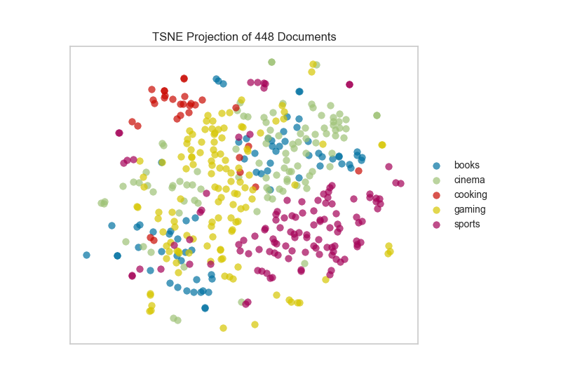
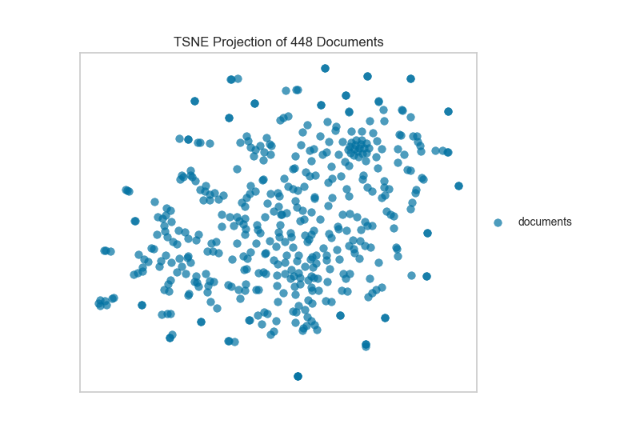
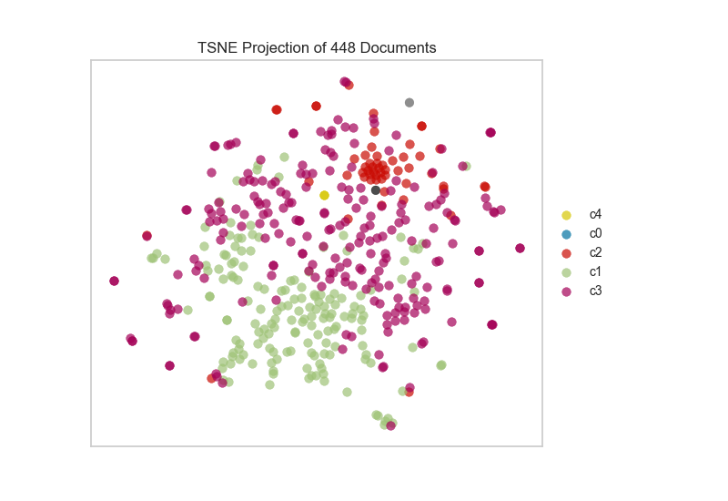

.. -*- mode: rst -*-

t-SNE Corpus Visualization
==========================

One very popular method for visualizing document similarity is to use t-distributed stochastic neighbor embedding, t-SNE. Scikit-Learn implements this decomposition method as the ``sklearn.manifold.TSNE`` transformer. By decomposing high-dimensional document vectors into 2 dimensions using probability distributions from both the original dimensionality and the decomposed dimensionality, t-SNE is able to effectively cluster similar documents. By decomposing to 2 or 3 dimensions, the documents can be visualized with a scatter plot.

Unfortunately, ``TSNE`` is very expensive, so typically a simpler decomposition method such as SVD or PCA is applied ahead of time. The ``TSNEVisualizer`` creates an inner transformer pipeline that applies such a decomposition first (SVD with 50 components by default), then performs the t-SNE embedding. The visualizer then plots the scatter plot, coloring by cluster or by class, or neither if a structural analysis is required.

.. code:: python

    from yellowbrick.text import TSNEVisualizer
    from sklearn.feature_extraction.text import TfidfVectorizer

After importing the required tools, we can :doc:`load the corpus <corpus>` and vectorize the text using TF-IDF.

.. code:: python

    # Load the data and create document vectors
    corpus = load_corpus('hobbies')
    tfidf  = TfidfVectorizer()

    docs   = tfidf.fit_transform(corpus.data)
    labels = corpus.target

Now that the corpus is vectorized we can visualize it, showing the distribution of classes.

.. code:: python

    # Create the visualizer and draw the vectors
    tsne = TSNEVisualizer()
    tsne.fit(docs, labels)
    tsne.poof()

If we omit the target during fit, we can visualize the whole dataset to see if any meaningful patterns are observed.

.. code:: python

    # Don't color points with their classes
    tsne = TSNEVisualizer(labels=["documents"])
    tsne.fit(docs)
    tsne.poof()

This means we don't have to use class labels at all, instead we can use cluster membership from K-Means to label each document, looking for clusters of related text by their contents:

.. code:: python

    # Apply clustering instead of class names.
    from sklearn.cluster import KMeans

    clusters = KMeans(n_clusters=5)
    clusters.fit(docs)

    tsne = TSNEVisualizer()
    tsne.fit(docs, ["c{}".format(c) for c in clusters.labels_])
    tsne.poof()

API Reference
-------------

.. automodule:: yellowbrick.text.tsne
    :members: TSNEVisualizer
    :undoc-members:
    :show-inheritance:
