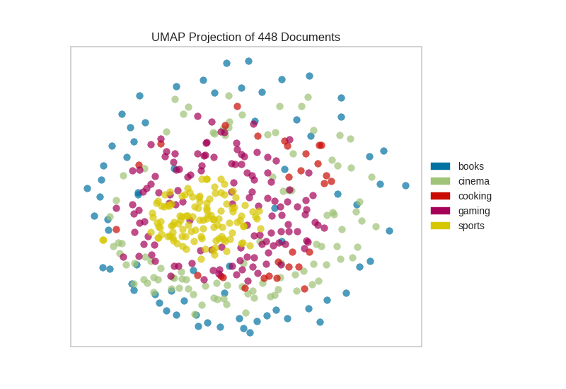
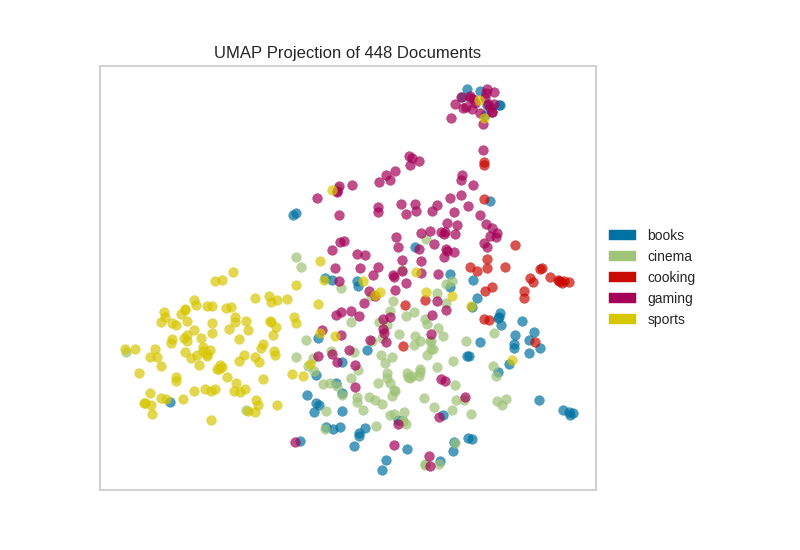

UMAP Corpus Visualization
==========================

`UMAP <https://github.com/lmcinnes/umap>`__ is a nonlinear
dimensionality reduction method that is well suited to embedding in two
or three dimensions for visualization as a scatter plot. UMAP is a
relatively new technique but very effective for visualizing clusters or
groups of data points and their relative proximities. It does a good job
of learning the local structure within your data but also attempts to
preserve the realtionships between your groups as can be seen in it’s
`exploration of
MNIST <https://umap-learn.readthedocs.io/en/latest/basic_usage.html#digits-data>`__.
It is fast, scalable, and can be applied directly to sparse matrices,
eliminating the need to run a truncatedSVD as a pre-processing step.
Additionally, it supports a wide variety of distance measures allowing
for easy exploration of your data.  For a more detailed explanation of the algorithm
the paper can be found `here <https://arxiv.org/abs/1802.03426>`__.

In this example we represent documents via a `term frequency inverse
document
frequency <https://scikit-learn.org/stable/modules/feature_extraction.html#text-feature-extraction>`__ (TF-IDF)
vector. Then use UMAP to find a low dimensional representation of these
documents. The yellowbrick visualizer then plots the scatter plot,
coloring by cluster or by class, or neither if a structural analysis is
required.

.. code:: ipython3

    from yellowbrick.text import UMAPVisualizer
    from sklearn.feature_extraction.text import TfidfVectorizer
    from yellowbrick.datasets.utils import load_corpus

After importing the required tools, we can :doc:`load the corpus <corpus>` and vectorize the text using TF-IDF.

.. code:: ipython3

    # Load the data and create document vectors
    corpus = load_corpus('hobbies', data_path='/mnt/timc/sandbox/ava00114/yellowbrick/data/')
    tfidf  = TfidfVectorizer()
    docs   = tfidf.fit_transform(corpus.data)
    labels = corpus.target

Now that the corpus is vectorized we can visualize it, showing the
distribution of classes.

.. code:: ipython3

    umap   = UMAPVisualizer()
    umap.fit(docs,labels)
    umap.poof()

Alternatively, if we believed that cosine distance was a more
appropriate metric on our feature space we could specify that via a
``metric`` paramater passed through to the underlying UMAP function by
the ``UMAPVisualizer``.

.. code:: ipython3

    umap   = UMAPVisualizer(metric='cosine')
    umap.fit(docs,labels)
    umap.poof()

If we omit the target during fit, we can visualize the whole dataset to
see if any meaningful patterns are observed.

.. code:: ipython3

    # Don't color points with their classes
    umap = UMAPVisualizer(labels=["documents"], metric='cosine')
    umap.fit(docs)
    umap.poof()

.. image:: images/umap_no_labels.png

This means we don’t have to use class labels at all. Instead we can use
cluster membership from K-Means to label each document. This will allow
us to look for clusters of related text by their contents:

.. code:: ipython3

    # Apply clustering instead of class names.
    from sklearn.cluster import KMeans
    
    clusters = KMeans(n_clusters=5)
    clusters.fit(docs)
    
    umap = UMAPVisualizer()
    umap.fit(docs, ["c{}".format(c) for c in clusters.labels_])
    umap.poof()

.. image:: images/umap_kmeans.png

On one hand, these clusters aren’t particularly well concentrated by the
two dimensional embedding of UMAP, on the other hand, the true labels
for this data are. That is a good indication that your data does indeed
live on a manifold in your tfIDF space and that structure is being
ignored by the kmeans algorithms. Clustering can be quite tricky in high
dimensional spaces and it is often a good idea to reduce your dimension
before running clustering algorithms on your data.

UMAP, it should be noted, is a manifold learning technique and as such
does not seek to preserve the distances between your data points in high
space but instead to learn the distances along an underlying manifold on
which your data points lie. As such one shouldn’t be too surprised when
it disagrees with a non-manifold based clustering technique. A detailed
explanation of this phenomenon can be found in this `UMAP
documentation <https://umap-learn.readthedocs.io/en/latest/clustering.html>`__.

API Reference
-------------

.. automodule:: yellowbrick.text.umap_vis
    :members: UMAPVisualizer
    :undoc-members:
    :show-inheritance:
