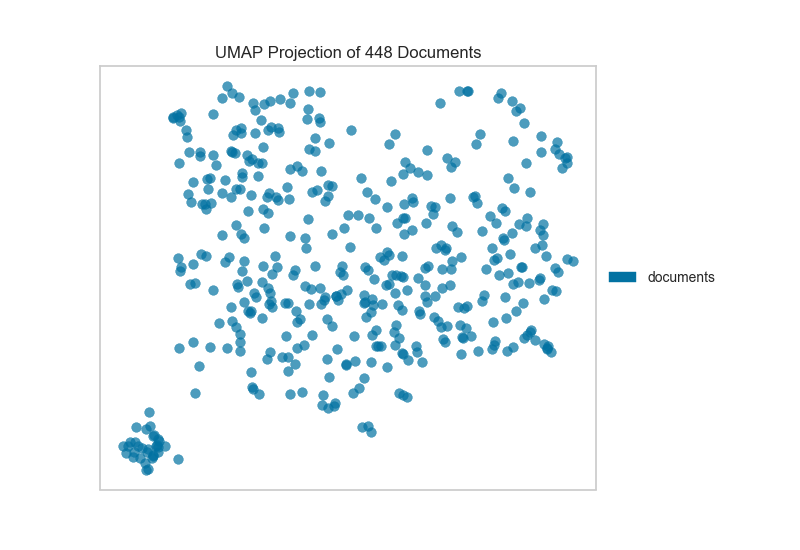
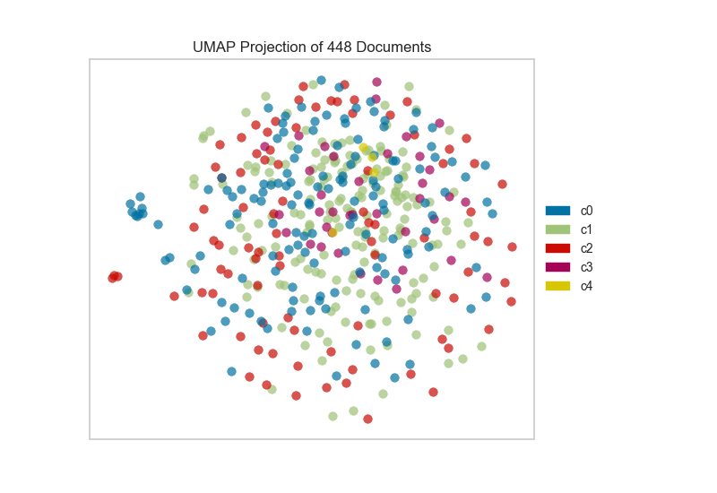

.. -*- mode: rst -*-

UMAP Corpus Visualization
==========================

`Uniform Manifold Approximation and Projection (UMAP) <https://github.com/lmcinnes/umap>`__ is a nonlinear
dimensionality reduction method that is well suited to embedding in two
or three dimensions for visualization as a scatter plot. UMAP is a
relatively new technique but is very effective for visualizing clusters or
groups of data points and their relative proximities. It does a good job
of learning the local structure within your data but also attempts to
preserve the relationships between your groups as can be seen in its
`exploration of
MNIST <https://umap-learn.readthedocs.io/en/latest/basic_usage.html#digits-data>`__.
It is fast, scalable, and can be applied directly to sparse matrices,
eliminating the need to run ``TruncatedSVD`` as a pre-processing step.
Additionally, it supports a wide variety of distance measures allowing
for easy exploration of your data. For a more detailed explanation of the algorithm
the paper can be found `here <https://arxiv.org/abs/1802.03426>`__.

=================   ==============================
Visualizer           :class:`~yellowbrick.text.umap_vis.UMAPVisualizer`
Quick Method         :func:`~yellowbrick.text.umap_vis.umap`
Models               Decomposition
Workflow             Feature Engineering/Selection
=================   ==============================

In this example, we represent documents via a `term frequency inverse
document
frequency <https://scikit-learn.org/stable/modules/feature_extraction.html#text-feature-extraction>`__ (TF-IDF)
vector and then use UMAP to find a low dimensional representation of these
documents. Next, the Yellowbrick visualizer plots the scatter plot,
coloring by cluster or by class, or neither if a structural analysis is
required.

After importing the required tools, we can use the :doc:`the hobbies corpus <../datasets/hobbies>` and vectorize the text using TF-IDF. Once the corpus is vectorized we can visualize it, showing the distribution of classes.

.. note to contributors: the below code requires an additional dependency on umap-learn
    that is not part of the core requirements, so has not been modified with a plot
    directive. See umap_vis.py to regenerate images.

.. code:: python

    from sklearn.feature_extraction.text import TfidfVectorizer

    from yellowbrick.datasets import load_hobbies
    from yellowbrick.text import UMAPVisualizer

    # Load the text data
    corpus = load_hobbies()

    tfidf = TfidfVectorizer()
    docs = tfidf.fit_transform(corpus.data)
    labels = corpus.target

    # Instantiate the text visualizer
    umap = UMAPVisualizer()
    umap.fit(docs, labels)
    umap.show()

Alternatively, if we believed that cosine distance was a more
appropriate metric on our feature space we could specify that via a
``metric`` parameter passed through to the underlying UMAP function by
the ``UMAPVisualizer``.

.. code:: python

    umap = UMAPVisualizer(metric='cosine')
    umap.fit(docs, labels)
    umap.show()

If we omit the target during fit, we can visualize the whole dataset to
see if any meaningful patterns are observed.

.. code:: python

    # Don't color points with their classes
    umap = UMAPVisualizer(labels=["documents"], metric='cosine')
    umap.fit(docs)
    umap.show()

This means we don’t have to use class labels at all. Instead, we can use
cluster membership from K-Means to label each document. This will allow
us to look for clusters of related text by their contents:

.. code:: python

    from sklearn.cluster import KMeans
    from sklearn.feature_extraction.text import TfidfVectorizer

    from yellowbrick.datasets import load_hobbies
    from yellowbrick.text import UMAPVisualizer

    # Load the text data
    corpus = load_hobbies()

    tfidf = TfidfVectorizer()
    docs = tfidf.fit_transform(corpus.data)

    # Instantiate the clustering model
    clusters = KMeans(n_clusters=5)
    clusters.fit(docs)

    umap = UMAPVisualizer()
    umap.fit(docs, ["c{}".format(c) for c in clusters.labels_])
    umap.show()

On one hand, these clusters aren’t particularly well concentrated by the
two-dimensional embedding of UMAP; while on the other hand, the true labels
for this data are. That is a good indication that your data does indeed
live on a manifold in your TF-IDF space and that structure is being
ignored by the K-Means algorithm. Clustering can be quite tricky in high
dimensional spaces and it is often a good idea to reduce your dimension
before running clustering algorithms on your data.

UMAP, it should be noted, is a manifold learning technique and as such
does not seek to preserve the distances between your data points in high
space but instead to learn the distances along an underlying manifold on
which your data points lie. As such, one shouldn’t be too surprised when
it disagrees with a non-manifold based clustering technique. A detailed
explanation of this phenomenon can be found in this `UMAP
documentation <https://umap-learn.readthedocs.io/en/latest/clustering.html>`__.

Quick Method
------------

The same functionality above can be achieved with the associated quick method ``umap``. This method will build the ``UMAPVisualizer`` object with the associated arguments, fit it, then (optionally) immediately show it

.. plot::
    :context: close-figs
    :alt: Quick method umap plot of the clustered hobbies corpus

    from sklearn.cluster import KMeans
    from sklearn.feature_extraction.text import TfidfVectorizer

    from yellowbrick.text import umap
    from yellowbrick.datasets import load_hobbies

    # Load the text data
    corpus = load_hobbies()

    tfidf = TfidfVectorizer()
    docs = tfidf.fit_transform(corpus.data)

    # Instantiate the clustering model
    clusters = KMeans(n_clusters=5)
    clusters.fit(docs)

    viz = umap(docs, ["c{}".format(c) for c in clusters.labels_])

API Reference
-------------

.. automodule:: yellowbrick.text.umap_vis
    :members: UMAPVisualizer, umap
    :undoc-members:
    :show-inheritance:
