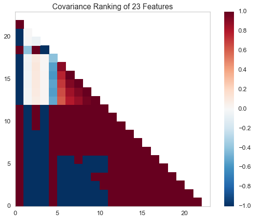
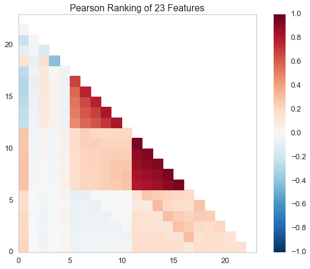
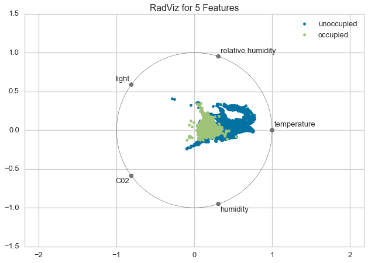
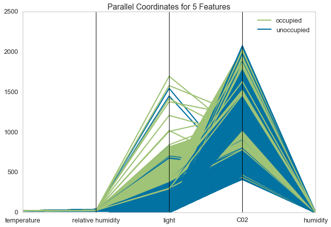
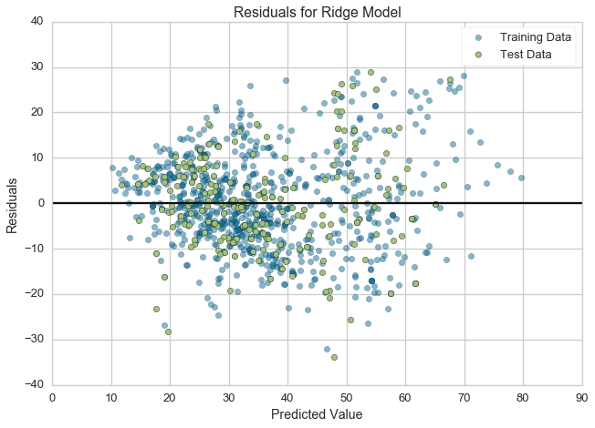
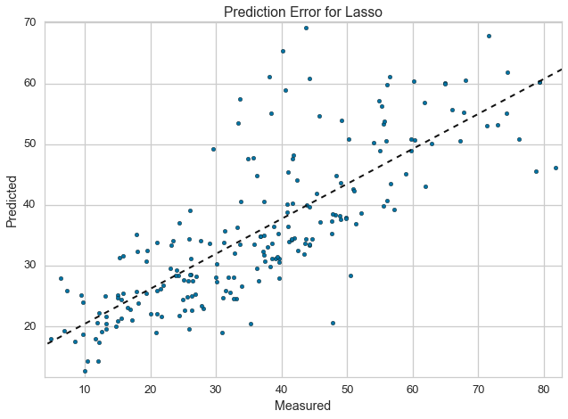
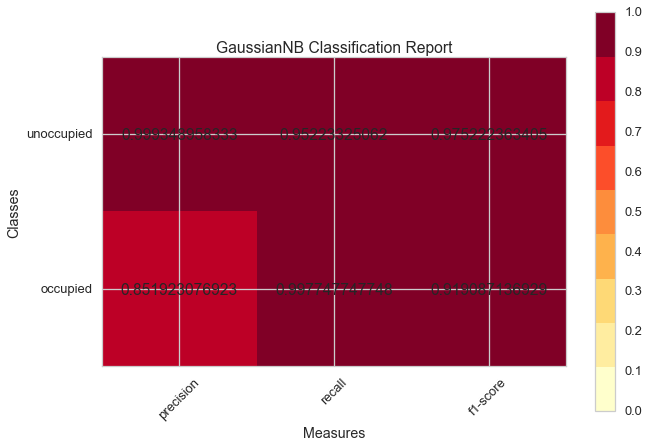
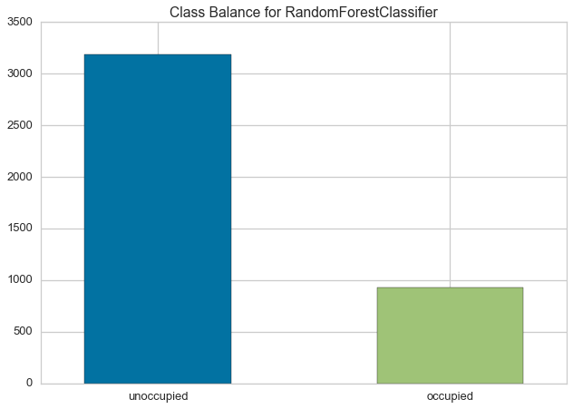

.. _examples/yellowbrick-examples:

=======
Methods
=======

Here is a walkthrough of some of the data and model visualization methods that are currently implemented in ``yellowbrick``.

.. code:: python

    import os
    import sys

    # Modify the path
    sys.path.append("..")

    import pandas as pd
    import yellowbrick as yb
    import matplotlib.pyplot as plt

Anscombe's Quartet
------------------

Yellowbrick has learned Anscombe's lesson - which is why we believe that
visual diagnostics are vital to machine learning.

.. code:: python

    g = yb.anscombe()

.. image:: images/examples_4_1.png

Load Datasets for Example Code
------------------------------

Yellowbrick has provided several datasets wrangled from the `UCI Machine
Learning Repository <http://archive.ics.uci.edu/ml/>`__ to present the
following examples. If you haven't downloaded the data, you can do so by
running:

::

    $ python download.py

In the same directory as the example notebook. Note that this will
create a directory called ``data`` that contains subdirectories with the
given data.

.. code:: python

    from download import download_all

    ## The path to the test data sets
    FIXTURES  = os.path.join(os.getcwd(), "data")

    ## Dataset loading mechanisms
    datasets = {
        "credit": os.path.join(FIXTURES, "credit", "credit.csv"),
        "concrete": os.path.join(FIXTURES, "concrete", "concrete.csv"),
        "occupancy": os.path.join(FIXTURES, "occupancy", "occupancy.csv"),
    }

    def load_data(name, download=True):
        """
        Loads and wrangles the passed in dataset by name.
        If download is specified, this method will download any missing files.
        """

        # Get the path from the datasets
        path = datasets[name]

        # Check if the data exists, otherwise download or raise
        if not os.path.exists(path):
            if download:
                download_all()
            else:
                raise ValueError((
                    "'{}' dataset has not been downloaded, "
                    "use the download.py module to fetch datasets"
                ).format(name))

        # Return the data frame
        return pd.read_csv(path)

Feature Analysis
----------------

Feature analysis visualizers are designed to visualize instances in data
space in order to detect features or targets that might impact
downstream fitting. Because ML operates on high-dimensional data sets
(usually at least 35), the visualizers focus on aggregation,
optimization, and other techniques to give overviews of the data. It is
our intent that the steering process will allow the data scientist to
zoom and filter and explore the relationships between their instances
and between dimensions.

At the moment we have three feature analysis visualizers implemented:

-  Rank2D: rank pairs of features to detect covariance
-  RadViz: plot data points along axes ordered around a circle to detect
   separability
-  Parallel Coordinates: plot instances as lines along vertical axes to
   detect clusters

Feature analysis visualizers implement the ``Transformer`` API from
Scikit-Learn, meaning they can be used as intermediate transform steps
in a ``Pipeline`` (particularly a ``VisualPipeline``). They are
instantiated in the same way, and then fit and transform are called on
them, which draws the instances correctly. Finally ``poof`` or ``show``
is called which displays the image.

.. code:: python

    # Feature Analysis Imports
    # NOTE that all these are available for import from the `yellowbrick.features` module
    from yellowbrick.features.rankd import Rank2D
    from yellowbrick.features.radviz import RadViz
    from yellowbrick.features.pcoords import ParallelCoordinates

Rank2D
~~~~~~

Rank1D and Rank2D evaluate single features or pairs of features using a
variety of metrics that score the features on the scale [-1, 1] or [0,
1] allowing them to be ranked. A similar concept to SPLOMs, the scores
are visualized on a lower-left triangle heatmap so that patterns between
pairs of features can be easily discerned for downstream analysis.

.. code:: python

    # Load the classification data set
    data = load_data('credit')

    # Specify the features of interest
    features = [
            'limit', 'sex', 'edu', 'married', 'age', 'apr_delay', 'may_delay',
            'jun_delay', 'jul_delay', 'aug_delay', 'sep_delay', 'apr_bill', 'may_bill',
            'jun_bill', 'jul_bill', 'aug_bill', 'sep_bill', 'apr_pay', 'may_pay', 'jun_pay',
            'jul_pay', 'aug_pay', 'sep_pay',
        ]

    # Extract the numpy arrays from the data frame
    X = data[features].as_matrix()
    y = data.default.as_matrix()

.. code:: python

    # Instantiate the visualizer with the Covariance ranking algorithm
    visualizer = Rank2D(features=features, algorithm='covariance')

    visualizer.fit(X, y)                # Fit the data to the visualizer
    visualizer.transform(X)             # Transform the data
    visualizer.poof()    # Draw/show/poof the data

.. code:: python

    # Instantiate the visualizer with the Pearson ranking algorithm
    visualizer = Rank2D(features=features, algorithm='pearson')

    visualizer.fit(X, y)                # Fit the data to the visualizer
    visualizer.transform(X)             # Transform the data
    visualizer.poof()    # Draw/show/poof the data

RadViz
~~~~~~

RadViz is a multivariate data visualization algorithm that plots each
feature dimension uniformely around the circumference of a circle then
plots points on the interior of the circle such that the point
normalizes its values on the axes from the center to each arc. This
meachanism allows as many dimensions as will easily fit on a circle,
greatly expanding the dimensionality of the visualization.

Data scientists use this method to dect separability between classes.
E.g. is there an opportunity to learn from the feature set or is there
just too much noise?

.. code:: python

    # Load the classification data set
    data = load_data('occupancy')

    # Specify the features of interest and the classes of the target
    features = ["temperature", "relative humidity", "light", "C02", "humidity"]
    classes = ['unoccupied', 'occupied']

    # Extract the numpy arrays from the data frame
    X = data[features].as_matrix()
    y = data.occupancy.as_matrix()

.. code:: python

    # Instantiate the visualizer
    visualizer = visualizer = RadViz(classes=classes, features=features)

    visualizer.fit(X, y)      # Fit the data to the visualizer
    visualizer.transform(X)   # Transform the data
    visualizer.poof()         # Draw/show/poof the data

For regression, the RadViz visualizer should use a color sequence to
display the target information, as opposed to discrete colors.

Parallel Coordinates
~~~~~~~~~~~~~~~~~~~~

Parallel coordinates displays each feature as a vertical axis spaced
evenly along the horizontal, and each instance as a line drawn between
each individual axis. This allows many dimensions; in fact given
infinite horizontal space (e.g. a scrollbar) an infinite number of
dimensions can be displayed!

Data scientists use this method to detect clusters of instances that
have similar classes, and to note features that have high varaince or
different distributions.

.. code:: python

    # Load the classification data set
    data = load_data('occupancy')

    # Specify the features of interest and the classes of the target
    features = ["temperature", "relative humidity", "light", "C02", "humidity"]
    classes = ['unoccupied', 'occupied']

    # Extract the numpy arrays from the data frame
    X = data[features].as_matrix()
    y = data.occupancy.as_matrix()

.. code:: python

    # Instantiate the visualizer
    visualizer = visualizer = ParallelCoordinates(classes=classes, features=features)

    visualizer.fit(X, y)      # Fit the data to the visualizer
    visualizer.transform(X)   # Transform the data
    visualizer.poof()         # Draw/show/poof the data

Regressor Evaluation
--------------------

Regression models attempt to predict a target in a continuous space.
Regressor score visualizers display the instances in model space to
better understand how the model is making predictions. We currently have
implemented two regressor evaluations:

-  Residuals Plot: plot the difference between the expected and actual
   values
-  Prediction Error: plot expected vs. the actual values in model space

Estimator score visualizers *wrap* Scikit-Learn estimators and expose
the Estimator API such that they have ``fit()``, ``predict()``, and
``score()`` methods that call the appropriate estimator methods under
the hood. Score visualizers can wrap an estimator and be passed in as
the final step in a ``Pipeline`` or ``VisualPipeline``.

.. code:: python

    # Regression Evaluation Imports

    from sklearn.linear_model import Ridge, Lasso
    from sklearn.cross_validation import train_test_split

    from yellowbrick.regressor import PredictionError, ResidualsPlot

Residuals Plot
~~~~~~~~~~~~~~

A residual plot shows the residuals on the vertical axis and the
independent variable on the horizontal axis. If the points are randomly
dispersed around the horizontal axis, a linear regression model is
appropriate for the data; otherwise, a non-linear model is more
appropriate.

.. code:: python

    # Load the data
    df = load_data('concrete')
    feature_names = ['cement', 'slag', 'ash', 'water', 'splast', 'coarse', 'fine', 'age']
    target_name = 'strength'

    # Get the X and y data from the DataFrame
    X = df[feature_names].as_matrix()
    y = df[target_name].as_matrix()

    # Create the train and test data
    X_train, X_test, y_train, y_test = train_test_split(X, y, test_size=0.2)

.. code:: python

    # Instantiate the linear model and visualizer
    ridge = Ridge()
    visualizer = ResidualsPlot(ridge)

    visualizer.fit(X_train, y_train)  # Fit the training data to the visualizer
    visualizer.score(X_test, y_test)  # Evaluate the model on the test data
    g = visualizer.poof()             # Draw/show/poof the data

Prediction Error Plot
~~~~~~~~~~~~~~~~~~~~~

Plots the actual targets from the dataset against the predicted values
generated by our model. This allows us to see how much variance is in
the model. Data scientists diagnose this plot by comparing against the
45 degree line, where the prediction exactly matches the model.

.. code:: python

    # Load the data
    df = load_data('concrete')
    feature_names = ['cement', 'slag', 'ash', 'water', 'splast', 'coarse', 'fine', 'age']
    target_name = 'strength'

    # Get the X and y data from the DataFrame
    X = df[feature_names].as_matrix()
    y = df[target_name].as_matrix()

    # Create the train and test data
    X_train, X_test, y_train, y_test = train_test_split(X, y, test_size=0.2)

.. code:: python

    # Instantiate the linear model and visualizer
    lasso = Lasso()
    visualizer = PredictionError(lasso)

    visualizer.fit(X_train, y_train)  # Fit the training data to the visualizer
    visualizer.score(X_test, y_test)  # Evaluate the model on the test data
    g = visualizer.poof()             # Draw/show/poof the data

Classifier Evaluation
---------------------

Classification models attempt to predict a target in a discrete space,
that is assign an instance of dependent variables one or more
categories. Classification score visualizers display the differences
between classes as well as a number of classifier-specific visual
evaluations. We currently have implemented three classifier evaluations:

-  ClassificationReport: Presents the confusion matrix of the classifier
   as a heatmap
-  ROCAUC: Presents the graph of receiver operating characteristics
   along with area under the curve
-  ClassBalance: Displays the difference between the class balances and
   support

Estimator score visualizers wrap Scikit-Learn estimators and expose the
Estimator API such that they have fit(), predict(), and score() methods
that call the appropriate estimator methods under the hood. Score
visualizers can wrap an estimator and be passed in as the final step in
a Pipeline or VisualPipeline.

.. code:: python

    # Classifier Evaluation Imports

    from sklearn.naive_bayes import GaussianNB
    from sklearn.linear_model import LogisticRegression
    from sklearn.ensemble import RandomForestClassifier
    from sklearn.cross_validation import train_test_split

    from yellowbrick.classifier import ClassificationReport, ROCAUC, ClassBalance

Classification Report
~~~~~~~~~~~~~~~~~~~~~

The classification report visualizer displays the precision, recall, and
F1 scores for the model. Integrates numerical scores as well color-coded
heatmap in order for easy interpretation and detection.

.. code:: python

    # Load the classification data set
    data = load_data('occupancy')

    # Specify the features of interest and the classes of the target
    features = ["temperature", "relative humidity", "light", "C02", "humidity"]
    classes = ['unoccupied', 'occupied']

    # Extract the numpy arrays from the data frame
    X = data[features].as_matrix()
    y = data.occupancy.as_matrix()

    # Create the train and test data
    X_train, X_test, y_train, y_test = train_test_split(X, y, test_size=0.2)

.. code:: python

    # Instantiate the classification model and visualizer
    bayes = GaussianNB()
    visualizer = ClassificationReport(bayes, classes=classes)

    visualizer.fit(X_train, y_train)  # Fit the training data to the visualizer
    visualizer.score(X_test, y_test)  # Evaluate the model on the test data
    g = visualizer.poof()             # Draw/show/poof the data

ROCAUC
~~~~~~

Plot the ROC to visualize the tradeoff between the classifier's
sensitivity and specificity.

.. code:: python

    # Load the classification data set
    data = load_data('occupancy')

    # Specify the features of interest and the classes of the target
    features = ["temperature", "relative humidity", "light", "C02", "humidity"]
    classes = ['unoccupied', 'occupied']

    # Extract the numpy arrays from the data frame
    X = data[features].as_matrix()
    y = data.occupancy.as_matrix()

    # Create the train and test data
    X_train, X_test, y_train, y_test = train_test_split(X, y, test_size=0.2)

.. code:: python

    # Instantiate the classification model and visualizer
    logistic = LogisticRegression()
    visualizer = ROCAUC(logistic)

    visualizer.fit(X_train, y_train)  # Fit the training data to the visualizer
    visualizer.score(X_test, y_test)  # Evaluate the model on the test data
    g = visualizer.poof()             # Draw/show/poof the data

.. image:: images/examples_35_0.png

ClassBalance
~~~~~~~~~~~~

Class balance chart that shows the support for each class in the fitted
classification model.

.. code:: python

    # Load the classification data set
    data = load_data('occupancy')

    # Specify the features of interest and the classes of the target
    features = ["temperature", "relative humidity", "light", "C02", "humidity"]
    classes = ['unoccupied', 'occupied']

    # Extract the numpy arrays from the data frame
    X = data[features].as_matrix()
    y = data.occupancy.as_matrix()

    # Create the train and test data
    X_train, X_test, y_train, y_test = train_test_split(X, y, test_size=0.2)

.. code:: python

    # Instantiate the classification model and visualizer
    forest = RandomForestClassifier()
    visualizer = ClassBalance(forest, classes=classes)

    visualizer.fit(X_train, y_train)  # Fit the training data to the visualizer
    visualizer.score(X_test, y_test)  # Evaluate the model on the test data
    g = visualizer.poof()             # Draw/show/poof the data

