.. _examples/yellowbrick-palettes:

=========
Palettes
=========

Yellowbrick includes custom palettes as well as familiar ones from Matplotlib and Seaborn.

.. code:: python

    %matplotlib inline

    import matplotlib.pyplot as plt
    from yellowbrick.style.palettes import PALETTES, color_palette

.. code:: python

    # ['blue', 'green', 'red', 'maroon', 'yellow', 'cyan']
    for palette in PALETTES.keys():
        color_palette(palette).plot()
        plt.title(palette, loc='left')

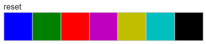

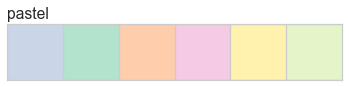

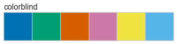

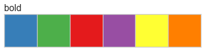

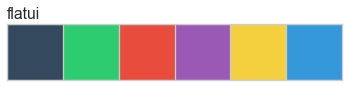

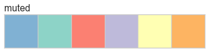

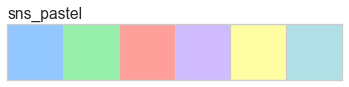

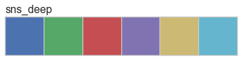

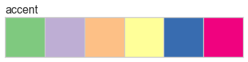

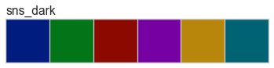

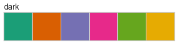

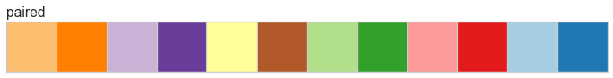

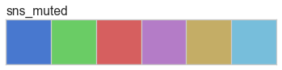

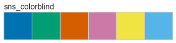

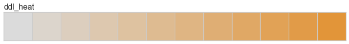

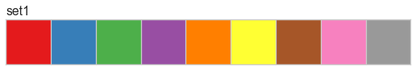

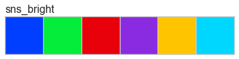

.. image:: images/palettes_2_17.png
