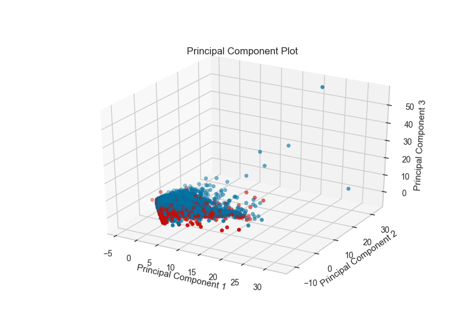
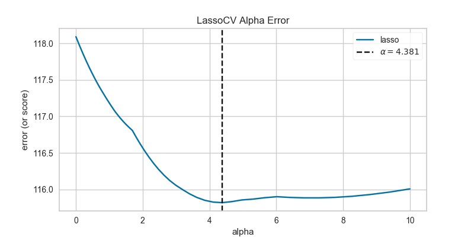
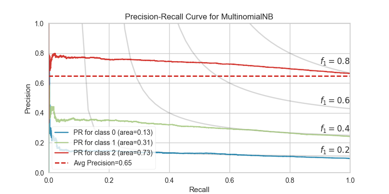

.. -*- mode: rst -*-

Gallery
=======

Feature Analysis
----------------

.. image:: images/gallery/parallel_coordinates.png
    :width: 200px
    :height: 100px
    :alt: Parallel Coordinates for 5 features
    :target: api/features/pcoords.html#parallel-coordinates

.. image:: images/gallery/concrete_tsne_manifold.png
    :width: 200px
    :height: 100px
    :alt: t-SNE Manifold Visualization
    :target: api/features/manifold.html#manifold-visualization

.. image:: images/gallery/occupancy_tsne_manifold.png
    :width: 200px
    :height: 100px
    :alt: t-SNE Manifold Visualization Discrete Target
    :target: api/features/manifold.html#discrete-target

.. image:: images/gallery/feature_importances.png
    :width: 200px
    :height: 100px
    :alt: Feature Importance using Ensemble Classifier
    :target: api/features/importances.html#feature-importances

.. image:: images/gallery/scatter.png
    :width: 200px
    :height: 100px
    :alt: Scatter Visualization
    :target: api/contrib/scatter.html#scatter-visualization

.. image:: images/gallery/jointplot.png
    :width: 200px
    :height: 100px
    :alt: Joint Point Visualization
    :target: api/features/jointplot.html#joint-plot-visualization

Regression Visualizers
----------------------

.. image:: images/gallery/prediction_error.png
    :width: 200px
    :height: 100px
    :alt: Prediction Error for Lasso
    :target: api/regressor/peplot.html#residuals-plot

Classification Visualizers
--------------------------

.. image:: images/gallery/confusion_matrix_digits.png
    :width: 200px
    :height: 100px
    :alt: Logistic Regression Confusion Matrix with Numeric Labels
    :target: api/classifier/confusion_matrix.html#confusion-matrix

.. image:: images/gallery/confusion_matrix_iris.png
    :width: 200px
    :height: 100px
    :alt: Logistic Regression Confusion Matrix with Class Name Labels
    :target: api/classifier/confusion_matrix.html#plotting-with-class-names

.. image:: images/gallery/class_prediction_error.png
    :width: 200px
    :height: 100px
    :alt: Class Prediction Error of Classifier
    :target: api/classifier/class_prediction_error.html#class-prediction-error

Clustering Visualizers
----------------------

.. image:: api/cluster/images/elbow.png
    :width: 200px
    :height: 100px
    :alt: Distortion Score Elbow for Mini Batch Means Clustering
    :target: api/cluster/elbow.html#elbow-method

.. image:: api/cluster/images/silhouette.png
    :width: 200px
    :height: 100px
    :alt: Silhoutte Plot of Mini Batch Kmeans Clustering
    :target: api/cluster/silhouette.html#silhouette-visualizer

.. image:: api/cluster/images/icdm.png
    :width: 200px
    :height: 100px
    :alt: Intercluster Distance Maps
    :target: api/cluster/icdm.html#intercluster-distance-maps

Model Selection Visualizers
---------------------------

.. image:: api/model_selection/images/validation_curve_regressor.png
    :width: 200px
    :height: 100px
    :alt: Validation Curve for Decision Tree Regresor
    :target: api/model_selection/validation_curve.html#validation-curve

.. image:: api/model_selection/images/learning_curve_classifier.png
    :width: 200px
    :height: 100px
    :alt: Learning Curve for MultinomialNB
    :target: api/model_selection/learning_curve.html#classification

.. image:: api/model_selection/images/learning_curve_clusterer.png
    :width: 200px
    :height: 100px
    :alt: Learning Curve for KMeans
    :target: api/model_selection/learning_curve.html#clustering

.. image:: api/model_selection/images/cv_scores_classifier.png
    :width: 200px
    :height: 100px
    :alt: CV Scores for MultinomialNB Classification
    :target: api/model_selection/cross_validation.html#classification

.. image:: api/model_selection/images/cv_scores_regressor.png
    :width: 200px
    :height: 100px
    :alt: CV Scores for Ridge Regression
    :target: api/model_selection/cross_validation.html#regression

Text Modeling Visualizers
---------------------------

.. image:: api/text/images/freqdist_corpus.png
    :width: 200px
    :height: 100px
    :alt: Validation Curve for Decision Tree Regresor
    :target: api/text/freqdist.html#token-frequency-distribution

.. image:: api/text/images/tsne_all_docs.png
    :width: 200px
    :height: 100px
    :alt: TSNE Projection of Documents
    :target: api/text/tsne.html#t-sne-corpus-visualization

.. image:: api/text/images/dispersion_docs.png
    :width: 200px
    :height: 100px
    :alt: Dispersion Plot
    :target: api/text/dispersion.html#dispersion-plot

Decision Boundaries Visualizer
------------------------------

.. image:: api/contrib/images/knn_decisionviz.png
    :width: 200px
    :height: 100px
    :alt: Nearest Neighbor Boundary Visualizer
    :target: api/contrib/boundaries.html#decisionboundaries-vizualizer

Target Visualizers
------------------

.. image:: api/target/images/balanced_binning_reference.png
    :width: 200px
    :height: 100px
    :alt: Balanced Binning Reference
    :target: api/target/binning.html#balanced-binning-reference

.. image:: api/target/images/class_balance_compare.png
    :width: 200px
    :height: 100px
    :alt: Class Balance
    :target: api/target/class_balance.html#class-balance

.. image:: api/target/images/feature_correlation_pearson.png
    :width: 200px
    :height: 100px
    :alt: Feature Correlation Pearson Correlation Coefficients
    :target: api/target/feature_correlation.html#pearson-correlation

.. image:: api/target/images/feature_correlation_mutual_info_regression.png
    :width: 200px
    :height: 100px
    :alt: Feature Correlation Mutual Information - Regression
    :target: api/target/feature_correlation.html#mutual-information-regression

.. image:: api/target/images/feature_correlation_mutual_info_classification.png
    :width: 200px
    :height: 100px
    :alt: Feature Correlation Mutual Information - Classification
    :target: api/target/feature_correlation.html#mutual-information-classification
