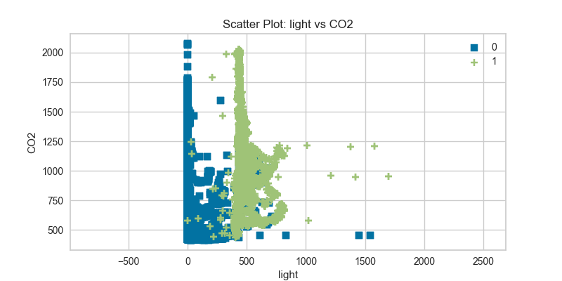
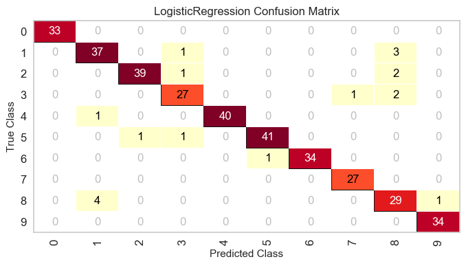
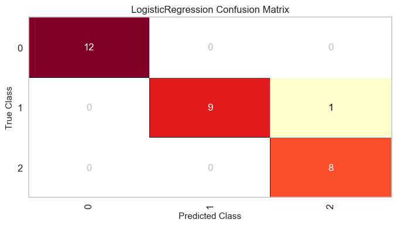
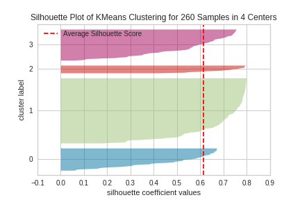
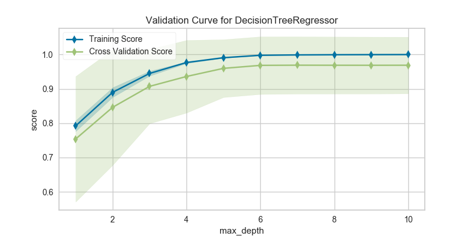
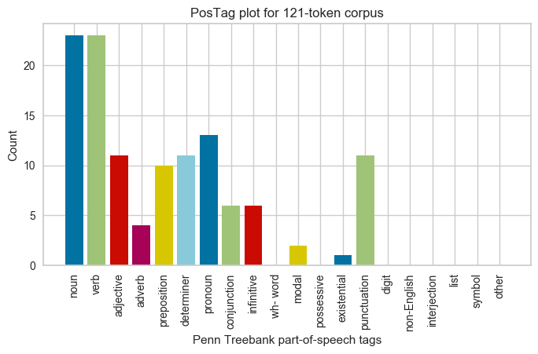

.. -*- mode: rst -*-

Gallery
=======

Feature Analysis
----------------

.. image:: images/gallery/radviz.png
    :width: 200px
    :height: 100px
    :alt: Features Analysis RadViz Visualizer
    :target: api/features/radviz.html#radviz-visualizer

.. image:: images/gallery/rank1d_shapiro.png
    :width: 200px
    :height: 100px
    :alt: Features Analysis Shapiro Rank1D
    :target: api/features/rankd.html#rank-1d

.. image:: images/gallery/rank2d_covariance.png
    :width: 200px
    :height: 100px
    :alt: Features Analysis Covariance Rank2D
    :target: api/features/rankd.html#rank-2d

.. image:: images/gallery/pca_projection_3d.png
    :width: 200px
    :height: 100px
    :alt: Principal Component Plot 3D
    :target: api/features/pca.html#pca-projection

.. image:: images/gallery/concrete_isomap_manifold.png
    :width: 200px
    :height: 100px
    :alt: Isomap Manifold Visualization
    :target: api/features/manifold.html#continuous-target

Regression Visualizers
----------------------

.. image:: images/gallery/residuals.png
    :width: 200px
    :height: 100px
    :alt: Residuals for Ridge Model
    :target: api/regressor/residuals.html#residuals-plot

.. image:: images/gallery/alpha_selection.png
    :width: 200px
    :height: 100px
    :alt: Alpha Selection for Lasso
    :target: api/regressor/alphas.html#alpha-selection

Classification Visualizers
--------------------------

.. image:: images/gallery/classification_report.png
    :width: 200px
    :height: 100px
    :alt: GaussianNB Classification Report
    :target: api/classifier/classification_report.html#classification-report

.. image:: images/gallery/rocauc_binary.png
    :width: 200px
    :height: 100px
    :alt: Binary ROC Curves
    :target: api/classifier/rocauc.html#rocauc

.. image:: images/gallery/rocauc_multiclass.png
    :width: 200px
    :height: 100px
    :alt: Multiclass ROC Curves
    :target: api/classifier/rocauc.html#multi-class-rocauc-curves

.. image:: images/gallery/precision_recall_binary.png
    :width: 200px
    :height: 100px
    :alt: Precision-Recall Curves
    :target: api/classifier/prcurve.html

.. image:: images/gallery/precision_recall_multiclass.png
    :width: 200px
    :height: 100px
    :alt: Multiclass Precision-Recall Curves
    :target: api/classifier/prcurve.html#multi-label-classification

.. image:: images/gallery/discrimination_threshold.png
    :width: 200px
    :height: 100px
    :alt: Discrimination Threshold Plot
    :target: api/classifier/threshold.html#discrimination-threshold

Clustering Visualizers
----------------------

.. image:: images/gallery/elbow.png
    :width: 200px
    :height: 100px
    :alt: Distortion Score Elbow for Mini Batch Means Clustering
    :target: api/cluster/elbow.html#elbow-method

Model Selection Visualizers
---------------------------

.. image:: images/gallery/rfecv_sklearn_example.png
    :width: 200px
    :height: 100px
    :alt: Recursive Feature Elimination with Ensemble Classifier
    :target: api/model_selection/rfecv.html#recursive-feature-elimination

Text Modeling Visualizers
---------------------------

Target Visualizers
------------------

