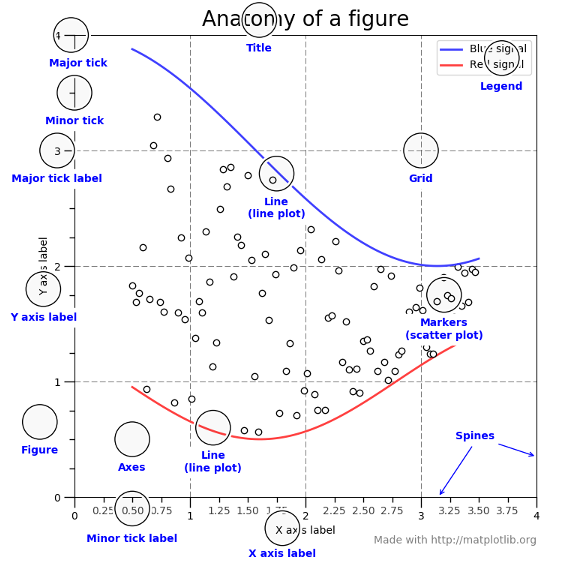

.. -*- mode: rst -*-

Effective Matplotlib
====================

Yellowbrick generates visualizations by wrapping `matplotlib <http://matplotlib.org/>`_, the most prominent Python scientific visualization library. Because of this, Yellowbrick is able to generate publication-ready images for a variety of GUI backends, image formats, and Jupyter notebooks. Yellowbrick strives to provide well-styled visual diagnostic tools and complete information. However, to customize figures or roll your own visualizers, a strong background in using matplotlib is required.

With permission, we have included part of `Chris Moffitt's <https://github.com/chris1610>`_ `Effectively Using Matplotlib <http://pbpython.com/effective-matplotlib.html>`_ as a crash course into Matplotlib terminology and usage. For a complete example, please visit his excellent post on creating a visual sales analysis! Additionally we recommend `Nicolas P. Rougier's Matplotlib tutorial <https://www.labri.fr/perso/nrougier/teaching/matplotlib/>`_ for an in-depth dive.

Figures and Axes
----------------

This graphic from the `matplotlib faq is gold <https://matplotlib.org/faq/usage_faq.html>`_. Keep it handy to understand the different terminology of a plot.

Most of the terms are straightforward but the main thing to remember is that the ``Figure`` is the final image that may contain 1 or more axes. The ``Axes`` represent an individual plot. Once you understand what these are and how to access them through the object oriented API, the rest of the process starts to fall into place.

The other benefit of this knowledge is that you have a starting point when you see things on the web. If you take the time to understand this point, the rest of the matplotlib API will start to make sense.

Matplotlib keeps a global reference to the global figure and axes objects which can be modified by the ``pyplot`` API. To access this import matplotlib as follows:

.. code:: python

    import matplotlib.pyplot as plt

    axes = plt.gca()

The ``plt.gca()`` function gets the current axes so that you can draw on it directly. You can also directly create a figure and axes as follows:

.. code:: python

    fig = plt.figure()
    ax = fig.add_subplot(111)

Yellowbrick will use ``plt.gca()`` by default to draw on. You can access the ``Axes`` object on a visualizer via its ``ax`` property:

.. code:: python

    from sklearn.linear_model import LinearRegression
    from yellowbrick.regressor import PredictionError

    # Fit the visualizer
    model = PredictionError(LinearRegression() )
    model.fit(X_train, y_train)
    model.score(X_test, y_test)

    # Call finalize to draw the final yellowbrick-specific elements
    model.finalize()

    # Get access to the axes object and modify labels
    model.ax.set_xlabel("measured concrete strength")
    model.ax.set_ylabel("predicted concrete strength")
    plt.savefig("peplot.pdf")

You can also pass an external ``Axes`` object directly to the visualizer:

.. code:: python

    model = PredictionError(LinearRegression(), ax=ax)

Therefore you have complete control of the style and customization of a Yellowbrick visualizer.

Creating a Custom Plot
----------------------

The first step with any visualization is to plot the data. Often the simplest way to do this is using the standard pandas plotting function (given a ``DataFrame`` called ``top_10``):

.. code:: python

    top_10.plot(kind='barh', y="Sales", x="Name")

The reason I recommend using pandas plotting first is that it is a quick and easy way to prototype your visualization. Since most people are probably already doing some level of data manipulation/analysis in pandas as a first step, go ahead and use the basic plots to get started.

Assuming you are comfortable with the gist of this plot, the next step is to customize it. Some of the customizations (like adding titles and labels) are very simple to use with the pandas plot function. However, you will probably find yourself needing to move outside of that functionality at some point. That's why it is recommended to create your own ``Axes`` first and pass it to the plotting function in Pandas:

.. code:: python

    fig, ax = plt.subplots()
    top_10.plot(kind='barh', y="Sales", x="Name", ax=ax)

The resulting plot looks exactly the same as the original but we added an additional call to ``plt.subplots()`` and passed the ``ax`` to the plotting function. Why should you do this? Remember when I said it is critical to get access to the axes and figures in matplotlib? That’s what we have accomplished here. Any future customization will be done via the ``ax`` or ``fig`` objects.

We have the benefit of a quick plot from pandas but access to all the power from matplotlib now. An example should show what we can do now. Also, by using this naming convention, it is fairly straightforward to adapt others’ solutions to your unique needs.

Suppose we want to tweak the x limits and change some axis labels? Now that we have the axes in the ``ax`` variable, we have a lot of control:

.. code:: python

    fig, ax = plt.subplots()
    top_10.plot(kind='barh', y="Sales", x="Name", ax=ax)
    ax.set_xlim([-10000, 140000])
    ax.set_xlabel('Total Revenue')
    ax.set_ylabel('Customer');

Here’s another shortcut we can use to change the title and both labels:

.. code:: python

    fig, ax = plt.subplots()
    top_10.plot(kind='barh', y="Sales", x="Name", ax=ax)
    ax.set_xlim([-10000, 140000])
    ax.set(title='2014 Revenue', xlabel='Total Revenue', ylabel='Customer')

To further demonstrate this approach, we can also adjust the size of this image. By using the ``plt.subplots()`` function, we can define the ``figsize`` in inches. We can also remove the legend using ``ax.legend().set_visible(False)``:

.. code:: python

    fig, ax = plt.subplots(figsize=(5, 6))
    top_10.plot(kind='barh', y="Sales", x="Name", ax=ax)
    ax.set_xlim([-10000, 140000])
    ax.set(title='2014 Revenue', xlabel='Total Revenue')
    ax.legend().set_visible(False)

There are plenty of things you probably want to do to clean up this plot. One of the biggest eye sores is the formatting of the Total Revenue numbers. Matplotlib can help us with this through the use of the ``FuncFormatter`` . This versatile function can apply a user defined function to a value and return a nicely formatted string to place on the axis.

Here is a currency formatting function to gracefully handle US dollars in the several hundred thousand dollar range:

.. code:: python

    def currency(x, pos):
        """
        The two args are the value and tick position
        """
        if x >= 1000000:
            return '${:1.1f}M'.format(x*1e-6)
        return '${:1.0f}K'.format(x*1e-3)

Now that we have a formatter function, we need to define it and apply it to the x axis. Here is the full code:

.. code:: python

    fig, ax = plt.subplots()
    top_10.plot(kind='barh', y="Sales", x="Name", ax=ax)
    ax.set_xlim([-10000, 140000])
    ax.set(title='2014 Revenue', xlabel='Total Revenue', ylabel='Customer')
    formatter = FuncFormatter(currency)
    ax.xaxis.set_major_formatter(formatter)
    ax.legend().set_visible(False)

That’s much nicer and shows a good example of the flexibility to define your own solution to the problem.

The final customization feature I will go through is the ability to add annotations to the plot. In order to draw a vertical line, you can use ``ax.axvline()`` and to add custom text, you can use ``ax.text()``.

For this example, we’ll draw a line showing an average and include labels showing three new customers. Here is the full code with comments to pull it all together.

.. code:: python

    # Create the figure and the axes
    fig, ax = plt.subplots()

    # Plot the data and get the average
    top_10.plot(kind='barh', y="Sales", x="Name", ax=ax)
    avg = top_10['Sales'].mean()

    # Set limits and labels
    ax.set_xlim([-10000, 140000])
    ax.set(title='2014 Revenue', xlabel='Total Revenue', ylabel='Customer')

    # Add a line for the average
    ax.axvline(x=avg, color='b', label='Average', linestyle='--', linewidth=1)

    # Annotate the new customers
    for cust in [3, 5, 8]:
    ax.text(115000, cust, "New Customer")

    # Format the currency
    formatter = FuncFormatter(currency)
    ax.xaxis.set_major_formatter(formatter)

    # Hide the legend
    ax.legend().set_visible(False)

While this may not be the most exciting plot it does show how much power you have when following this approach.

Up until now, all the changes we have made have been with the individual plot. Fortunately, we also have the ability to add multiple plots on a figure as well as save the entire figure using various options.

If we decided that we wanted to put two plots on the same figure, we should have a basic understanding of how to do it. First, create the figure, then the axes, then plot it all together. We can accomplish this using ``plt.subplots()``:

.. code:: python

    fig, (ax0, ax1) = plt.subplots(nrows=1, ncols=2, sharey=True, figsize=(7, 4))

In this example, I’m using ``nrows`` and ``ncols`` to specify the size because this is very clear to the new user. In sample code you will frequently just see variables like 1,2. I think using the named parameters is a little easier to interpret later on when you’re looking at your code.

I am also using ``sharey=True`` so that the y-axis will share the same labels.

This example is also kind of nifty because the various axes get unpacked to ``ax0`` and ``ax1``. Now that we have these axes, you can plot them like the examples above but put one plot on ``ax0`` and the other on ``ax1``.

.. code:: python

    # Get the figure and the axes
    fig, (ax0, ax1) = plt.subplots(nrows=1,ncols=2, sharey=True, figsize=(7, 4))
    top_10.plot(kind='barh', y="Sales", x="Name", ax=ax0)
    ax0.set_xlim([-10000, 140000])
    ax0.set(title='Revenue', xlabel='Total Revenue', ylabel='Customers')

    # Plot the average as a vertical line
    avg = top_10['Sales'].mean()
    ax0.axvline(x=avg, color='b', label='Average', linestyle='--', linewidth=1)

    # Repeat for the unit plot
    top_10.plot(kind='barh', y="Purchases", x="Name", ax=ax1)
    avg = top_10['Purchases'].mean()
    ax1.set(title='Units', xlabel='Total Units', ylabel='')
    ax1.axvline(x=avg, color='b', label='Average', linestyle='--', linewidth=1)

    # Title the figure
    fig.suptitle('2014 Sales Analysis', fontsize=14, fontweight='bold');

    # Hide the legends
    ax1.legend().set_visible(False)
    ax0.legend().set_visible(False)

When writing code in a Jupyter notebook you can take advantage of the ``%matplotlib inline`` or ``%matplotlib notebook`` directives to render figures inline. More often, however, you probably want to save your images to disk. Matplotlib supports many different formats for saving files. You can use ``fig.canvas.get_supported_filetypes()`` to see what your system supports:

.. code:: python

    fig.canvas.get_supported_filetypes()

.. parsed-literal::

    {'eps': 'Encapsulated Postscript',
     'jpeg': 'Joint Photographic Experts Group',
     'jpg': 'Joint Photographic Experts Group',
     'pdf': 'Portable Document Format',
     'pgf': 'PGF code for LaTeX',
     'png': 'Portable Network Graphics',
     'ps': 'Postscript',
     'raw': 'Raw RGBA bitmap',
     'rgba': 'Raw RGBA bitmap',
     'svg': 'Scalable Vector Graphics',
     'svgz': 'Scalable Vector Graphics',
     'tif': 'Tagged Image File Format',
     'tiff': 'Tagged Image File Format'}

Since we have the fig object, we can save the figure using multiple options:

.. code:: python

    fig.savefig('sales.png', transparent=False, dpi=80, bbox_inches="tight")

This version saves the plot as a png with opaque background. I have also specified the dpi and bbox_inches="tight" in order to minimize excess white space.
