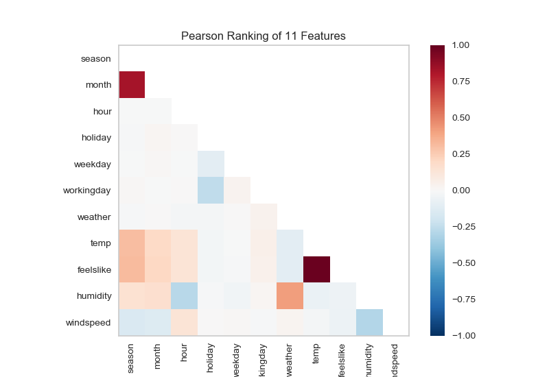
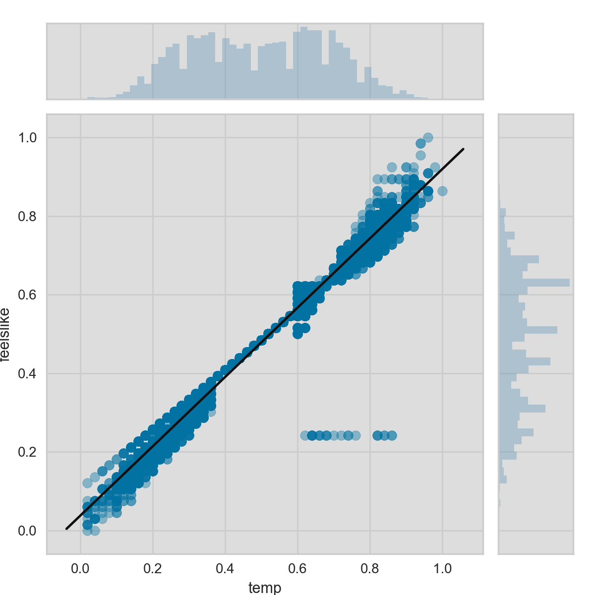
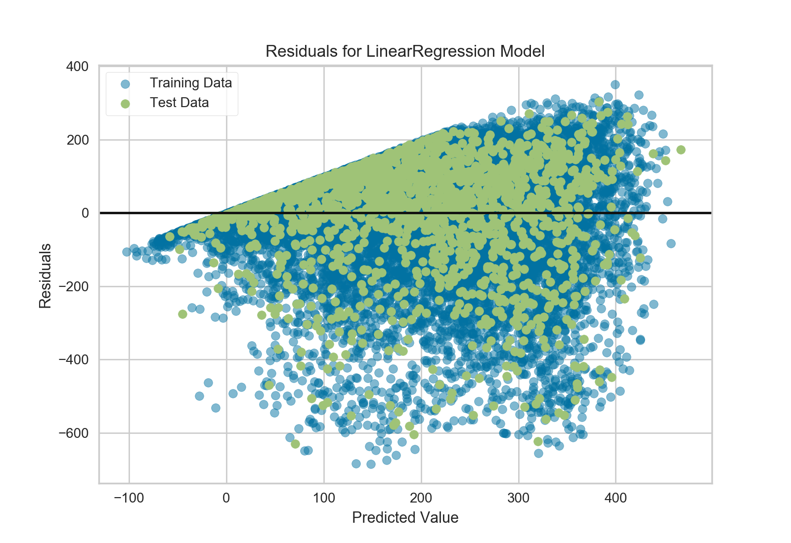
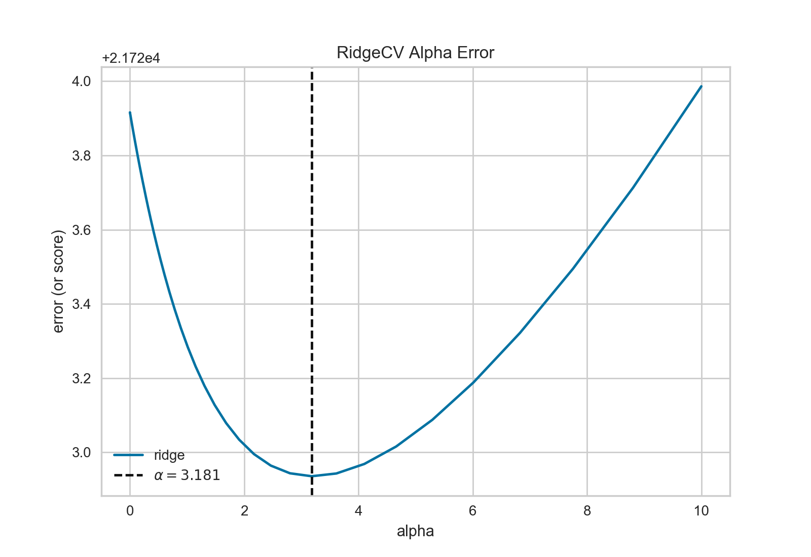
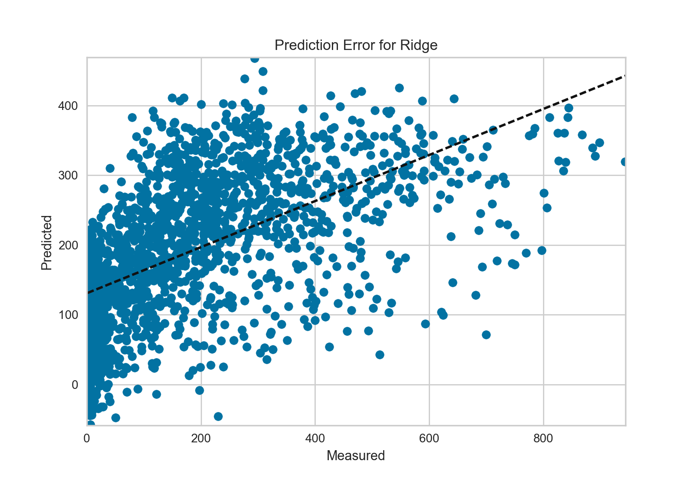

.. -*- mode: rst -*-

Quick Start
===========

If you're new to Yellowbrick, this guide will get you started and help you include visualizers in your machine learning workflow. Before we get started, however, there are several notes about development environments that you should consider.

Yellowbrick has two primary dependencies: `Scikit-Learn <http://scikit-learn.org/>`_ and `Matplotlib <http://matplotlib.org/>`_. If you do not have these Python packages, they will be installed alongside Yellowbrick. Note that Yellowbrick works best with Scikit-Learn version 0.18 or later and Matplotlib version 2.0 or later. Both of these packages require some C code to be compiled, which can be difficult on some systems, like Windows. If you're having trouble, try using a distribution of Python that includes these packages like `Anaconda <https://anaconda.org>`_.

Yellowbrick is also commonly used inside of a `Jupyter Notebook <http://jupyter.org/>`_ alongside `Pandas <http://pandas.pydata.org/>`_ data frames. Notebooks make it especially easy to coordinate code and visualizations, however you can also use Yellowbrick inside of regular Python scripts, either saving figures to disk or showing figures in a GUI window. If you're having trouble with this, please consult Matplotlib's `backends documentation <https://matplotlib.org/faq/usage_faq.html#what-is-a-backend>`_.

.. NOTE:: Jupyter, Pandas, and other ancillary libraries like NLTK for text visualizers are not installed with Yellowbrick and must be installed separately.

Installation
------------

Yellowbrick is compatible with Python 2.7 or later, but it is preferred to use Python 3.5 or later to take full advantage of all functionality. The simplest way to install Yellowbrick is from PyPI_ with pip_, Python's preferred package installer.

.. code-block:: bash

    $ pip install yellowbrick

.. _PyPI: https://pypi.python.org/pypi/yellowbrick
.. _pip: https://docs.python.org/3/installing/

Note that Yellowbrick is an active project and routinely publishes new releases with more visualizers and updates. In order to upgrade Yellowbrick to the latest version, use pip as follows.

.. code-block:: bash

    $ pip install -u yellowbrick

You can also use the ``-u`` flag to update Scikit-Learn, matplotlib, or any other third party utilities that work well with Yellowbrick to their latest versions.

If you're using Windows or Anaconda, you can take advantage of the `conda <https://conda.io/docs/intro.html>`_ utility to install the `Anaconda Yellowbrick package <https://anaconda.org/DistrictDataLabs/yellowbrick>`_:

.. code-block:: bash

    conda install -c districtdatalabs yellowbrick

.. WARNING:: There is a `known bug <https://github.com/DistrictDataLabs/yellowbrick/issues/205>`_ installing matplotlib on Linux with Anaconda. If you're having trouble please let us know on GitHub.

Once installed, you should be able to import Yellowbrick without an error, both in Python and inside of Jupyter notebooks. Note that because of matplotlib, Yellowbrick does not work inside of a virtual environment without jumping through some hoops.

Using Yellowbrick
-----------------
The Yellowbrick API is specifically designed to play nicely with Scikit-Learn. The primary interface is therefore a ``Visualizer`` -- an object that learns from data to produce a visualization. Visualizers are Scikit-Learn `Estimator <http://scikit-learn.org/stable/developers/contributing.html#apis-of-scikit-learn-objects>`_ objects and have a similar interface along with methods for drawing. In order to use visualizers, you simply use the same workflow as with a Scikit-Learn model, import the visualizer, instantiate it, call the visualizer's ``fit()`` method, then in order to render the visualization, call the visualizer's ``poof()`` method, which does the magic!

For example, there are several visualizers that act as transformers, used to perform feature analysis prior to fitting a model. Here is an example to visualize a high dimensional data set with parallel coordinates:

.. code-block:: python

    from yellowbrick.features import ParallelCoordinates

    visualizer = ParallelCoordinates()
    visualizer.fit_transform(X, y)
    visualizer.poof()

As you can see, the workflow is very similar to using a Scikit-Learn transformer, and visualizers are intended to be integrated along with Scikit-Learn utilities. Arguments that change how the visualization is drawn can be passed into the visualizer upon instantiation, similarly to how hyperparameters are included with Scikit-Learn models.

The ``poof()`` method finalizes the drawing (adding titles, axes labels, etc) and then renders the image on your behalf. If you're in a Jupyter notebook, the image should just appear. If you're in a Python script, a GUI window should open with the visualization in interactive form. However, you can also save the image to disk by passing in a file path as follows:

.. code-block:: python

    visualizer.poof(outpath="pcoords.png")

The extension of the filename will determine how the image is rendered, in addition to the .png extension, .pdf is also commonly used.

.. NOTE:: Data input to Yellowbrick is identical to that of Scikit-Learn: a dataset, ``X``, which is a two-dimensional matrix of shape ``(n,m)`` where ``n`` is the number of instances (rows) and ``m`` is the number of features (columns). The dataset ``X`` can be a Pandas DataFrame, a Numpy array, or even a Python list of lists. Optionally, a vector ``y``, which represents the target variable (in supervised learning), can also be supplied as input. The target ``y`` must have length ``n`` -- the same number of elements as rows in ``X`` and can be a Pandas Series, Numpy array, or Python list.

Visualizers can also wrap Scikit-Learn models for evaluation, hyperparameter tuning and algorithm selection. For example, to produce a visual heatmap of a classification report, displaying the precision, recall, F1 score, and support for each class in a classifier, wrap the estimator in a visualizer as follows:

.. code-block:: python

    from yellowbrick.classifier import ClassificationReport
    from sklearn.linear_model import LogisticRegression

    model = LogisticRegression()
    visualizer = ClassificationReport(model)

    visualizer.fit(X_train, y_train)
    visualizer.score(X_test, y_test)
    visualizer.poof()

Only two additional lines of code are required to add visual evaluation of the classifier model, the instantiation of a ``ClassificationReport`` visualizer that wraps the classification estimator and a call to its ``poof()`` method. In this way, Visualizers *enhance* the machine learning workflow without interrupting it.

.. TODO:: Walkthrough visual pipelines and text analysis.

The class-based API is meant to integrate with Scikit-Learn directly, however on occasion there are times when you just need a quick visualization. Yellowbrick supports quick functions for taking advantage of this directly. For example, the two visual diagnostics could have been instead implemented as follows:

.. code-block:: python

    from sklearn.linear_model import LogisticRegression

    from yellowbrick.features import parallel_coordinates
    from yellowbrick.classifier import classification_report

    # Displays parallel coordinates
    g = parallel_coordinates(X, y)

    # Displays classification report
    g = classification_report(LogisticRegression(), X, y)

These quick functions give you slightly less control over the machine learning workflow, but quickly get you diagnostics on demand and are very useful in exploratory processes.

Walkthrough
-----------

Consider a regression analysis as a simple example of the use of visualizers in the machine learning workflow. Using a `bike sharing dataset <https://s3.amazonaws.com/ddl-data-lake/yellowbrick/bikeshare.zip>`_ based upon the one uploaded to the `UCI Machine Learning Repository <https://archive.ics.uci.edu/ml/datasets/bike+sharing+dataset>`_, we would like to predict the number of bikes rented in a given hour based on features like the season, weather, or if it's a holiday.

.. note:: We have updated the dataset from the UCI ML repository to make it a bit easier to load into Pandas; make sure you download the `Yellowbrick version of the dataset <https://s3.amazonaws.com/ddl-data-lake/yellowbrick/bikeshare.zip>`_.

After downloading the dataset and unzipping it in your current working directory, we can load our data as follows:

.. code-block:: python

    import pandas as pd

    data = pd.read_csv('bikeshare.csv')
    X = data[[
        "season", "month", "hour", "holiday", "weekday", "workingday",
        "weather", "temp", "feelslike", "humidity", "windspeed"
    ]]
    y = data["riders"]

The machine learning workflow is the art of creating *model selection triples*, a combination of features, algorithm, and hyperparameters that uniquely identifies a model fitted on a specific data set. As part of our feature selection, we want to identify features that have a linear relationship with each other, potentially introducing covariance into our model and breaking OLS (guiding us toward removing features or using regularization). We can use the Rank2D_ visualizer to compute Pearson correlations between all pairs of features as follows:

.. _Rank2D: http://www.scikit-yb.org/en/latest/api/yellowbrick.features.html#module-yellowbrick.features.rankd

.. code-block:: python

   from yellowbrick.features import Rank2D

   visualizer = Rank2D(algorithm="pearson")
   visualizer.fit_transform(X)
   visualizer.poof()

This figure shows us the Pearson correlation between pairs of features such that each cell in the grid represents two features identified in order on the x and y axes and whose color displays the magnitude of the correlation. A Pearson correlation of 1.0 means that there is a strong positive, linear relationship between the pairs of variables and a value of -1.0 indicates a strong negative, linear relationship (a value of zero indicates no relationship). Therefore we are looking for dark red and dark blue boxes to identify further.

In this chart we see that features 7 (temperature) and feature 9 (feelslike) have a strong correlation and also that feature 0 (season) has a strong correlation with feature 1 (month). This seems to make sense; the apparent temperature we feel outside depends on the actual temperature and other airquality factors, and the season of the year is described by the month! To dive in deeper, we can use the `JointPlotVisualizer <http://www.scikit-yb.org/en/latest/api/yellowbrick.features.html#module-yellowbrick.features.jointplot>`_ to inspect those relationships.

.. code-block:: python

    from yellowbrick.features import JointPlotVisualizer

    visualizer = JointPlotVisualizer(feature='temp', target='feelslike')
    visualizer.fit(X['temp'], X['feelslike'])
    visualizer.poof()

This visualizer plots a scatter diagram of the apparent temperature on the y axis and the actual measured temperature on the x axis and draws a line of best fit using a simple linear regression. Additionally, univariate distributions are shown as histograms above the x axis for temp and next to the y axis for feelslike.  The ``JointPlotVisualizer`` gives an at-a-glance view of the very strong positive correlation of the features, as well as the range and distribution of each feature. Note that the axes are normalized to the space between zero and one, a common technique in machine learning to reduce the impact of one feature over another.

This plot is very interesting; first there appear to be some outliers in the dataset, where feelslike is approximately equal to 0.25. These instances may need to be manually removed in order to improve the quality of the final model because they could represent data input errors. Secondly, we can see that more extreme temperatures create an exaggerated effect in perceived temperature; the colder it is, the colder people are likely to believe it to be, and the warmer it is, the warmer it appears to be. Moderate temperatures feel like they do. This gives us the intuition that feelslike may be a better feature than temp, and if it is causing problems in our regression analysis, we should probably remove the temp variable in favor of feels like.

At this point, we can train our model; let's fit a linear regression to our model and plot the residuals.

.. code-block:: python

    from yellowbrick.regressor import ResidualsPlot
    from sklearn.linear_model import LinearRegression
    from sklearn.model_selection import train_test_split

    # Create training and test sets
    X_train, X_test, y_train, y_test = train_test_split(
        X, y, test_size=0.1
    )

    visualizer = ResidualsPlot(LinearRegression())
    visualizer.fit(X_train, y_train)
    visualizer.score(X_test, y_test)
    visualizer.poof()

The residuals plot shows the error against the predicted value, and allows us to look for heteroskedasticity in the model; e.g. regions in the target where the error is greatest. The shape of the residuals can strongly inform us where OLS (ordinary least squares) is being most strongly effected by the components of our model (namely the features). In this case, we can see that the lower the predicted value (the lower the number of riders), the lower the error, but the higher the number of predicted riders, the higher the error. This indicates that our model has more noise in certain regions of the target or that two variables are colinear, meaning that they are injecting error as the noise in their relationship changes.

The residuals plot also shows how the model is injecting error, the bold horizontal line at ``residuals = 0`` is no error, and any point above or below that line indicates the magnitude of error. For example, most of the residuals are negative, and since the score is computed as ``actual - expected``, this means that the expected value is bigger than the actual value most of the time, e.g. that our model is primarily guessing more than the actual number of riders. Moreover, there is a very interesting boundary along the top right of the residuals graph, indicating an interesting affect in model space; possibly that some feature is strongly weighted in the region of that model.

Finally the residuals are colored by training and test set. This helps us identify errors in creating train and test splits. If the test error doesn't match the train error then our model is either overfit or underfit. Otherwise it could be an error in shuffling the dataset before creating the splits.

Because our coefficient of determination for this model is 0.328, let's see if we can fit a better model using *regularization*, and explore another visualizer at the same time.

.. code-block:: python

    import numpy as np

    from sklearn.linear_model import RidgeCV
    from yellowbrick.regressor import AlphaSelection

    alphas = np.logspace(-10, 1, 200)
    visualizer = AlphaSelection(RidgeCV(alphas=alphas))
    visualizer.fit(X, y)
    visualizer.poof()

When exploring model families, the primary thing to consider is how the model becomes more *complex*. As the model increases in complexity, the error due to variance increases because the model is becoming more overfit and cannot generalize to unseen data. However, the simpler the model is the more error there is likely to be due to bias; the model is underfit and therefore misses its target more frequently. The goal therefore of most machine learning is to create a model that is *just complex enough*, finding a middle ground between bias and variance.

For a linear model, complexity comes from the features themselves and their assigned weight according to the model. Linear models therefore expect the *least number of features* that achieves an explanatory result. One technique to achieve this is *regularization*, the introduction of a parameter called alpha that normalizes the weights of the coefficients with each other and penalizes complexity. Alpha and complexity have an inverse relationship, the higher the alpha, the lower the complexity of the model and vice versa.

The question therefore becomes how you choose alpha. One technique is to fit a number of models using cross-validation and selecting the alpha that has the lowest error. The ``AlphaSelection`` visualizer allows you to do just that, with a visual representation that shows the behavior of the regularization. As you can see in the figure above, the error decreases as the value of alpha increases up until our chosen value (in this case, 3.181) where the error starts to increase. This allows us to target the bias/variance trade-off and to explore the relationship of regularization methods (for example Ridge vs. Lasso).

We can now train our final model and visualize it with the ``PredictionError`` visualizer:

.. code-block:: python

    from sklearn.linear_model import Ridge
    from yellowbrick.regressor import PredictionError

    visualizer = PredictionError(Ridge(alpha=3.181))
    visualizer.fit(X_train, y_train)
    visualizer.score(X_test, y_test)
    visualizer.poof()

The prediction error visualizer plots the actual (measured) vs. expected (predicted) values against each other. The dotted black line is the 45 degree line that indicates zero error. Like the residuals plot, this allows us to see where error is occurring and in what magnitude.

In this plot we can see that most of the instance density is less than 200 riders. We may want to try orthogonal matching pursuit or splines to fit a regression that takes into account more regionality. We can also note that that weird topology from the residuals plot seems to be fixed using the Ridge regression, and that there is a bit more balance in our model between large and small values. Potentially the Ridge regularization cured a covariance issue we had between two features. As we move forward in our analysis using other model forms, we can continue to utilize visualizers to quickly compare and see our results.

Hopefully this workflow gives you an idea of how to integrate Visualizers into machine learning with Scikit-Learn and inspires you to use them in your work and write your own! For additional information on getting started with Yellowbrick, check out the :doc:`tutorial`. After that you can get up to speed on specific visualizers detailed in the :doc:`api/index`.
