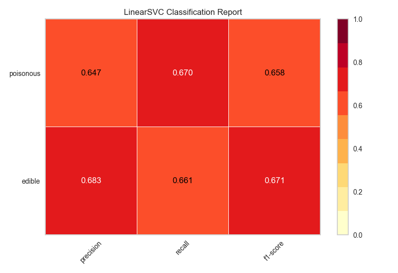
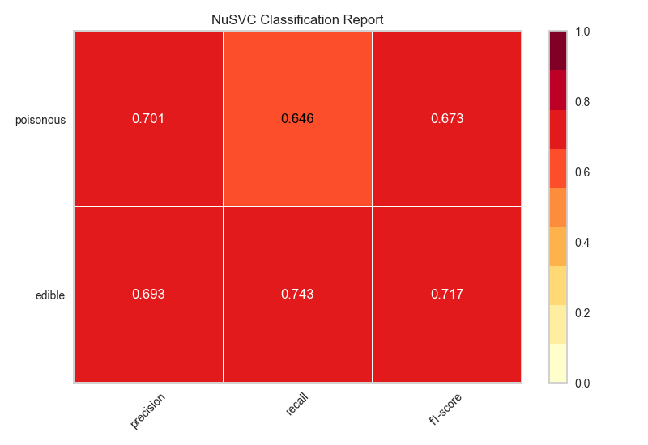
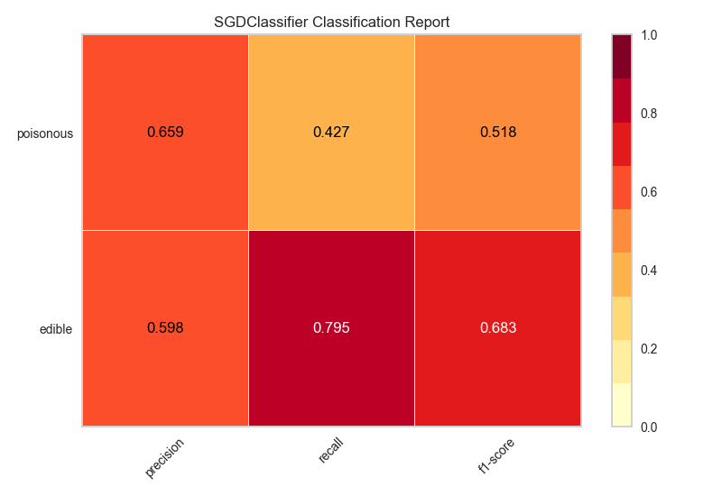
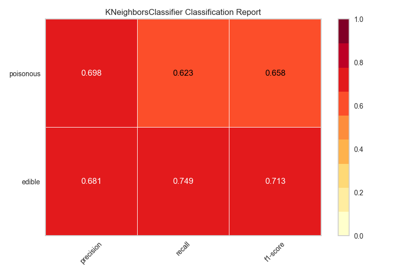
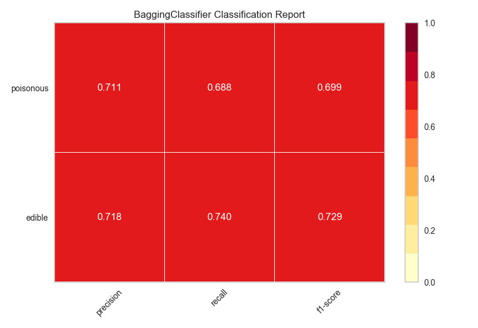
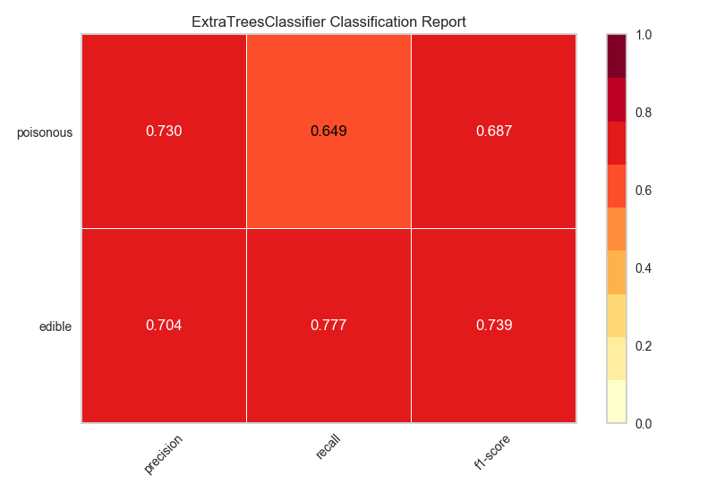

.. -*- mode: rst -*-

Model Selection Tutorial
========================

In this tutorial, we are going to look at scores for a variety of
`Scikit-Learn <http://scikit-learn.org>`__ models and compare them using
visual diagnostic tools from `Yellowbrick <http://www.scikit-yb.org>`__
in order to select the best model for our data.

The Model Selection Triple
--------------------------
Discussions of machine learning are frequently characterized by a singular focus on model selection. Be it logistic regression, random forests, Bayesian methods, or artificial neural networks, machine learning practitioners are often quick to express their preference. The reason for this is mostly historical. Though modern third-party machine learning libraries have made the deployment of multiple models appear nearly trivial, traditionally the application and tuning of even one of these algorithms required many years of study. As a result, machine learning practitioners tended to have strong preferences for particular (and likely more familiar) models over others.

However, model selection is a bit more nuanced than simply picking the "right" or "wrong" algorithm. In practice, the workflow includes:

  1. selecting and/or engineering the smallest and most predictive feature set
  2. choosing a set of algorithms from a model family, and
  3. tuning the algorithm hyperparameters to optimize performance.

The **model selection triple** was first described in a 2015 SIGMOD_ paper by Kumar et al. In their paper, which concerns the development of next-generation database systems built to anticipate predictive modeling, the authors cogently express that such systems are badly needed due to the highly experimental nature of machine learning in practice. "Model selection," they explain, "is iterative and exploratory because the space of [model selection triples] is usually infinite, and it is generally impossible for analysts to know a priori which [combination] will yield satisfactory accuracy and/or insights."

Recently, much of this workflow has been automated through grid search methods, standardized APIs, and GUI-based applications. In practice, however, human intuition and guidance can more effectively hone in on quality models than exhaustive search. By visualizing the model selection process, data scientists can steer towards final, explainable models and avoid pitfalls and traps.

The Yellowbrick library is a diagnostic visualization platform for machine learning that allows data scientists to steer the model selection process. Yellowbrick extends the Scikit-Learn API with a new core object: the Visualizer. Visualizers allow visual models to be fit and transformed as part of the Scikit-Learn Pipeline process, providing visual diagnostics throughout the transformation of high dimensional data.

.. _SIGMOD: http://cseweb.ucsd.edu/~arunkk/vision/SIGMODRecord15.pdf

About the Data
--------------

This tutorial uses a modified version of the mushroom dataset_ from
the `UCI Machine Learning Repository <http://archive.ics.uci.edu/ml/>`__.
Our objective is to predict if a mushroom is poisonous or edible based on
its characteristics.

.. _dataset: https://github.com/rebeccabilbro/rebeccabilbro.github.io/blob/master/data/agaricus-lepiota.txt

The data include descriptions of hypothetical samples corresponding to
23 species of gilled mushrooms in the Agaricus and Lepiota Family. Each
species was identified as definitely edible, definitely poisonous, or of
unknown edibility and not recommended (this latter class was combined
with the poisonous one).

Our file, "agaricus-lepiota.txt," contains information for 3 nominally
valued attributes and a target value from 8124 instances of mushrooms
(4208 edible, 3916 poisonous).

Let's load the data with Pandas.

.. code:: python

    import os
    import pandas as pd

    names = [
        'class',
        'cap-shape',
        'cap-surface',
        'cap-color'
    ]

    mushrooms = os.path.join('data','agaricus-lepiota.txt')
    dataset   = pd.read_csv(mushrooms)
    dataset.columns = names
    dataset.head()

= =========  =========  ===========  =========
. class      cap-shape  cap-surface  cap-color
= =========  =========  ===========  =========
0 edible     bell       smooth       white
1 poisonous  convex     scaly        white
2 edible     convex     smooth       gray
3 edible     convex     scaly        yellow
4 edible     bell       smooth       white
= =========  =========  ===========  =========

.. code:: python

    features = ['cap-shape', 'cap-surface', 'cap-color']
    target   = ['class']

    X = dataset[features]
    y = dataset[target]

Feature Extraction
------------------

Our data, including the target, is categorical. We will need to change
these values to numeric ones for machine learning. In order to extract
this from the dataset, we'll have to use Scikit-Learn transformers to
transform our input dataset into something that can be fit to a model.
Luckily, Sckit-Learn does provide a transformer for converting
categorical labels into numeric integers:
`sklearn.preprocessing.LabelEncoder <http://scikit-learn.org/stable/modules/generated/sklearn.preprocessing.LabelEncoder.html>`__.
Unfortunately it can only transform a single vector at a time, so we'll
have to adapt it in order to apply it to multiple columns.

.. code:: python

    from sklearn.base import BaseEstimator, TransformerMixin
    from sklearn.preprocessing import LabelEncoder, OneHotEncoder

    class EncodeCategorical(BaseEstimator, TransformerMixin):
        """
        Encodes a specified list of columns or all columns if None.
        """

        def __init__(self, columns=None):
            self.columns  = [col for col in columns]
            self.encoders = None

        def fit(self, data, target=None):
            """
            Expects a data frame with named columns to encode.
            """
            # Encode all columns if columns is None
            if self.columns is None:
                self.columns = data.columns

            # Fit a label encoder for each column in the data frame
            self.encoders = {
                column: LabelEncoder().fit(data[column])
                for column in self.columns
            }
            return self

        def transform(self, data):
            """
            Uses the encoders to transform a data frame.
            """
            output = data.copy()
            for column, encoder in self.encoders.items():
                output[column] = encoder.transform(data[column])

            return output

Modeling and Evaluation
-----------------------

Common metrics for evaluating classifiers
~~~~~~~~~~~~~~~~~~~~~~~~~~~~~~~~~~~~~~~~~

**Precision** is the number of correct positive results divided by the
number of all positive results (e.g. *How many of the mushrooms we
predicted would be edible actually were?*).

**Recall** is the number of correct positive results divided by the
number of positive results that should have been returned (e.g. *How
many of the mushrooms that were poisonous did we accurately predict were
poisonous?*).

The **F1 score** is a measure of a test's accuracy. It considers both
the precision and the recall of the test to compute the score. The F1
score can be interpreted as a weighted average of the precision and
recall, where an F1 score reaches its best value at 1 and worst at 0.

::

    precision = true positives / (true positives + false positives)

    recall = true positives / (false negatives + true positives)

    F1 score = 2 * ((precision * recall) / (precision + recall))

Now we're ready to make some predictions!

Let's build a way to evaluate multiple estimators -- first using
traditional numeric scores (which we'll later compare to some visual
diagnostics from the Yellowbrick library).

.. code:: python

    from sklearn.metrics import f1_score
    from sklearn.pipeline import Pipeline

    def model_selection(X, y, estimator):
        """
        Test various estimators.
        """
        y = LabelEncoder().fit_transform(y.values.ravel())
        model = Pipeline([
             ('label_encoding', EncodeCategorical(X.keys())),
             ('one_hot_encoder', OneHotEncoder()),
             ('estimator', estimator)
        ])

        # Instantiate the classification model and visualizer
        model.fit(X, y)

        expected  = y
        predicted = model.predict(X)

        # Compute and return the F1 score (the harmonic mean of precision and recall)
        return (f1_score(expected, predicted))

.. code:: python

    # Try them all!
    from sklearn.svm import LinearSVC, NuSVC, SVC
    from sklearn.neighbors import KNeighborsClassifier
    from sklearn.linear_model import LogisticRegressionCV, LogisticRegression, SGDClassifier
    from sklearn.ensemble import BaggingClassifier, ExtraTreesClassifier, RandomForestClassifier

.. code:: python

    model_selection(X, y, LinearSVC())

.. parsed-literal::

    0.65846308387744845

.. code:: python

    model_selection(X, y, NuSVC())

.. parsed-literal::

    0.63838842388991346

.. code:: python

    model_selection(X, y, SVC())

.. parsed-literal::

    0.66251459711950167

.. code:: python

    model_selection(X, y, SGDClassifier())

.. parsed-literal::

    0.69944182052382997

.. code:: python

    model_selection(X, y, KNeighborsClassifier())

.. parsed-literal::

    0.65802139037433149

.. code:: python

    model_selection(X, y, LogisticRegressionCV())

.. parsed-literal::

    0.65846308387744845

.. code:: python

    model_selection(X, y, LogisticRegression())

.. parsed-literal::

    0.65812609897010799

.. code:: python

    model_selection(X, y, BaggingClassifier())

.. parsed-literal::

    0.687643484132343

.. code:: python

    model_selection(X, y, ExtraTreesClassifier())

.. parsed-literal::

    0.68713648045448383

.. code:: python

    model_selection(X, y, RandomForestClassifier())

.. parsed-literal::

    0.69317131158367451

Preliminary Model Evaluation
~~~~~~~~~~~~~~~~~~~~~~~~~~~~

Based on the results from the F1 scores above, which model is performing
the best?

Visual Model Evaluation
-----------------------

Now let's refactor our model evaluation function to use Yellowbrick's
``ClassificationReport`` class, a model visualizer that displays the
precision, recall, and F1 scores. This visual model analysis tool
integrates numerical scores as well color-coded heatmap in order to
support easy interpretation and detection, particularly the nuances of
Type I and Type II error, which are very relevant (lifesaving, even) to
our use case!

**Type I error** (or a **"false positive"**) is detecting an effect that
is not present (e.g. determining a mushroom is poisonous when it is in
fact edible).

**Type II error** (or a **"false negative"**) is failing to detect an
effect that is present (e.g. believing a mushroom is edible when it is
in fact poisonous).

.. code:: python

    from sklearn.pipeline import Pipeline
    from yellowbrick.classifier import ClassificationReport

    def visual_model_selection(X, y, estimator):
        """
        Test various estimators.
        """
        y = LabelEncoder().fit_transform(y.values.ravel())
        model = Pipeline([
             ('label_encoding', EncodeCategorical(X.keys())),
             ('one_hot_encoder', OneHotEncoder()),
             ('estimator', estimator)
        ])

        # Instantiate the classification model and visualizer
        visualizer = ClassificationReport(model, classes=['edible', 'poisonous'])
        visualizer.fit(X, y)
        visualizer.score(X, y)
        visualizer.poof()

.. code:: python

    visual_model_selection(X, y, LinearSVC())

.. code:: python

    visual_model_selection(X, y, NuSVC())

.. code:: python

    visual_model_selection(X, y, SVC())

.. code:: python

    visual_model_selection(X, y, SGDClassifier())

.. code:: python

    visual_model_selection(X, y, KNeighborsClassifier())

.. code:: python

    visual_model_selection(X, y, LogisticRegressionCV())

.. code:: python

    visual_model_selection(X, y, LogisticRegression())

.. code:: python

    visual_model_selection(X, y, BaggingClassifier())

.. code:: python

    visual_model_selection(X, y, ExtraTreesClassifier())

.. code:: python

    visual_model_selection(X, y, RandomForestClassifier())

Reflection
----------

1. Which model seems best now? Why?
2. Which is most likely to save your life?
3. How is the visual model evaluation experience different from numeric
   model evaluation?
