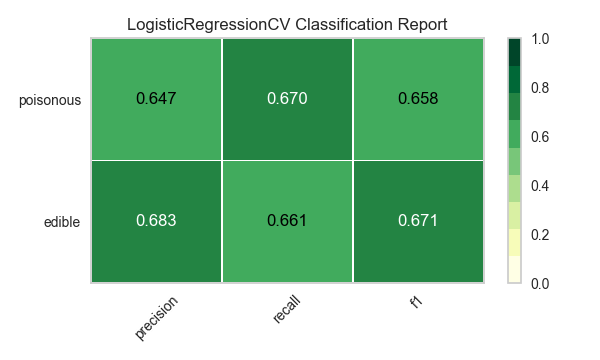
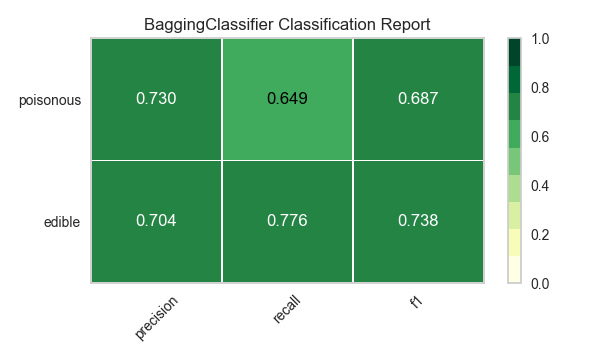

.. -*- mode: rst -*-

Tutoriel sur la sélection des modèles
========================

Dans ce tutoriel, nous allons examiner les scores d'une variété de modèles `Scikit-Learn <http://scikit-learn.org>`__ et les comparer en utilisant les outils de diagnostic visuel de `Yellowbrick <http://www.scikit-yb.org>`__ afin de sélectionner le meilleur modèle pour nos données.

La triple sélection de modèle
--------------------------
Les discussions sur l'apprentissage automatique sont souvent caractérisées par une focalisation singulière sur la sélection de modèles. Qu'il s'agisse de régression logistique, de forêts aléatoires, de méthodes bayésiennes ou de réseaux neuronaux artificiels, les praticiens de l'apprentissage automatique sont souvent prompts à exprimer leur préférence. La raison en est essentiellement historique. Bien que les bibliothèques d'apprentissage automatique tierces modernes aient rendu le déploiement de plusieurs modèles presque trivial, l'application et le réglage d'un seul de ces algorithmes nécessitaient traditionnellement de nombreuses années d'étude. Par conséquent, les praticiens de l'apprentissage automatique avaient tendance à privilégier certains modèles (probablement plus familiers) par rapport à d'autres.

Cependant, la sélection d'un modèle est un peu plus nuancée que le simple choix du "bon" ou du "mauvais" algorithme. Dans la pratique, le flux de travail comprend

  1. la sélection et/ou l'élaboration de l'ensemble de caractéristiques le plus petit et le plus prédictif
  2. le choix d'un ensemble d'algorithmes à partir d'une famille de modèles, et
  3. le réglage des hyperparamètres de l'algorithme pour optimiser les performances.

La **triple sélection de modèle** a été décrite pour la première fois dans un article SIGMOD_ de 2015 par Kumar et al. Dans leur article, qui concerne le développement de systèmes de base de données de nouvelle génération conçus pour anticiper la modélisation prédictive, les auteurs expliquent de manière convaincante que de tels systèmes sont absolument nécessaires en raison de la nature hautement expérimentale de l'apprentissage automatique dans la pratique. "La sélection des modèles, expliquent-ils, est itérative et exploratoire car l'espace des [triplets de sélection de modèles] est généralement infini, et il est généralement impossible pour les analystes de savoir a priori quelle [combinaison] produira une précision et/ou des informations satisfaisantes.

Récemment, une grande partie de ce flux de travail a été automatisée grâce à des méthodes de recherche en grille, des API normalisées et des applications basées sur des interfaces graphiques. Dans la pratique, cependant, l'intuition et les conseils de l'homme peuvent permettre d'identifier des modèles de qualité plus efficacement qu'une recherche exhaustive. En visualisant le processus de sélection des modèles, les scientifiques des données peuvent s'orienter vers des modèles définitifs et explicables et éviter les pièges et les écueils.

La bibliothèque Yellowbrick est une plateforme de visualisation diagnostique pour l'apprentissage automatique qui permet aux scientifiques des données d'orienter le processus de sélection des modèles. Yellowbrick étend l'API Scikit-Learn avec un nouvel objet central : le visualiseur. Les visualiseurs permettent d'ajuster et de transformer des modèles visuels dans le cadre du processus Scikit-Learn Pipeline, en fournissant des diagnostics visuels tout au long de la transformation de données à haute dimension.

.. _SIGMOD : http://cseweb.ucsd.edu/~arunkk/vision/SIGMODRecord15.pdf

À propos des données
--------------


Ce tutoriel utilise les données sur les champignons du module Yellowbrick :doc:`api/datasets/index`. Notre objectif est de prédire si un champignon est toxique ou comestible en fonction de ses caractéristiques.

.. NOTE: : La version YB des données sur les champignons diffère de l'ensemble de données sur les champignons du `UCI Machine Learning Repository <http://archive.ics.uci.edu/ml/>`__. La version Yellowbrick a été délibérément modifiée pour rendre la modélisation un peu plus difficile.

Les données comprennent des descriptions d'échantillons hypothétiques correspondant à 23 espèces de champignons à branchies de la famille Agaricus et Lepiota. Chaque espèce a été identifiée comme certainement comestible, certainement toxique, ou de comestibilité inconnue et déconseillée (cette dernière catégorie a été combinée avec celle des champignons toxiques).

Nos données contiennent des informations pour 3 attributs à valeur nominale et une valeur cible pour 8124 cas de champignons (4208 comestibles, 3916 toxiques).

Chargeons les données :

.. code:: python

    from yellowbrick.datasets import load_mushroom

    X, y = load_mushroom()
    print(X[:5]) # inspect the first five rows

.. parsed-literal::

            shape  surface     color
    0      convex   smooth    yellow
    1        bell   smooth     white
    2      convex    scaly     white
    3      convex   smooth      gray
    4      convex    scaly    yellow


Extraction de caractéristiques
------------------

Nos données, y compris la cible, sont catégoriques. Nous devrons transformer ces valeurs en valeurs numériques pour l'apprentissage automatique. Afin d'extraire cela du jeu de données, nous devrons utiliser les transformateurs de scikit-learn pour transformer notre jeu de données d'entrée en quelque chose qui peut être adapté à un modèle. Heureusement, scikit-learn fournit des transformateurs pour convertir les étiquettes catégorielles en nombres entiers :
`sklearn.preprocessing.LabelEncoder <http://scikit-learn.org/stable/modules/generated/sklearn.preprocessing.LabelEncoder.html>`__ et `sklearn.preprocessing.OneHotEncoder <http://scikit-learn.org/stable/modules/generated/sklearn.preprocessing.OneHotEncoder.html>`__.

Nous allons utiliser une combinaison de l'objet ``Pipeline`` de scikit-learn (voici <http://zacstewart.com/2014/08/05/pipelines-of-featureunions-of-pipelines.html>`__ un excellent article sur l'utilisation des pipelines par `Zac Stewart <https://twitter.com/zacstewart>`__), ```OneHotEncoder``, et ``LabelEncoder`` :
.. code:: python

    from sklearn.pipeline import Pipeline
    from sklearn.preprocessing import OneHotEncoder, LabelEncoder

    # Label-encode targets before modeling
    y = LabelEncoder().fit_transform(y)

    # One-hot encode columns before modeling
    model = Pipeline([
     ('one_hot_encoder', OneHotEncoder()),
     ('estimator', estimator)
    ])

Modélisation et évaluation
-----------------------

Métriques communes pour l'évaluation des classificateurs
~~~~~~~~~~~~~~~~~~~~~~~~~~~~~~~~~~~~~~~~~

**La précision** est le nombre de résultats positifs corrects divisé par le nombre de tous les résultats positifs (par ex.
par le nombre de tous les résultats positifs (par exemple, *Combien de champignons que nous avons prédits comme étant comestibles l'ont été ?
champignons dont nous avons prédit qu'ils seraient comestibles l'ont été?*).

**Le rappel** est le nombre de résultats positifs corrects divisé par le nombre de résultats positifs qui auraient dû l'être.
par le nombre de résultats positifs qui auraient dû être renvoyés (par ex.
combien de champignons vénéneux avons-nous prédit avec précision qu'ils étaient vénéneux ?
vénéneux?*).

Le **score F1** est une mesure de la précision d'un test. Il prend en compte à la fois
Il prend en compte la précision et le rappel du test pour calculer le score. Le score F1
peut être interprété comme une moyenne pondérée de la précision et du rappel.
où le score F1 atteint sa meilleure valeur à 1 et sa pire valeur à 0.

::

    precision = true positives / (true positives + false positives)

    recall = true positives / (false negatives + true positives)

    F1 score = 2 * ((precision * recall) / (precision + recall))

Nous sommes maintenant prêts à faire des prédictions !

Construisons un moyen d'évaluer plusieurs estimateurs -- d'abord en utilisant des
traditionnels (que nous comparerons plus tard à des diagnostics visuels de la bibliothèque
visuels de la bibliothèque Yellowbrick).

.. code:: python

    from sklearn.metrics import f1_score
    from sklearn.pipeline import Pipeline
    from sklearn.svm import LinearSVC, NuSVC, SVC
    from sklearn.neighbors import KNeighborsClassifier
    from sklearn.preprocessing import OneHotEncoder, LabelEncoder
    from sklearn.linear_model import LogisticRegressionCV, LogisticRegression, SGDClassifier
    from sklearn.ensemble import BaggingClassifier, ExtraTreesClassifier, RandomForestClassifier


    models = [
        SVC(gamma='auto'), NuSVC(gamma='auto'), LinearSVC(),
        SGDClassifier(max_iter=100, tol=1e-3), KNeighborsClassifier(),
        LogisticRegression(solver='lbfgs'), LogisticRegressionCV(cv=3),
        BaggingClassifier(), ExtraTreesClassifier(n_estimators=300),
        RandomForestClassifier(n_estimators=300)
    ]


    def score_model(X, y, estimator, **kwargs):
        """
        Test various estimators.
        """
        y = LabelEncoder().fit_transform(y)
        model = Pipeline([
            ('one_hot_encoder', OneHotEncoder()),
            ('estimator', estimator)
        ])

        # Instantiate the classification model and visualizer
        model.fit(X, y, **kwargs)

        expected  = y
        predicted = model.predict(X)

        # Compute and return F1 (harmonic mean of precision and recall)
        print("{}: {}".format(estimator.__class__.__name__, f1_score(expected, predicted)))

    for model in models:
        score_model(X, y, model)


.. parsed-literal::

    SVC: 0.6624286455630514
    NuSVC: 0.6726016476215785
    LinearSVC: 0.6583804143126177
    SGDClassifier: 0.5582697992842696
    KNeighborsClassifier: 0.6581185045215279
    LogisticRegression: 0.6580434509606933
    LogisticRegressionCV: 0.6583804143126177
    BaggingClassifier: 0.6879633373770051
    ExtraTreesClassifier: 0.6871364804544838
    RandomForestClassifier: 0.687643484132343


Évaluation préliminaire du modèle
~~~~~~~~~~~~~~~~~~~~~~~~~~~~

Sur la base des résultats des scores F1 ci-dessus, quel est le modèle le plus performant ?

Évaluation visuelle du modèle
-----------------------

Refactorisons maintenant notre fonction d'évaluation de modèle pour utiliser la classe ``ClassificationReport`` de Yellowbrick, un visualiseur de modèle qui affiche les scores de précision, de rappel et F1. Cet outil visuel d'analyse de modèle intègre des scores numériques ainsi que des cartes thermiques codées en couleur afin de faciliter l'interprétation et la détection, en particulier les nuances de l'erreur de Type I et de Type II, qui sont très pertinentes (voire salvatrices) pour notre cas d'utilisation !

**L'erreur de type I** (ou **"faux positif "**) consiste à détecter un effet qui n'existe pas (par exemple, déterminer qu'un champignon est vénéneux alors qu'il est en fait comestible).

**L'erreur de type II** (ou **"faux négatif "**) consiste à ne pas détecter un effet présent (par exemple, croire qu'un champignon est comestible alors qu'il est en fait toxique).

.. code:: python

    from sklearn.pipeline import Pipeline
    from yellowbrick.classifier import ClassificationReport


    def visualize_model(X, y, estimator, **kwargs):
        """
        Test various estimators.
        """
        y = LabelEncoder().fit_transform(y)
        model = Pipeline([
            ('one_hot_encoder', OneHotEncoder()),
            ('estimator', estimator)
        ])

        # Instantiate the classification model and visualizer
        visualizer = ClassificationReport(
            model, classes=['edible', 'poisonous'],
            cmap="YlGn", size=(600, 360), **kwargs
        )
        visualizer.fit(X, y)
        visualizer.score(X, y)
        visualizer.show()

    for model in models:
        visualize_model(X, y, model)


.. image:: images/tutorial/modelselect_svc.png

.. image:: images/tutorial/modelselect_nu_svc.png

.. image:: images/tutorial/modelselect_linear_svc.png

.. image:: images/tutorial/modelselect_sgd_classifier.png

.. image:: images/tutorial/modelselect_kneighbors_classifier.png

.. image:: images/tutorial/modelselect_logistic_regression.png





.. image:: images/tutorial/modelselect_extra_trees_classifier.png

.. image:: images/tutorial/modelselect_random_forest_classifier.png


Réflexion
----------

1. Quel modèle vous semble le plus approprié aujourd'hui ? Pourquoi ?
2. Lequel est le plus susceptible de vous sauver la vie ?
3. En quoi l'évaluation visuelle d'un modèle diffère-t-elle de l'évaluation numérique d'un modèle ?
   numérique ?