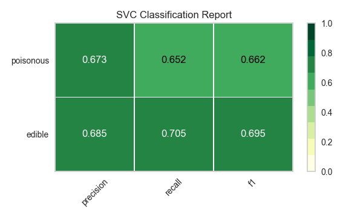
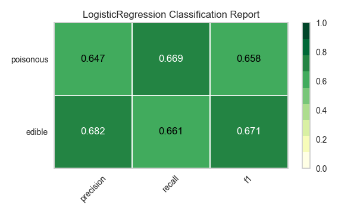

.. -*- mode: rst -*-

Model Selection Tutorial
========================

In this tutorial, we are going to look at scores for a variety of `Scikit-Learn <http://scikit-learn.org>`__ models and compare them using visual diagnostic tools from `Yellowbrick <http://www.scikit-yb.org>`__ in order to select the best model for our data.

The Model Selection Triple
--------------------------
Discussions of machine learning are frequently characterized by a singular focus on model selection. Be it logistic regression, random forests, Bayesian methods, or artificial neural networks, machine learning practitioners are often quick to express their preference. The reason for this is mostly historical. Though modern third-party machine learning libraries have made the deployment of multiple models appear nearly trivial, traditionally the application and tuning of even one of these algorithms required many years of study. As a result, machine learning practitioners tended to have strong preferences for particular (and likely more familiar) models over others.

However, model selection is a bit more nuanced than simply picking the "right" or "wrong" algorithm. In practice, the workflow includes:

  1. selecting and/or engineering the smallest and most predictive feature set
  2. choosing a set of algorithms from a model family, and
  3. tuning the algorithm hyperparameters to optimize performance.

The **model selection triple** was first described in a 2015 SIGMOD_ paper by Kumar et al. In their paper, which concerns the development of next-generation database systems built to anticipate predictive modeling, the authors cogently express that such systems are badly needed due to the highly experimental nature of machine learning in practice. "Model selection," they explain, "is iterative and exploratory because the space of [model selection triples] is usually infinite, and it is generally impossible for analysts to know a priori which [combination] will yield satisfactory accuracy and/or insights."

Recently, much of this workflow has been automated through grid search methods, standardized APIs, and GUI-based applications. In practice, however, human intuition and guidance can more effectively hone in on quality models than exhaustive search. By visualizing the model selection process, data scientists can steer towards final, explainable models and avoid pitfalls and traps.

The Yellowbrick library is a diagnostic visualization platform for machine learning that allows data scientists to steer the model selection process. Yellowbrick extends the Scikit-Learn API with a new core object: the Visualizer. Visualizers allow visual models to be fit and transformed as part of the Scikit-Learn Pipeline process, providing visual diagnostics throughout the transformation of high dimensional data.

.. _SIGMOD: http://cseweb.ucsd.edu/~arunkk/vision/SIGMODRecord15.pdf

About the Data
--------------

This tutorial uses the mushrooms data from the Yellowbrick :doc:`api/datasets/index` module. Our objective is to predict if a mushroom is poisonous or edible based on its characteristics.

.. NOTE:: The YB version of the mushrooms data differs from the mushroom dataset from the `UCI Machine Learning Repository <http://archive.ics.uci.edu/ml/>`__. The Yellowbrick version has been deliberately modified to make modeling a bit more of a challenge.

The data include descriptions of hypothetical samples corresponding to 23 species of gilled mushrooms in the Agaricus and Lepiota Family. Each species was identified as definitely edible, definitely poisonous, or of unknown edibility and not recommended (this latter class was combined with the poisonous one).

Our data contains information for 3 nominally valued attributes and a target value from 8124 instances of mushrooms (4208 edible, 3916 poisonous).

Let's load the data:

.. code:: python

    from yellowbrick.datasets import load_mushroom

    X, y = load_mushroom()
    print(X[:5]) # inspect the first five rows

.. parsed-literal::

            shape  surface     color
    0      convex   smooth    yellow
    1        bell   smooth     white
    2      convex    scaly     white
    3      convex   smooth      gray
    4      convex    scaly    yellow

Feature Extraction
------------------

Our data, including the target, is categorical. We will need to change these values to numeric ones for machine learning. In order to extract this from the dataset, we'll have to use scikit-learn transformers to transform our input dataset into something that can be fit to a model. Luckily, scikit-learn does provide transformers for converting categorical labels into numeric integers:
`sklearn.preprocessing.LabelEncoder <http://scikit-learn.org/stable/modules/generated/sklearn.preprocessing.LabelEncoder.html>`__ and `sklearn.preprocessing.OneHotEncoder <http://scikit-learn.org/stable/modules/generated/sklearn.preprocessing.OneHotEncoder.html>`__.

We'll use a combination of scikit-learn's ``Pipeline`` object (`here's <http://zacstewart.com/2014/08/05/pipelines-of-featureunions-of-pipelines.html>`__ a great post on using pipelines by `Zac Stewart <https://twitter.com/zacstewart>`__), ``OneHotEncoder``, and ``LabelEncoder``:

.. code:: python

    from sklearn.pipeline import Pipeline
    from sklearn.preprocessing import OneHotEncoder, LabelEncoder

    # Label-encode targets before modeling
    y = LabelEncoder().fit_transform(y)

    # One-hot encode columns before modeling
    model = Pipeline([
     ('one_hot_encoder', OneHotEncoder()),
     ('estimator', estimator)
    ])

Modeling and Evaluation
-----------------------

Common metrics for evaluating classifiers
~~~~~~~~~~~~~~~~~~~~~~~~~~~~~~~~~~~~~~~~~

**Precision** is the number of correct positive results divided by the
number of all positive results (e.g. *How many of the mushrooms we
predicted would be edible actually were?*).

**Recall** is the number of correct positive results divided by the
number of positive results that should have been returned (e.g. *How
many of the mushrooms that were poisonous did we accurately predict were
poisonous?*).

The **F1 score** is a measure of a test's accuracy. It considers both
the precision and the recall of the test to compute the score. The F1
score can be interpreted as a weighted average of the precision and
recall, where an F1 score reaches its best value at 1 and worst at 0.

::

    precision = true positives / (true positives + false positives)

    recall = true positives / (false negatives + true positives)

    F1 score = 2 * ((precision * recall) / (precision + recall))

Now we're ready to make some predictions!

Let's build a way to evaluate multiple estimators -- first using
traditional numeric scores (which we'll later compare to some visual
diagnostics from the Yellowbrick library).

.. code:: python

    from sklearn.metrics import f1_score
    from sklearn.pipeline import Pipeline
    from sklearn.svm import LinearSVC, NuSVC, SVC
    from sklearn.neighbors import KNeighborsClassifier
    from sklearn.preprocessing import OneHotEncoder, LabelEncoder
    from sklearn.linear_model import LogisticRegressionCV, LogisticRegression, SGDClassifier
    from sklearn.ensemble import BaggingClassifier, ExtraTreesClassifier, RandomForestClassifier

    models = [
        SVC(gamma='auto'), NuSVC(gamma='auto'), LinearSVC(),
        SGDClassifier(max_iter=100, tol=1e-3), KNeighborsClassifier(),
        LogisticRegression(solver='lbfgs'), LogisticRegressionCV(cv=3),
        BaggingClassifier(), ExtraTreesClassifier(n_estimators=300),
        RandomForestClassifier(n_estimators=300)
    ]

    def score_model(X, y, estimator, **kwargs):
        """
        Test various estimators.
        """
        y = LabelEncoder().fit_transform(y)
        model = Pipeline([
            ('one_hot_encoder', OneHotEncoder()),
            ('estimator', estimator)
        ])

        # Instantiate the classification model and visualizer
        model.fit(X, y, **kwargs)

        expected  = y
        predicted = model.predict(X)

        # Compute and return F1 (harmonic mean of precision and recall)
        print("{}: {}".format(estimator.__class__.__name__, f1_score(expected, predicted)))

    for model in models:
        score_model(X, y, model)

.. parsed-literal::

    SVC: 0.6624286455630514
    NuSVC: 0.6726016476215785
    LinearSVC: 0.6583804143126177
    SGDClassifier: 0.5582697992842696
    KNeighborsClassifier: 0.6581185045215279
    LogisticRegression: 0.6580434509606933
    LogisticRegressionCV: 0.6583804143126177
    BaggingClassifier: 0.6879633373770051
    ExtraTreesClassifier: 0.6871364804544838
    RandomForestClassifier: 0.687643484132343

Preliminary Model Evaluation
~~~~~~~~~~~~~~~~~~~~~~~~~~~~

Based on the results from the F1 scores above, which model is performing the best?

Visual Model Evaluation
-----------------------

Now let's refactor our model evaluation function to use Yellowbrick's ``ClassificationReport`` class, a model visualizer that displays the precision, recall, and F1 scores. This visual model analysis tool integrates numerical scores as well as color-coded heatmaps in order to support easy interpretation and detection, particularly the nuances of Type I and Type II error, which are very relevant (lifesaving, even) to our use case!

**Type I error** (or a **"false positive"**) is detecting an effect that is not present (e.g. determining a mushroom is poisonous when it is in fact edible).

**Type II error** (or a **"false negative"**) is failing to detect an effect that is present (e.g. believing a mushroom is edible when it is in fact poisonous).

.. code:: python

    from sklearn.pipeline import Pipeline
    from yellowbrick.classifier import ClassificationReport

    def visualize_model(X, y, estimator, **kwargs):
        """
        Test various estimators.
        """
        y = LabelEncoder().fit_transform(y)
        model = Pipeline([
            ('one_hot_encoder', OneHotEncoder()),
            ('estimator', estimator)
        ])

        # Instantiate the classification model and visualizer
        visualizer = ClassificationReport(
            model, classes=['edible', 'poisonous'],
            cmap="YlGn", size=(600, 360), **kwargs
        )
        visualizer.fit(X, y)
        visualizer.score(X, y)
        visualizer.show()

    for model in models:
        visualize_model(X, y, model)

.. image:: images/tutorial/modelselect_sgd_classifier.png

.. image:: images/tutorial/modelselect_kneighbors_classifier.png

.. image:: images/tutorial/modelselect_logistic_regression_cv.png

.. image:: images/tutorial/modelselect_bagging_classifier.png

.. image:: images/tutorial/modelselect_extra_trees_classifier.png

Reflection
----------

1. Which model seems best now? Why?
2. Which is most likely to save your life?
3. How is the visual model evaluation experience different from numeric
   model evaluation?
