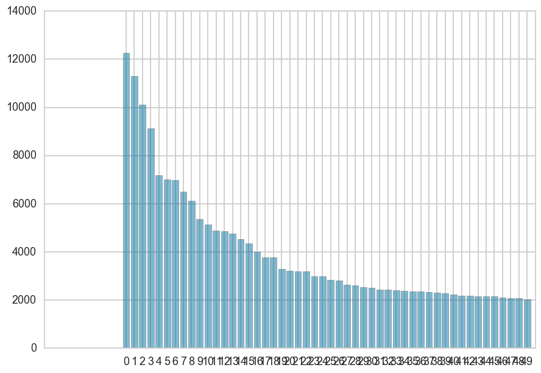

### Error 1 

Trying to import Yellowbrick:

```

from yellowbrick.text import FreqDistVisualizer
---------------------------------------------------------------------------
ImportError                               Traceback (most recent call last)
<ipython-input-4-7d5d783f521e> in <module>()
----> 1 from yellowbrick.text import FreqDistVisualizer

ImportError: No module named 'yellowbrick'
```

Was not in a virtualenv, tried to get a virtualenv set up; still having problems with yellowbrick. 
Solved: sys.path.append

### Error 2 

On import, deprecation warning:

```
/usr/local/lib/python3.5/site-packages/sklearn/cross_validation.py:44: DeprecationWarning: This module was deprecated in version 0.18 in favor of the model_selection module into which all the refactored classes and functions are moved. Also note that the interface of the new CV iterators are different from that of this module. This module will be removed in 0.20.
  "This module will be removed in 0.20.", DeprecationWarning)
```

In my user testing I'm using Scikit-Learn 0.18 

### Error 3 

Running `FreqDistVisualizer` in a pipeline:

```
from sklearn.pipeline import Pipeline 
from sklearn.feature_extraction.text import CountVectorizer 
from yellowbrick.text import FreqDistVisualizer

visualizer = Pipeline([
    ('norm', TextNormalizer()),
    ('count', CountVectorizer(tokenizer=lambda x: x, preprocessor=None, lowercase=False)),
    ('viz', FreqDistVisualizer())
])

visualizer.fit_transform(documents(), labels())
visualizer.named_steps['viz'].poof()
```

I get the following error:

```
---------------------------------------------------------------------------
AttributeError                            Traceback (most recent call last)
<ipython-input-53-3514380b0c82> in <module>()
      9 ])
     10 
---> 11 visualizer.fit_transform(documents(), labels())
     12 visualizer.named_steps['viz'].poof()

/usr/local/lib/python3.5/site-packages/sklearn/pipeline.py in fit_transform(self, X, y, **fit_params)
    301         Xt, fit_params = self._fit(X, y, **fit_params)
    302         if hasattr(last_step, 'fit_transform'):
--> 303             return last_step.fit_transform(Xt, y, **fit_params)
    304         elif last_step is None:
    305             return Xt

/usr/local/lib/python3.5/site-packages/sklearn/base.py in fit_transform(self, X, y, **fit_params)
    495         else:
    496             # fit method of arity 2 (supervised transformation)
--> 497             return self.fit(X, y, **fit_params).transform(X)
    498 
    499 

AttributeError: 'NoneType' object has no attribute 'transform'
```

This is because the `fit()` method needs to return self. 
Also, the features passed into fit do not match the vector y that I'm passing to it. 
Instead, features needs to be added as input to the initializer, or passed to 
`inverse_transform` as needed on the vectorizer. 

### Error 4 

If I don't call poof() then I get a graphic displayed in the notebook that's not finalized. I think this is going to be a weirdness of `%matplotlib inline` 




### Error 5 

Ran the TSNE visualizer ... but ended up with an empty figure? 


### Error 6 

I created a classifier, and I wanted to get a ClassBalance, ClassificationReport, _and_ ROCAUC for each of them. So I trained the model, then created the `ScoreVisualizer` by passing in the _trained_ model, and called score on it. 

```
from sklearn.linear_model import LogisticRegression 
from yellowbrick.classifier import ClassBalance, ClassificationReport, ROCAUC

logit = LogisticRegression()
logit.fit(docs_train, labels_train)

logit_balance = ClassBalance(logit)
logit_balance.score(docs_test, labels_test)
logit_balance.poof()
```

Because I didn't pass in a classes argument I got the following:

```
---------------------------------------------------------------------------
TypeError                                 Traceback (most recent call last)
<ipython-input-22-92e90e138936> in <module>()
      1 logit_balance = ClassBalance(logit)
----> 2 logit_balance.score(docs_test, labels_test)
      3 logit_balance.poof()

/Users/benjamin/Repos/tmp/yellowbrick/yellowbrick/classifier.py in score(self, X, y, **kwargs)
    488         y_pred = self.predict(X)
    489         self.scores  = precision_recall_fscore_support(y, y_pred)
--> 490         self.support = dict(zip(self.classes_, self.scores[-1]))
    491         return self.draw()
    492 

TypeError: zip argument #1 must support iteration
``` 

Passing the following fixed the problem:

```
logit_balance = ClassBalance(logit, classes=set(labels_test))
```

### Error 7 

Attempting to get a classification report for a multi-class classifier:

```
logit_balance = ClassificationReport(logit, classes=set(labels_test))
logit_balance.score(docs_test, labels_test)
logit_balance.poof()
``` 

In the same way as before led to the following exception:

```
---------------------------------------------------------------------------
IndexError                                Traceback (most recent call last)
<ipython-input-27-7b911cc79c37> in <module>()
      1 logit_balance = ClassificationReport(logit, classes=set(labels_test))
----> 2 logit_balance.score(docs_test, labels_test)
      3 logit_balance.poof()

/Users/benjamin/Repos/tmp/yellowbrick/yellowbrick/classifier.py in score(self, X, y, **kwargs)
    133         self.scores = map(lambda s: dict(zip(self.classes_, s)), self.scores[0:3])
    134         self.scores = dict(zip(keys, self.scores))
--> 135         return self.draw(y, y_pred)
    136 
    137     def draw(self, y, y_pred):

/Users/benjamin/Repos/tmp/yellowbrick/yellowbrick/classifier.py in draw(self, y, y_pred)
    158         for column in range(len(self.matrix)+1):
    159             for row in range(len(self.classes_)):
--> 160                 self.ax.text(column,row,self.matrix[row][column],va='center',ha='center')
    161 
    162         fig = plt.imshow(self.matrix, interpolation='nearest', cmap=self.cmap, vmin=0, vmax=1)

IndexError: list index out of range
```

And it displayed the following:


**NOTE**: Same behavior when I tried to fit and score the classifier myself. 

### Error 8 

Running a ROCAUC on a multiclass classifier:

```
logit_balance = ROCAUC(logit)
logit_balance.score(docs_test, labels_test)
logit_balance.poof()
```

Resulted in a warning that we didn't have a binary classifier:

```
---------------------------------------------------------------------------
ValueError                                Traceback (most recent call last)
<ipython-input-28-5eccb2a02e03> in <module>()
      1 logit_balance = ROCAUC(logit)
----> 2 logit_balance.score(docs_test, labels_test)
      3 logit_balance.poof()

/Users/benjamin/Repos/tmp/yellowbrick/yellowbrick/classifier.py in score(self, X, y, **kwargs)
    311         """
    312         y_pred = self.predict(X)
--> 313         self.fpr, self.tpr, self.thresholds = roc_curve(y, y_pred)
    314         self.roc_auc = auc(self.fpr, self.tpr)
    315         return self.draw(y, y_pred)

/usr/local/lib/python3.5/site-packages/sklearn/metrics/ranking.py in roc_curve(y_true, y_score, pos_label, sample_weight, drop_intermediate)
    503     """
    504     fps, tps, thresholds = _binary_clf_curve(
--> 505         y_true, y_score, pos_label=pos_label, sample_weight=sample_weight)
    506 
    507     # Attempt to drop thresholds corresponding to points in between and

/usr/local/lib/python3.5/site-packages/sklearn/metrics/ranking.py in _binary_clf_curve(y_true, y_score, pos_label, sample_weight)
    312              array_equal(classes, [-1]) or
    313              array_equal(classes, [1]))):
--> 314         raise ValueError("Data is not binary and pos_label is not specified")
    315     elif pos_label is None:
    316         pos_label = 1.

ValueError: Data is not binary and pos_label is not specified

```